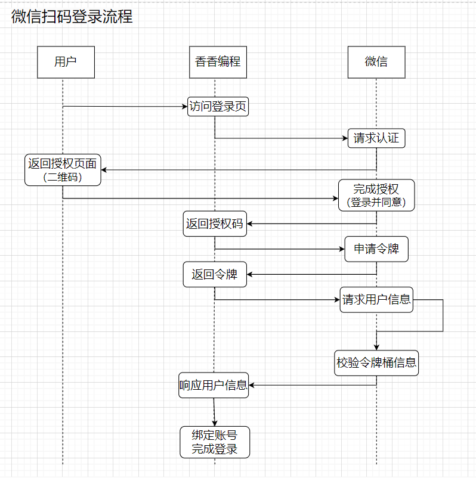

<!-- more -->
### 1.什么是OAUTH2.0?

OAuth 2.0 是一种用于授权的开放标准协议，它允许第三方应用程序在资源所有者的许可下访问资源所有者的资源，而无需暴露资源所有者的凭据（如用户名和密码）。它通常用于提供第三方访问HTTP服务，例如社交媒体账户、在线文件存储等。OAuth 2.0 是 OAuth 协议的第二个版本，比 OAuth 1.0 简化了许多流程，增强了灵活性和安全性。

OAuth 2.0 的工作流程主要涉及以下角色：

1. **资源所有者（Resource Owner）**：即用户，拥有受保护的资源，并通过授权服务器授予客户端访问这些资源的权限
2. **客户端（Client）**：想要访问资源拥有者的资源的应用程序。它需要获得授权才能访问资源服务器上的受保护资源。
3. **授权服务器（Authorization Server）**：处理客户端的授权请求，并颁发访问令牌。授权服务器验证资源拥有者的身份并获取其授权。
4. **资源服务器（Resource Server）**：托管资源拥有者的受保护资源，并使用访问令牌来验证和处理客户端的请求。

OAuth 2.0 的基本授权流程如下：

1. **客户端请求授权**：客户端向资源所有者请求授权，通常通过用户界面引导用户进行授权。
2. **资源所有者授予授权**：资源所有者同意授权，并通过授权服务器生成授权代码（Authorization Code）。
3. **客户端获取授权代码**：客户端收到授权代码。
4. **客户端交换授权代码**：客户端将授权代码发送给授权服务器，交换访问令牌。
5. **授权服务器颁发访问令牌**：授权服务器验证授权代码并向客户端颁发访问令牌。
6. **客户端访问资源**：客户端使用访问令牌访问资源服务器上的资源。

###### a. OAuth 2.0 授权模式

OAuth 2.0 定义了多种授权模式，以满足不同的应用场景：

1. **授权码模式（Authorization Code Grant）**：最常用的模式，适用于服务器端应用，包含了授权码的获取和交换流程。
2. **简化模式（Implicit Grant）**：主要用于浏览器中的单页应用，省略了授权码的交换步骤，直接获取访问令牌。
3. **密码模式（Resource Owner Password Credentials Grant）**：用户直接向客户端提供用户名和密码，适用于信任级别较高的应用。
4. **客户端凭证模式（Client Credentials Grant）**：客户端以自身身份获取访问令牌，用于访问自身资源或服务端间的交互。

### 2.用户扫码是如何实现的

这边以微信登陆为例：

1. 首先用户点击微信登陆，第三方网站或应用程序生成一个用于登录的二维码，并将其展示给用户。
2. 用户使用微信扫描该二维码。
3. 微信客户端将请求发送到微信服务器，并请求用户授权该第三方应用程序访问其个人信息。
4. 用户在微信客户端上看到授权请求，可以选择允许或拒绝。
5. 如果用户同意授权，微信服务器带着授权码回调到回调地址上，然后第三方网站或应用程序带着这个授权码向微信服务器请求令牌
6. 微信服务器在校验授权码有效性之后，将向第三方应用程序颁发一个访问令牌（Access Token），该令牌用于代表用户访问其个人信息。
7. 第三方应用程序可以使用此访问令牌来获取用户的个人信息，例如昵称、头像等。用户在第三方应用程序中进行操作，第三方应用程序使用访问令牌向微信服务器请求用户的个人信息。



### 3. 如果要实现不同域名下的cookie正常使用，应该怎么处理？

1. **设置 Cookie 的域名属性：** 当设置 Cookie 时，可以通过指定域名属性来确保 Cookie 在不同子域名之间共享。例如，如果你希望 Cookie 在`example.com`和`subdomain.example.com`之间共享，则可以设置 Cookie 的域名属性为`.example.com`（注意前面的点号），这样 Cookie 就可以在所有以`example.com`为结尾的子域名下共享。

```javascript
document.cookie = "name=value; domain=.example.com; path=/";
```

2. **设置跨域资源共享（CORS）：** 如果是通过 AJAX 或 Fetch 发起的跨域请求，需要在服务器端设置适当的 CORS 头来允许跨域请求。服务器响应中应包含 `Access-Control-Allow-Origin` 头，并设置为允许访问的域名。例如：

```javascript
Access-Control-Allow-Origin: https://example.com
```

3. **使用代理：** 如果跨域请求不能通过上述方法解决，可以考虑在服务器端设置代理，即在同一域名下创建一个中间层，由该中间层代理请求到其他域名，然后再将结果返回给客户端。这种方法可以绕过浏览器的同源策略限制。

   

3. **设置 Cookie 的路径**：确保路径参数设置为 Cookie 所在的路径。通常，将路径设置为根路径 `/` 是最简单和最通用的方法，使得 Cookie 在整个网站的所有页面中可用。

```javascript
document.cookie = "name=value; domain=.example.com; path=/";
```

### 4.假如1亿用户体量，如何设计一个登录验签服务？

设计一个支持 1 亿用户体量的登录验签服务需要考虑到高可用性、安全性和性能等因素。以下是一个可能的设计方案：

1. **负载均衡**：使用负载均衡技术将流量分发到多个服务器上，以确保服务的高可用性和可扩展性。可以考虑使用负载均衡器如 Nginx 或 AWS ELB。

2. **分布式架构**：采用分布式架构，将用户数据和登录状态分布在多个服务器上，以应对大规模用户的访问。可以使用分布式数据库（如MySQL Cluster、Cassandra等）或 NoSQL 数据库（如MongoDB、Redis等）来存储用户数据和登录状态。

3. **安全性**：
   - 使用 HTTPS 协议进行通信，以保障数据的安全传输。
   - 对用户密码进行加密存储，推荐使用哈希函数加盐存储用户密码，如 bcrypt。
   - 使用 JWT（JSON Web Token）或类似的令牌机制来生成并验证用户身份，避免在服务端存储用户的敏感信息。
   - 实施防火墙、DDoS 防护和安全审计等安全措施，保护系统免受恶意攻击。

4. **高性能**：
   - 使用缓存技术加速登录验签过程，例如，将经常访问的用户信息存储在缓存中，减少数据库访问次数。
   - 使用异步处理技术，如消息队列，将请求分发给多个工作节点并行处理，提高系统的响应速度和吞吐量。
   - 对数据库进行优化，如索引、分片等，以提高查询性能和扩展性。

5. **监控和日志**：建立完善的监控系统，实时监控系统运行状态、性能指标和异常情况，并及时进行预警和处理。同时，记录日志以便追踪和排查问题。

6. **容灾备份**：定期进行数据备份，并建立容灾备份系统，以防止数据丢失和系统故障导致的服务中断。

7. **合理的访问限制**：实施合理的访问限制策略，如限制登录失败次数、IP 访问频率等，以防止暴力破解和恶意攻击。

8. **持续优化**：定期进行性能测试和优化，不断改进系统架构和代码实现，以适应不断增长的用户体量和变化的需求。
