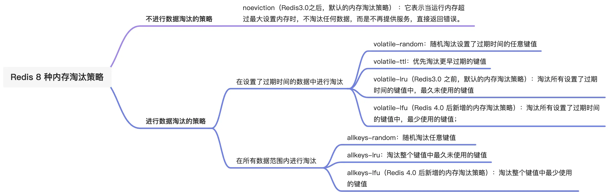

## 当Redis内存满了

在 Redis 的运行内存达到了某个**阀值**，就会触发**内存淘汰机制**，这个阀值就是我们设置的最大运行内存此值在 Redis 的配置文件中可以找到，配置项为 maxmemory。

这个时候就需要进行内存淘汰了，在redis中大体有两种策略：

## 不进行数据淘汰的策略

`noeviction`(Redis3.0之后，默认的内存淘汰策略)：它表示当运行内存超过最大设置内存时，不淘汰任何数据，而是不再提供服务，直接返回错误。

## 进行数据淘汰的策略

这个策略又可以分为「在设置了过期时间的数据中进行淘汰」和「在所有数据范围内进行淘汰」这两类策略。 

### 1. 在设置了过期时间的数据中进行淘汰

- volatile-random：随机淘汰设置了过期时间的任意键值
- volatile-ttl：优先淘汰更早过期的键值。
- volatile-lru (Redis3.0 之前，默认的内存淘汰策略)：淘汰所有设置了过期时间的键值中，最久未使用的键值
- volatile-lfu (Redis 4.0 后新增的内存淘汰策略)：淘汰所有设置了过期时间的键值中，最少使用的键值

### 2. 在所有数据范围内进行淘汰

- allkeys-random：随机淘汰任意键值
- allkeys-Iru：淘汰整个键值中最久未使用的键值
- allkeys-lfu (Redis 4.0 后新增的内存淘汰策略)：淘汰整个键值中最少使用的键值

### LRU算法和LFU算法

##### LRU算法：

> **LRU算法是什么？**

LRU 全称是`Least Recently Used`翻译为最近最少使用，会选择淘汰最近最少使用的数据。

传统 LRU 算法的实现是基于「链表」结构，链表中的元素按照操作顺序从前往后排列，最新操作的键会被移动到表头，当需要内存淘汰时，只需要删除链表尾部的元素即可，因为链表尾部的元素就代表最久未被使用的元素

传统的 LRU 算法存在两个问题

- 需要用链表管理所有的缓存数据，这会带来额外的空间开销
- 当有数据被访问时，需要在链表上把该数据移动到头端，如果有大量数据被访问，就会带来很多链表移动操作，会很耗时，进而会降低 Redis 缓存性能

> **Redis是如何实现LRU算法的？**

Redis 实现的是一种**近似 LRU 算法**，目的是为了更好的节约内存。

它的实现方式是在 Redis 的对象结构体中添加一个**额外的字段**，用于记录此数据的**最后一次访问时间**。
当 Redis 进行内存淘汰时，会使用**随机采样**的方式来淘汰数据它是随机取 5 个值（此值可配置），然后淘汰最久没有使用的那个

**优点**

- 不用为所有的数据维护一个大链表，节省了空间占用
- 不用在每次数据访问时都移动链表项，提升了缓存的性能

**缺点**

无法解决缓存污染问题，比如应用一次读取了大量的数据，而这些数据只会被读取这一次，那么这些数据会留存在 Redis 缓存中很长一段时间，造成缓存污染。因此，在 Redis 4.0 之后引入了 LFU 算法来解决这人问题。

##### LFU算法

> 什么是LFU算法？

LFU 全称是`Least Frequently Used`翻译为**最近最不常用**的，LFU 算法是根据数据访问次数来淘汰数据的它的核心思想是“如果数据过去被访问多次，那么将来被访问的频率也更高”。

所以，LFU 算法会记录每个数据的访问次数。当一个数据被再次访问时，就会增加该数据的访问次数。

> Redis是如何实现LFU算法的？

1. 在 LRU 算法中，Redis 对象头的 24 bits 的lru 字段是用来记录 key 的访问时间戳，因此在LRU 模式下，Redis可以根据对象头中的 lru 字段记录的值，来比较最后一次 key 的访问时间长，从而淘汰最久未被使用的 key。
2. 在LFU 算法中，Redis对象头的 24 bits 的 lru 字段被分成两段来存储，高 16bit 存诸ldt(`Last DecrementTime`)，用来记录 key 的访问时间戳；低 8bit 存储 logc(Logistic Counter)「访问频次」，用来记录 key 的访问频次。

