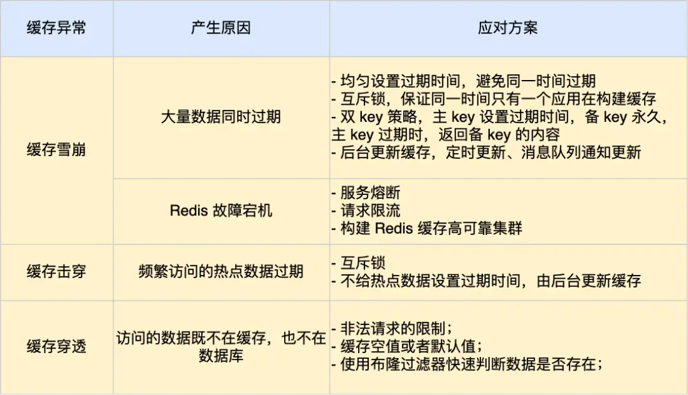

## 缓存雪崩

现象：当大量缓存数据在同一时间过期失效，如果此时有大量请求访问，就只能全打到你的db上，让数据库的压力骤增，严重会造成数据库宕机，从而造成一系列服务崩溃

应对方式：

- 合理的设置缓存过期时间，有意识地将过期时间分开

- 加锁，在处理请求的时候如果发现Redis中没有要查找的数据，就加一个锁，保证同一时间内针对某一条数据就只有一个请求会去访问数据库，然后将数据发给所有的请求。当缓存构建之后，在释放锁。

  实现互斥锁的时候，最好设置**超时时间**，不然第一个请求拿到了锁，然后这个请求发生了某种意外而一直阻塞，一直不释放锁，这时其他请求也一直拿不到锁，整个系统就会出现无响应的现象。

- 将缓存设置为永不过期，由后台自主的去更新缓存数据。这样可能会造成内存负担，然后会有**Redis的缓存淘汰机制**，会将一部分数据给淘汰掉，那直到下一次数据更新，这些被淘汰的数据是无法展示给数据库的，就造成数据丢失。解决这个问题可以有两种办法：

  1. 给更新缓存的线程再加一个用途用来频繁的去检测缓存是否有效，当缓存失效是就立马去数据库中读取数据更新到缓存（检测时间不能太长会造成用户体验差）
  2. 当业务线程发现缓存失效后，通过**消息队列的形式**发送一条消息给后台更新缓存，然后后台可以在更新前检查一下缓存状态，再决定是否更新

- 在业务刚刚上线的时候，进行**缓存预热**

### Redis服务宕机造成缓存雪崩

解决：

1. 服务熔断请求限流，在Redis宕机的时候，启动**服务熔断**，**暂停对缓存的访问直接返回错误**，不去访问数据库，降低对数据库的压力。
   为了减少对服务的影响，我们可以对请求进行**限流**，只允许部分请求去找数据，再多的就直接拒绝
2. 构建缓存集群，在主节点崩溃后服务也可以正常运行

## 缓存击穿

hot key问题，在一个频繁访问的缓存过期，那这个大量的请求也会达到db上造成数据库宕机

- 互斥锁方案，保证同一时间只有一个业务线程更新缓存，未能获取互斥锁的请求，要么等待锁释放后重新读取缓存，要么就返回空值或者默认值。
- 不给热点数据设置过期时间，由后台异步更新缓存，或者在热点数据准备要过期前，提前通知后台线程更新缓存以及重新设置过期时间。

## 缓存穿透

当用户访问的数据，既不在缓存中也不再数据库中，这样也不能构建缓存，所有打进来的请求都会直接到db上，这就是穿透

缓存穿透的发生一般有这两种情况:

1. 业务误操作，缓存中的数据和数据库中的数据都被误删除了，所以导致缓存和数据库中都没有数据
2. 黑客恶意攻击，故意大量访问某些读取不存在数据的业务

应对缓存穿透的方案：

- 第一种方案，**非法请求的限制**
- 第二种方案，**缓存空值或者默认值**
- 第二种方案，使用**布隆过滤器**快速判断数据是否存在，避免通过查询数据库来判断数据是否存在

第一种方案，非法请求的限制

当有大量恶意请求访问不存在的数据的时候，也会发生缓存穿透，因此在 API 入口处我们要判断求请求参数是否合理，请求参数是否含有非法值、请求字段是否存在，如果判断出是恶意请求就直接返回错误，避免进一步访问缓存和数据库。

第二种方案缓存空值或者默认值

当我们线上业务发现缓存穿透的现象时，可以针对查询的数据，在缓存中设置一个空值或者默认值，这样后续请求就可以从缓存中读取到空值或者默认值，返回给应用，而不会继续查询数据库。

第三种方案，使用布隆过滤器判断数据是否存在

在数据库中加入数据的时候，在布隆过滤器中标记一下，后面在缓存失效的情况下请求直接打到db上，就可以先去查询布隆过滤器就判断这个数据是否存在数据库中，如果不在就不需要再去访问数据库

**布隆过滤器**

布隆过滤器由「初始值都为 0 的位图数组」和「 N 个哈希函数」两部分组成。

布隆过滤器会通过 3 个操作完成标记

- 第一步，使用 N 个哈希函数分别对数据做哈希计算，得到 N 个哈希值。
- 第二步，将第一步得到的 N 个哈希值对位图数组的长度取模，得到每个哈希值在位图数组的对应位置。
- 第二步，将每个哈希值在位图数组的对应位置的值设置为 1。

布隆过滤器由于是基于哈希函数实现查找的，高效查找的同时存在哈希冲突的可能性，所以在查询的时候**布隆过滤器说这个数据存在，那么这个数据不一定存在；如果他说不存在，就一定不存在**。

