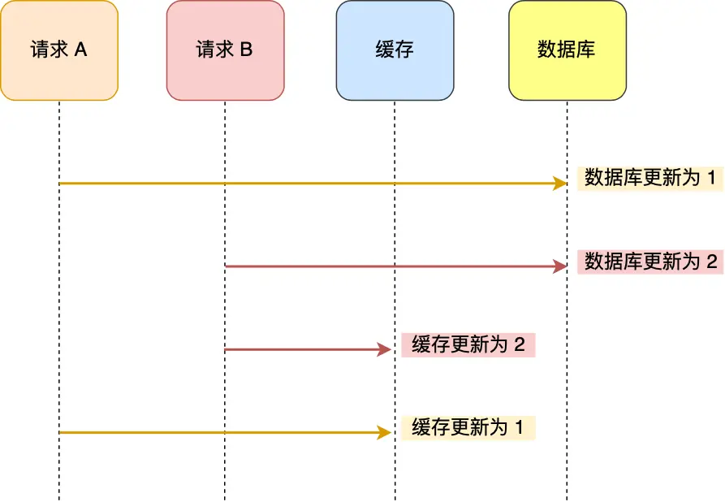
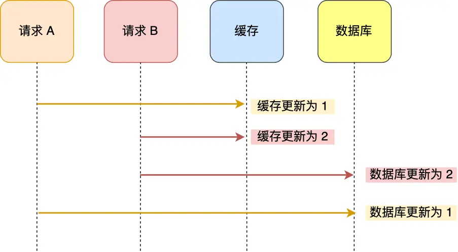
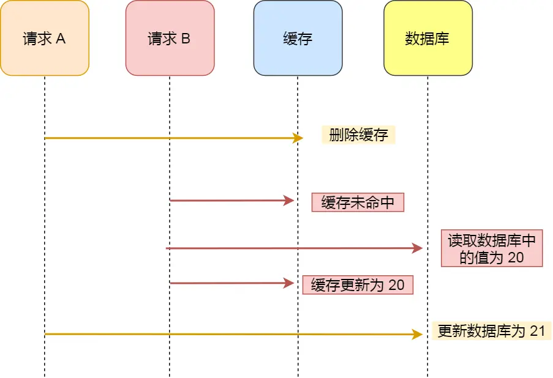

## 数据一致性

### 双写策略

**先写数据库，再写缓存**

在遇到并发的时候会出现问题：A 请求先将数据库的数据更新为 1，然后在更新缓存前，请求 B 将数据库的数据更新为 2，紧接着也把缓存更新为 2，然后 A 请求更新缓存为 1。



**先写缓存，再写数据库**

也会因为并发问题，A 请求先将缓存的数据更新为 1，然后在更新数据库前，请求 B 将缓存的数据更新为 2，紧接着也把数据库更新为 2，然后 A 请求更新数据库为 1。



解决双写策略的问题，我们可以：

- 在缓存执行更新之前去加一个**分布式锁**，保证在同一时间只去运行同一个请求的更新（单飞）。但这也会带来性能问题。
- 在更新完缓存的时候，给缓存加上一个**较短的过期时间**，这样哪怕出现数据不一致的问题，也仅仅只是一会，不会影响业务。

### 读时更新，写时删除

**先删缓存，再写数据库**

如果有两个请求中一个请求执行数据的更新，那么他就会先去删除缓存；在这期间另一个请求去读取数据，然后将数据库中未修改的数据更新到缓存中；然后第一个请求去修改数据库中的数据；这就会导致最终数据库中的数据和缓存中的数据不一致。


解决这个问题，我们可以采用**延时双删**的策略，下面是延时双删的伪代码：

```go
//删除缓存
redis.DEL(context.Background(),"x")
//更新数据库
db.update(x)
//睡眠
time.sleep(N)
//在删除缓存
redis.DEL(context.Background(),"x")
```

中间睡几秒是为了，请求B能够完成从数据库读取数据，并存到缓存中。

**先更新数据库，再删除缓存**

假如某个用户数据在缓存中不存在，请求 A 读取数据时从数据库中查询到年龄为 20，在未写入缓存中时另一个请求 B 更新数据。它更新数据库中的年龄为 21，并且清空缓存。这时请求A 把从数据库中读到的年龄为 20 的数据写入到缓存中。



但这只是理论上的，在实际中**缓存写入是远比数据库写入快**的。所以很难出现请求A的缓存还没写入请求B就已经更新数据的情况，并且如果A的数据缓存更新在B删除缓存之前，也是后面回去数据库直接查找数据。所以**他是可以保证数据一致性的**。

::: note 

 由于这是两步操作，所以可能会出现第二个操作失败的情况，这时候我们就可以采用**消息队列重试机制**。当操作失败就重式直到完成，或达到上限，返回错误。
::: 


### 永不过期，由后端自主更新

设置一个定时器，定时去数据库中拉去新的数据。

采用监听binlog，当数据库有更新操作的时候，再去更新数据

### 单飞

```go
package main

import (
	"context"
	"fmt"
	"github.com/go-redis/redis/v8"
	"time"
)

var (
	Rdb     *redis.Client
	ctx     = context.Background()
	lockKey = "my-lock-key"
)

func getRdb() {
	Rdb = redis.NewClient(&redis.Options{
		Addr:     "8.130.17.124:6379",
		Password: "021001",
		DB:       2,
	})
	fmt.Println("Redis连接成功")
}

func Close() {
	err := Rdb.Close()
	if err != nil {
		return
	}
	fmt.Println("Redis关闭成功")
}

// 尝试去获取锁
func acquireLock() (bool, error) {
	result, err := Rdb.SetNX(ctx, lockKey, "1", 5*time.Second).Result()
	if err != nil {
		return false, err
	}
	return result, nil
}

// 释放锁
func releaseLock() error {
	_, err := Rdb.Del(ctx, lockKey).Result()
	if err != nil {
		return err
	}
	return nil
}

func main() {
	getRdb()
	defer Close()

	locked, err := acquireLock()
	if err != nil {
		fmt.Println(err)
		return
	}
	if locked {
		fmt.Println("获取锁成功")
		// 业务逻辑
		time.Sleep(6 * time.Second)

		//释放锁
		err = releaseLock()
		if err != nil {
			fmt.Println(err)
			return
		}
		fmt.Println("释放锁成功")
	} else {
		fmt.Println("获取锁失败,另一个进程持有锁")
	}
}

//func main() {
//	getRdb()
//	defer Close()
//
//	lockKey = "my-lock-key"
//
//	// 模拟另一个进程持有锁
//	fmt.Println("模拟另一个进程持有锁...")
//	locked, err := acquireLock()
//	if err != nil {
//		fmt.Println("锁初始化失败:", err)
//		return
//	}
//
//	if locked {
//		fmt.Println("锁已设置 (模拟另一个进程持有锁)")
//
//		// 等待一段时间后尝试获取锁
//		time.Sleep(2 * time.Second)
//
//		// 当前进程尝试获取锁
//		fmt.Println("当前进程尝试获取锁...")
//		lockedAgain, err := acquireLock()
//		if err != nil {
//			fmt.Println("获取锁失败:", err)
//			return
//		}
//
//		if lockedAgain {
//			fmt.Println("成功获取锁，处理任务中...")
//		} else {
//			fmt.Println("获取锁失败，另一进程仍持有锁。")
//		}
//
//		// 释放锁
//		fmt.Println("释放锁...")
//		err = releaseLock()
//		if err != nil {
//			fmt.Println("释放锁失败:", err)
//		} else {
//			fmt.Println("锁已释放")
//		}
//
//	} else {
//		fmt.Println("无法设置模拟锁，可能锁已被占用。")
//	}
//}
```