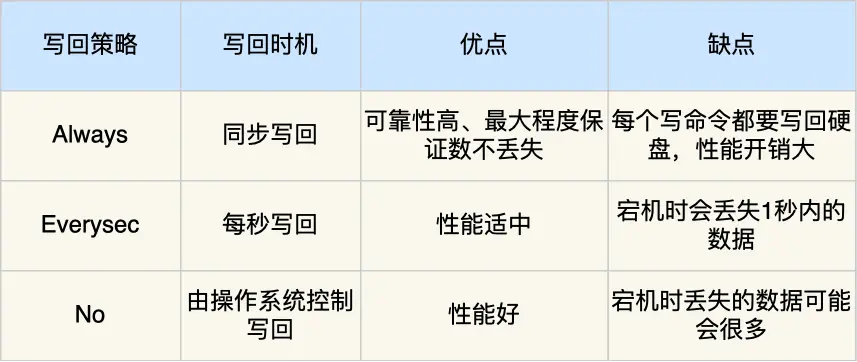

## Redis持久化

AOF 日志：每执行一条写操作命令，就把该命令以追加的方式写入到一个文件里
RDB 快照：将某一时刻的内存数据，以二进制的方式写入磁盘
混合持久化方式：Redis 4.0 新增的方式，集成了 AOF 和 RBD 的优点

### AOF

先执行命令再写日志

1. 避免额外的检查开销：如果当前的命令语法有问题，那么如果不进行命令语法检查，该错误的命令记录到 AOF 日志里后，Redis 在使用日志恢复数据时，就可能会出错.
2. 不会阻塞当前写操作命令的执行：因为当写操作命令执行成功后，才会将命令记录到 AOF 日志

风险

1. 数据可能会丢失：执行写操作命令和记录日志是两个过程，那当 Redis 在还没来得及将命令写入到硬盘时，服务器发生宕机了，这个数据就会有丢失的风险。
2. 可能阻塞其他操作：因为 AOF 日志也是在主线程中执行，所以当 Redis 把日志文件写入磁盘的时候，还是会阻塞后续的操作无法执行。

### AOF的写回策略

AOF日志不可以过大，不然在恢复数据的时候会很慢。

### AOF重写机制

如何避免：AOF重写机制，读取当前数据库中的所有键值对，然后将每一个键值对用一条命令记录到新的 AOF 文件，等到全部记录完后，就将新的 AOF 文件替换掉现有的 AOF 文件

#### 重写过程

后台子进程 bgrewriteaof 来完成的，两个好处：

- 子进程进行 AOF 重写期间，主进程可以继续处理命令请求，从而避免阻塞主进程

- 子进程带有主进程的数据副本，这里使用子进程而不是线程，因为如果是使用线程，多线程之间会共享内存，那么在修改共享内存数据的时候，需要通过加锁来保证数据的安全，而这样就会降低性能。而使用子进程，创建子进程时，父子进程是共享内存数据的，不过这个共享的内存只能以只读的方式，而当父子进程任意一方修改了该共享内存，就会发生【写时复制】，于是父子进程就有了独立的数据副本就不用加锁来保证数据安全。

重写 AOF 日志过程中，如果主进程修改了已经存在 key-value
就会造成数据不一致问题，为了解决这种数据不一致问题，Redis 设置了一个 AOF 重写缓冲区，这个缓冲区在创建 bgrewriteaof子进程之后开始使用。

在重写AOF 期间，当 Redis 执行完一个写命令之后，它会同时将这个写命令写入到 「AOF 缓冲区」和「AOF 重写缓冲区」。

当子进程结束会向主进程发送一个信号，主程在接受之后会将「AOF 重写缓冲区」的内容追加到AOF文件中

### RDB

将某一时刻的内存数据，全部记录下来，再回复内存的时候只需要将RDB文件读入就可以

Redis 提供了两个命令来生成`RDB`文件，分别是`save`和`bgsave`

1. 执行了`save`命令，就会在主线程生成`RDB` 文件，由于和执行操作命令在同一个线程，所以如果写入RDB 文件的时间太长，会阻塞主线程;
2. 执行了`bqsave` 命令，会创建一个子进程来生成 `RDB` 文件，这样可以避免主线程的阻塞

在快照期间，数据库是可以进行修改的

### 混合持久化

混合持久化工作在 AOF 日志重写过程，当开启了混合持久化时，在 AOF 重写日志时，fork 出来的重写子进程会先将与主线程共享的内存数据以 RDB 方式写入到 AOF 文件，然后主线程处理的操作命令会被记录在重写缓冲区里，重写缓冲区里的增量命令会以 AOF 方式写入到 AOF 文件，写入完成后通知主进程将新的含有 RDB 格式和 AOF 格式的 AOF 文件替换日的的 AOF 文件。

1. 这样的好处在于，重启 Redis 加载数据的时候，由于前半部分是 RDB 内容，这样加载的时候速度会很快。
2. 加载完 RDB 的内容后，才会加载后半部分的 AOF 内容，这里的内容是 Redis 后台子进程重写 AOF 期间主线程处理的操作命令，可以使得数据更少的丢失

**混合持久化缺点:**

1. AOF 文件中添加了 RDB 格式的内容，使得 AOF 文件的可读性变得很差

2. 兼容性差，如果开启混合持久化，那么此混合持久化 AOF 文件，就不能用在 Redis 4.0 之前版本了。

**AOF持久化大Key的影响：**

当使用 Always 策略的时候，如果写入是一个大 Key，主线程在执行 fsync()函数的时候，阻塞的时间会比较久

当使用Everysec策略的时候，由于是异步执行 fsync() 函数，所以大 Key 持久化的过程(数据同步磁盘)不会影响主线程。

当使用 No 策略的时候，由于永不执行 fsync()函数，所以大 Key 持久化的过程不会影响主线程

**RDB持久化大Key的影响：**

随着 Redis 存在越来越多的大 Key，那么 Redis 就会占用很多内存，对应的页表就会越大

在通过 fork() 函数创建子进程的时候，虽然不会复制父进程的物理内存，但是内核会把父进程的页表复制一份给子进程，如果页表很大，那么这个复制过程是会很耗时的，那么在执行 fork 函数的时候就会发生阻塞现象

如果创建完子进程后，父进程对共享内存中的大 Key 进行了修改，那么内核就会发生写时复制，会把物理内存复制一份，由于大 Key 占用的物理内存是比较大的，那么在复制物理内存这一过程中，也是比较耗时的，于是父进程(主线程)就会发生阻塞。