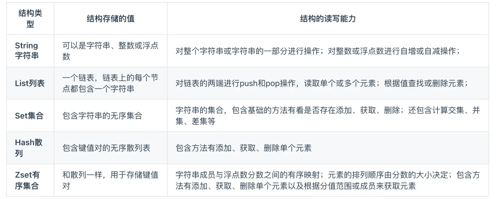
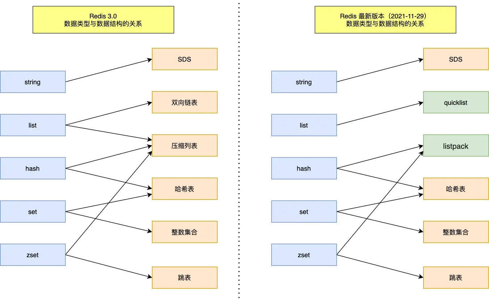
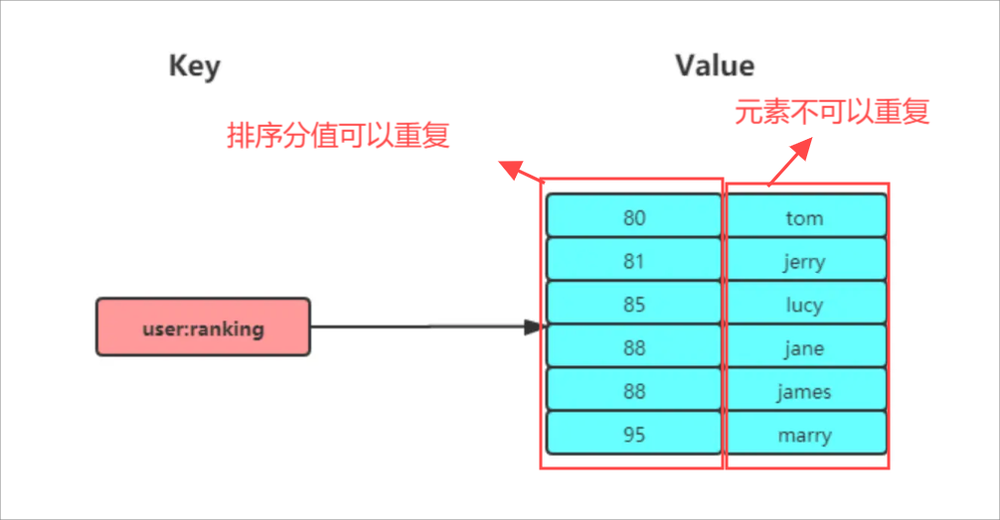

# Redis常用的数据类型

## **redis常用的数据类型，以及他的底层实现**






## 1.string

### 底层原理

String：Key-Value，底层是int和SDS（简单的动态字符串）

SDS相比于原生的C字符串L:

- **SDS不仅可以保存文本数据，还可以保存二进制数据**。因为 SDS 使用 len 属性的值而不是空字符判断字符串是否结束，并且 SDS 的所有 API 都会以处理二进制的方式来处理 SDS 存放在 buf[] 数组里的数据。所以 SDS 不光能存放文本数据，而且能保存图片、音频、视频、压缩文件这样的二进制数据。

- **SDS 获取字符串长度的时间复杂度是 0(1)**。因为 C 语言的字符串并不记录自身长度，所以获取长度的复杂度为 0(n);而 SDS 结构里用 len 属性记录了字符串长度，所以复杂度为 0(1)。

- **Redis 的 SDS API 是安全的，拼接字符串不会造成缓冲区溢出**。因为 SDS 在拼接字符串之前会检查SDS 空间是否满足要求，如果空间不够会自动扩容，所以不会导致缓冲区溢出的问题。

  字符串对象的内部编码 (encoding) 有3 种: int、raw和 embstr.

`embstr`编码是专门用于保存短字符串的一种优化编码方式，`row`编码是用来存储长字符串的

可以看到`embstr`和`raw`编码都会使用`SDS`来保存值，但不同之处在于`embstr`会通过一次内存分配函数来分配一块连续的内存空间来保存`redisObject`和`SDS`，而`raw`编码会通过调用两次内存分配函数来分别分配两块空间来保存`redisObject`和`SDS`。

- embstr 编码将创建字符串对象所需的内存分配次数从 raw 编码的两次降低为一次
- 释放embstr 编码的字符串对象同样只需要调用一次内存释放函数:
- 因为 embstr 编码的字符串对象的所有数据都保存在一块连续的内存里面可以更好的利用 CPU 缓存提升性能。

但是 embstr 也有缺点的:

如果字符串的长度增加需要重新分配内存时，整个redisObject和sds都需要重新分配空间，所以embsti编码的字符串对象实际上是只读的，redis没有为embstr编码的字符串对象编写任何相应的修改程序。当我们对embstr编码的字符串对象执行任何修改命令(例如append) 时，程序会先将对象的编码从embstr转换成raw，然后再执行修改命令

### 常用命令

```c++
# 设置 key-value 类型的值
> SET name lin
OK
# 根据 key 获得对应的 value
> GET name
"lin"
# 判断某个 key 是否存在
> EXISTS name
(integer) 1
# 返回 key 所储存的字符串值的长度
> STRLEN name
(integer)
# 删除某个 key 对应的值
> DEL name
(integer)1
# 批量设置 key-value 类型的值
> MSET key1 value1 key2 value2
OK
# 批量获取多个 key 对应的 value
> MGET key1 key2
1) "value1"
2) "value2'
# 设置 key-value 类型的值
> SET number 0
OK
# 将 key 中储存的数字值增
> INCR number
(integer)1
# 将key中存储的数字值加 10
> INCRBY number 10
(integer) 11
#将 key 中储存的数字值减1
> DECR number
(integer) 10
# 将key中存储的数字值减 10
> DECRBY number 10
(integer)
# 设置 key 在 60 秒后过期 (该方法是针对已经存在的key设置过期时间)
> EXPIRE name 60
(integer)1
# 查看数据还有多久过期
> TTL name
(integer)51
#设置 key-value 类型的值，并设置该key的过期时间为 60 秒
> SET key value EX 60
OK
> SETEX key 60 value
OK
#不存在就插入 (not exists)
> SETNX key value
(integer)1
```

### 使用场景

缓存，常规计数场景像访问次数、转发等

> 分布式锁：SET 命令有个 NX 参数可以实现 [key不存在才插入]，可以用它来实现分布式锁
>
> ```c
> SET lock_key unique_value NX PX 10000
> ```
>
> - 如果 key 不存在，则显示插入成功，可以用来表示加锁成功
> - 如果 key 存在，则会显示插入失败，可以用来表示加锁失败。
>
> SetNX加锁，可以设置一个过期时间。如果想要解除锁，就要把lock_key删除掉，在此之前需要判断这个客户端是不是加锁的那个。这就是两步，所以就可以使用lua脚本，在Resids中执行lua脚本是可以以原子性进行。

共享session信息

## 2.List

### 底层原理

**List 列表是简单的字符串列表**，按照插入顺序排序，可以从头部或尾部向 List 列表添加元素，列表的最大长度为 2^32 - 1 ，也即每个列表支持超过 40 亿 个元素

**List 类型的底层数据结构是由双向链表或压缩列表实现的:**

- 如果列表的元素个数小于 512 个(默认值，可由 list-max-ziplist-entries 配置)，列表每个元素的值都小于 64 字节(默认值，可由 list-max-ziplist-value 配置)，Redis 会使用压缩列表作为List 类型的底层数据结构;

- 如果列表的元素不满足上面的条件，Redis 会使用双向链表作为 List 类型的底层数据结构；

  但是**在 Redis 3.2 版本之后，List 数据类型底层数据结构就只由 quicklist 实现了，替代了双向链表和压缩列表。**

### 常用命令

```c#
# 将一个或多个值value插入到key列表的表头(最左边),最后的值在最前面
LPUSH key value [value ...]
# 将一个或多个值value插入到key列表的表尾(最右边)
RPUSH key value [value ...]
# 移除并返回key列表的头元素
LPOP key
# 移除并返回key列表的尾元素
RPOP key
# 返回列表key中指定区间内的元素,区间以偏移量start和stop指定,从0开始
LRANGE key start stop
# 从key列表表头弹出一个元素,没有就阻塞timeout秒,如果timeout=0则一直阻塞
BLPOP key [key ...] timeout
# 从key列表表尾弹出一个元素,没有就阻塞timeout秒,如果timeout=0则一直阻塞
BRPOP key [key ...] timeout
```

### 使用场景

消息队列：**消息保序、处理重复的消息和保证消息可靠性**

- List本身就是先进先出的顺序对数据进行存取LPUSH + RPOP（左进右出），**阻塞读取：使用 BRPOP；**
- 要实现处理重复消息，每一个消息都一个全局ID。消费者要记录已经处理过的消息ID，后续在收到消息的时候，将ID与已经处理的进行比较。**List本身不会生成，需要我们自己生成然后插入List**
- 将读取的List进行备份，防止在处理过程中造成数据丢失,`BRPOPLPUSH`在每次读取的时候将元素加到另一个List

缺点：不支持消费组的形式，因为在一个消费者读取之后list就被弹出来

## 3.Hash

### 底层原理

Hash 是一个键值对（key - value）集合，其中 value 的形式如：`value=[{field1，value1}，...{fieldN，valueN}]`。Hash 类型的底层数据结构是由**压缩列表或哈希表**实现的

- 如果列表的元素个数小于 512 个(默认值，可由 list-max-ziplist-entries 配置)，列表每个元素的值都小于 64 字节(默认值，可由 list-max-ziplist-value 配置)，**Redis 会使用压缩列表作为List 类型的底层数据结构**
- 如果不满足上面的情况，就会使用**哈希表**作为底层数据结构

**在 Redis 7.0 中，压缩列表数据结构已经废弃了，交由 listpack 数据结构来实现了**

### 常用命令

```c
# 存储一个哈希表key的键值
HSET key field value
# 获取哈希表key对应的field键值
HGET key field
# 在一个哈希表key中存储多个键值对
HMSET key field value [field value...]
# 批量获取哈希表key中多个field键值
HMGET key field [field ...]
# 删除哈希表key中的field键值
HDEL key field [field ...]
# 返回哈希表key中field的数量
HLEN key
# 返回哈希表key中所有的键值
HGETALL key
#为哈希表key中field键的值加上增量n
HINCRBY key field n
```

### 使用场景

缓存类型为（key，field，value），可以用来存储对象

一般对象用 String + Json 存储，对象中某些频繁变化的属性可以考虑抽出来用 Hash 类型存储。

购物车，key代表用户id，field代表商品id，value是数量

## 4.Set

### 底层原理

Set类型是一个无序并唯一的键值集合。

Set的底层是哈希表或整数集合：

- 在数据都是整数且小于512个使用**整数集合**
- 不满足上面就是用**哈希表**

### 常用命令

```c
# 往集合key中存入元素，元素存在则忽略，若key不存在则新建
SADD key member [member ...]
# 从集合key中删除元素
SREM key member [member ...]
# 获取集合key中所有元素
SMEMBERS key
# 获取集合key中的元素个数
SCARD key
# 判断member元素是否存在于集合key中
SISMEMBER key member
#从集合key中随机选出count个元素，元素不从key中删除
SRANDMEMBER key [count]
# 从集合key中随机选出count个元素，元素从key中删除
spop key [count]

# 交集运算
SINTER key [key ...]
# 将交集结果存入新集合destination中
SINTERSTORE destination key [key...]
    
# 并集运算
SUNION key [key]
# 将并集结果存入新集合destination中
SUNIONSTORE destination key [key ...]
            
# 差集运算
SDIFF key [key ...]
# 将差集结果存入新集合destination中
SDIFFSTORE destination key [key ...]
```

### 使用场景

Set的交、并、差集，计算复杂度较高，在数据量较大的时候，执行会导致redis阻塞（可以采用主从集群，在从库中计算返回数据给主库）。

- 点赞，可以确保一个用户只能点一次
- 计算两个之间的交集，可以用开计算共同关注的好友、公众号等。
- 抽奖，可以确保一个用户在中奖之后就把它踢出

## 5.Zset

### 底层原理

比`Set`多另一个排序分值`score`（分值），对于有序集合 ZSet 来说，每个存储元素相当于有两个值组成的，一个是有序集合的元素值，一个是排序值。



Zset的底层实现是**压缩列表**或**跳表**：

- 如果有序集合的元素个数小于 128个，并且每个元素的值小于 64 字节时，Redis 会使用**压缩列表**作为 Zset 类型的底层数据结构；

- 如果有序集合的元素不满足上面的条件，Redis 会使用**跳表**作为 Zset 类型的底层数据结构;

  

  在 Redis 7.0 中，压缩列表数据结构已经废弃了，交由 **listpack** 数据结构来实现了

### 常用命令

```c
# 往有序集合key中加入带分值元素
ZADD key score member [[score member]...]
# 往有序集合key中删除元素
ZREM key member [member ...]
# 返回有序集合key中元素member的分值
ZSCORE key member
# 返回有序集合key中元素个数
ZCARD key
    
# 为有序集合key中元素member的分值加上increment
ZINCRBY key increment member
    
# 正序获取有序集合key从start下标到stop下标的元素
ZRANGE key start stop [WITHSCORES]
# 倒序获取有序集合key从start下标到stop下标的元素
ZREVRANGE key start stop [WITHSCORES]
    
# 返回有序集合中指定分数区间内的成员，分数由低到高排序
ZRANGEBYSCORE key min max [WITHSCORES] [LIMIT offset count]
    
# 返回指定成员区间内的成员，按字典正序排列，分数必须相同。
ZRANGEBYLEX key min max [LIMIT offset count]
# 返回指定成员区间内的成员，按字典倒序排列，分数必须相同
ZREVRANGEBYLEX key max min [LIMIT offset count]
    
# 并集计算(相同元素分值相加)
ZUNIONSTORE destkey numberkeys key [key...]
# 交集计算(相同元素分值相加)，numberkeys代表有多少个集合，WEIGHTS 你可以为键指定权重最后分值会乘以你设置的权重
ZINTERSTORE destkey numberkeys key [key...]
```

### 使用场景

排行榜，对电话姓名进行排序

## 6.BitMap

### 底层原理

用一串连续的二进制数组（用bit来进行`0|1`的设置），使用String 类型作为底层数据结构实现的一种统计二值状态的数据类型

### 常用命令

```c
# 设置值，其中value只能是0 和 1
SETBIT key offset value
    
# 获取值
GETBIT key offset
    
# 获取指定范围内值为 1 的个数
# start 和 end 以字节为单位
BITCOUNT key start end

# BitMap间的运算
# operations 位移操作符，枚举值
# AND 与运算 &
# OR 或运算
# XOR 异或^
# NOT 取反
# result 计算的结果，会存储在该key中
# keyl ... keyn 参与运算的key，可以有多个，空格分割，not运算只能一个key
# 当 BITOP 处理不同长度的字符串时，较短的那个字符串所缺少的部分会被看作 0。返回值# 是保存到 destket
BITOp [operations] [result] [key1] [keyn...]
    
# 返回指定key中第一次出现指定value(0/1)的位置
BITPOS [key] [valuel]
```

### 使用场景

签到统计，可以找到首次打卡时间

判断用户登录态，连续签到用户总数