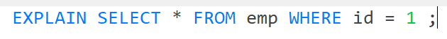
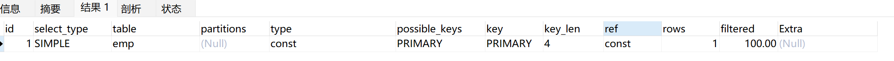

># EXPLAIN 一个SQL语句可以查询到什么？
>

>

>
> - **select_type**：SQL 查询语句的类型。例如，如果是 `SIMPLE` 表示这个 SQL 是没有子查询或者联合查询的简单查询。
> - **table**：查询的表名。
> - **partitions**：查询的表分区。通常这个字段涉及到一个被分区的表。例如，如果一张表按照日期范围被分区，那么这个查询可能只查询其中的一个区，此时 `partitions` 会展示分区的名字或者标识符。
> - **type**：查询中表的访问类型。
>   - **const**：当 `type` 是 `const` 时表示查询的时间是恒定的，数据库可以保证最多只有一行可以满足查询结果，**<u>*提供了最快的访问速度*</u>**。
>   - **ref**：当 `type` 是 `ref` 时表示使用的非唯一索引来查询，会有多行匹配这条查询，`ref` 比全表扫描快，***<u>但可能比使用唯一索引慢</u>***。
>   - **ALL**：当 `type` 是 `ALL` 表示没有使用索引，需要扫描全表，<u>***提供最慢的查询***</u>。
> - **possible_keys**：可能用于优化查询的索引。
> - **key**：实际用于查询的索引。
> - **ref**：如果 `type` 是 `ref`，这里会显示使用哪个列或常量来访问索引。
> - **rows**：估计需要检查的行数。
> - **filtered**：表示查询中某个特定步骤的条件过滤后剩余的数据比例。这个字段通常出现在使用了 `WHERE` 子句或其他条件表达式过滤数据的查询中。
> - **Extra**：一些额外的信息，可能包括是否使用了临时表、是否需要进行文件排序等。

