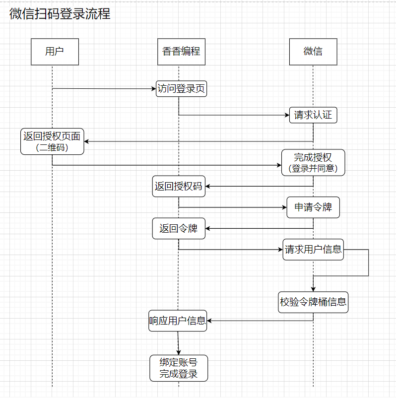

<!-- more -->

# 面试题

1. **僵尸进程**（Zombie Process）：当一个进程完成执行，但其父进程尚未调用`wait()`或`waitpid()`来获取其终止状态时，该进程就成为僵尸进程。僵尸进程不再执行任何代码，但在系统进程表中仍然存在，直到其父进程请求并处理了它的终止状态为止。
2. **孤儿进程**（Orphan Process）：当父进程提前终止或意外退出时，其子进程可能会成为孤儿进程。这些孤儿进程会被 `init` 进程（在大多数Unix系统中是PID为1的特殊进程）接管。`init` 进程会成为孤儿进程的新父进程，并负责回收它们的资源，防止它们变成僵尸进程。
3. **守护进程**（Daemon Process）：守护进程是在后台运行的系统服务进程，通常在系统启动时启动，并一直运行直到系统关闭。它们通常不与用户直接交互，而是执行系统级别的任务，如日志记录、网络服务等。
4. **饥饿进程**（Starvation Process）：饥饿进程是指因为资源分配问题而无法获得所需资源（如CPU时间、内存等）而无法继续执行的进程。饥饿可能是由于不公平的资源分配策略或竞争条件引起的。


# 

[TOC]

计网部分：

#### 1.TCP和UDP的区别

TCP和UDP是传输层常见的两种传输协议，提供一种可靠的数据传输和通信方式；

其中，TCP的特点是：面向连接，可靠的，基于字节流的

提供一种可靠的数据传输，所以一般适用于上传下载，网页请求，邮件发送等场景

UDP的特点是：无连接，不可靠的，面向报文的
提供一种快速，但相对不可靠的数据传输，所以常用在对数据实时性要求较高，对数据完整性和正确性不那么高的场景，比如音视频通话，一些实时游戏

#### 2.TCP是如何做链接管理的？

TCP在连接时使用三次握手，在断开时使用四次握手；确保连接的稳定和可靠

------

#### 3.TCP是如何保证可靠的？

通过确认应答机制以及重传机制来保证数据传输的可靠

#### 4.重传机制有哪些？

1.超时重传：已建立连接或者正在建立连接的两方，其中一方在发出数据包之后超一定时间，不返回ACK包，那么这一方就会认定出现丢包现象，重传这个数据包

2.快速重传：已建立连接或者正在建立连接的两方，其中一方在发出数据包之后，重复三次收到相同的ACK包，那么这一方就会认为数据包丢失，重传数据包；
**快速重传解决了超时重传重传周期太长的问题，但是超时重传和快速重传都具有一个问题：在一端  发送一堆数据包之后，其中某一个/几个数据包丢失时，无法精准定位是哪一个/几个，所以会选择将这个数据包之后的所有数据包全部重传一遍，容易造成资源的浪费，和网络的负担**

3.SACK：在TCP头部加一个SACK字段在每次接收完数据之后，将接收到数据的信息放到ACK包的这个字段，告知对方接收了哪些数据；<u>**这样如果出现数据丢失，发送方根据这一字段就可以精准定位这个丢失包，并且重发这个包**</u>

4.Duplicate SACK：又称`D_SACK`，用于通知发送方哪些数据被重复接收了；***让发送方知道时丢包还是网络延迟***

------

#### 5.TCP是如何保证有序的？

在发送方，当传输层使用TCP协议时，数据包在经过传输层时可能会被拆分成多个小数据包，这个时候在TCP报文段中，每段数据都会被标记上一个序列号，表示数据在数据流中的位置

在发送方接受到这些数据包的时候，会将它放到缓冲区，并根据序列号进行排序和重新组装，以确保数据的有序性

#### 6.粘包问题？

TCP时一个面向字节流的协议，所谓字节流就是一串没有边界的二进制数据

在当使用TCP协议时，在传输层，一个完整的数据包可能会被拆分成多个小的数据包，也可能多个小的数据包会被合并成一个大数据包发送，就会出现连包和拆包的问题，导致接收方无法正确解析数据边界，造成数据处理错误

**解决方法：**

1.固定数据长度：在发送数据的同时，将每个包的长度固定

2.使用特殊符号标识边界：例如在每一个完整的数据之后加一个特殊字符

3.自定义消息结构：我们可以自定义一个消息结构，由头部和消息体组成，在头部保存当前整个消息的长度

4.通过自定义协议

------

#### 7.滑动窗口

在TCP建立连接的时候，双方协商缓冲区大小，通过Window字段告知对方本端的缓冲区大小，
并在TCP连接建立之后开辟出一片缓冲区

在连接建立之后，发送端就可以跟据接收端和本端窗口大小，向对方发送相应的字节数；接收放在接收完数据之后将其放到缓冲区，等待上层应用读取，当数据被读取，相应的缓冲区就会被释放；并跟据本端剩余缓冲区大小通告对方当前能接受数据的缓冲区大小

发送方根据接收方的窗口变化，相应改变本端的窗口大小；然后发送方就可以根据接收端和本端窗口大小继续发送数据

#### 8.拥塞控制

1.慢启动：在TCP连接建立完成之后，它发送数据的能力会呈指数形式增长，每收到1次ACK，拥塞窗口加1

2.拥塞避免：当拥塞窗口超过慢启动门限，就会进入拥塞避免算法，此时他发送数据的能力呈线性增长，**每当收到一个 ACK 时，cwnd 增加 1/cwnd。**

3.拥塞发生：

- 发生超时重传的拥塞发生算法：慢启动门限变成**拥塞窗口/2**，直接将拥塞窗口降为1
- 发生快速重传的拥塞发生算法：将拥塞窗口减半，慢启动门限等于当前拥塞窗口，进入快恢复算法

4.快速恢复：

- 拥塞窗口 `cwnd = ssthresh + 3` （ 3 的意思是确认有 3 个数据包被收到了）；
- 重传丢失的数据包；
- 如果再收到重复的 ACK，那么 cwnd 增加 1；
- 如果收到新数据的 ACK 后，把 cwnd 设置为第一步中的 ssthresh 的值，原因是该 ACK 确认了新的数据，说明从 duplicated ACK 时的数据都已收到，该恢复过程已经结束，可以回到恢复之前的状态了，也即再次进入拥塞避免状态；

#### 9.TCP的三次握手和四次挥手？

##### 三次握手

###### 1.第一次握手

**首先双方都处于`closed`状态，客户端会发送一个带有`SYN`（同步序列编号）标志的TCP报文到服务器，表示客户端请求连接；并且在其中客户端还会选择一个`ISN`（初始序列号）放入`SYN`报文段中**

第一次握手之后：客户端处于`SYN_SENT`状态（同步已发送），服务器处于`LISTEN`（监听状态）

###### 2.第二次握手

**服务器同意建立连接，会回复一个带有`SYN`和`ACK`（确认号）标识的TCP报文；服务器也会选择一个初始序列号用于标识服务器到客户端的数据流**

第二次握手之后：客户端处于`SYN_SENT`状态，服务器处于`SYN-RCVD`（半连接状态）

###### 3.第三次握手

**客户端在接收服务器的带有`SYN`和`ACK`（确认号）标识的TCP报文之后，会向服务器发送一个带有`ACK`标志的确认报文段;并且这个报文字段包含客户端收到的服务端的`ISN`，以及`ACK`（表示客户端希望下一次接受的序列号）**

第三次握手之后：客户端和服务器都进入`ESTABLISHED`

三次握手的目的是**确认双方都有发送和接受的能力**

##### 四次挥手

###### 1.第一次挥手

客户端主动想要断开连接，向服务器发送一个FIN报文，之后客户端进入FIN_WAIT_1状态

###### 2.第二次挥手

服务端收到该报文，向客户端发送一个ACK报文，服务端进入CLOSE_WAIT状态，客户端接收之后进入FIN_WAIT_2状态

###### 3.第三次挥手

服务端可能还有数据需要处理和发送，等服务端不再发送数据时，发送FIN报文，之后服务端进入LAST_ACK状态

###### 4.第四次挥手

客户端向服务端发送ACK报文，服务端接收到报文之后进入CLOSE状态，而客户端则会TIME_WAIT(2MSL)之后进入CLOSE状态

**主动关闭连接的，才有 TIME_WAIT 状态。**

#### 10.time_wait状态的意义

TIME_WAIT状态标识一个连接已经完成了关闭过程，并且在等最后的确认报文

有两点作用：

第一点：

- 防止历史连接中的数据，被后面相同四元组的连接错误的接收；

第二点：

- 保证「被动关闭连接」的一方，能被正确的关闭；

如果没有time_wait状态或者time_wait时间太短，可能导致数据错乱或者连接错误

#### 11.为什么需要三次握手而不是四次，两次

#### 什么是restful风格？

RESTful 是一种针对网络应用程序设计的架构风格，它基于 HTTP 协议，强调了资源的标识、状态和操作的统一性。


#### 用户登录：

##### 1.什么是OAUTH2.0?

OAuth 2.0 是一种用于授权的开放标准协议，它允许第三方应用程序在资源所有者的许可下访问资源所有者的资源，而无需暴露资源所有者的凭据（如用户名和密码）。它通常用于提供第三方访问HTTP服务，例如社交媒体账户、在线文件存储等。OAuth 2.0 是 OAuth 协议的第二个版本，比 OAuth 1.0 简化了许多流程，增强了灵活性和安全性。

OAuth 2.0 的工作流程主要涉及以下角色：

1. **资源所有者（Resource Owner）**：即用户，拥有受保护的资源，并通过授权服务器授予客户端访问这些资源的权限
2. **客户端（Client）**：想要访问资源拥有者的资源的应用程序。它需要获得授权才能访问资源服务器上的受保护资源。
3. **授权服务器（Authorization Server）**：处理客户端的授权请求，并颁发访问令牌。授权服务器验证资源拥有者的身份并获取其授权。
4. **资源服务器（Resource Server）**：托管资源拥有者的受保护资源，并使用访问令牌来验证和处理客户端的请求。

OAuth 2.0 的基本授权流程如下：

1. **客户端请求授权**：客户端向资源所有者请求授权，通常通过用户界面引导用户进行授权。
2. **资源所有者授予授权**：资源所有者同意授权，并通过授权服务器生成授权代码（Authorization Code）。
3. **客户端获取授权代码**：客户端收到授权代码。
4. **客户端交换授权代码**：客户端将授权代码发送给授权服务器，交换访问令牌。
5. **授权服务器颁发访问令牌**：授权服务器验证授权代码并向客户端颁发访问令牌。
6. **客户端访问资源**：客户端使用访问令牌访问资源服务器上的资源。

###### a. OAuth 2.0 授权模式

OAuth 2.0 定义了多种授权模式，以满足不同的应用场景：

1. **授权码模式（Authorization Code Grant）**：最常用的模式，适用于服务器端应用，包含了授权码的获取和交换流程。
2. **简化模式（Implicit Grant）**：主要用于浏览器中的单页应用，省略了授权码的交换步骤，直接获取访问令牌。
3. **密码模式（Resource Owner Password Credentials Grant）**：用户直接向客户端提供用户名和密码，适用于信任级别较高的应用。
4. **客户端凭证模式（Client Credentials Grant）**：客户端以自身身份获取访问令牌，用于访问自身资源或服务端间的交互。

##### 2.用户扫码是如何实现的

这边以微信登陆为例：

1. 首先用户点击微信登陆，第三方网站或应用程序生成一个用于登录的二维码，并将其展示给用户。
2. 用户使用微信扫描该二维码。
3. 微信客户端将请求发送到微信服务器，并请求用户授权该第三方应用程序访问其个人信息。
4. 用户在微信客户端上看到授权请求，可以选择允许或拒绝。
5. 如果用户同意授权，微信服务器带着授权码回调到回调地址上，然后第三方网站或应用程序带着这个授权码向微信服务器请求令牌
6. 微信服务器在校验授权码有效性之后，将向第三方应用程序颁发一个访问令牌（Access Token），该令牌用于代表用户访问其个人信息。
7. 第三方应用程序可以使用此访问令牌来获取用户的个人信息，例如昵称、头像等。用户在第三方应用程序中进行操作，第三方应用程序使用访问令牌向微信服务器请求用户的个人信息。



##### 3. 如果要实现不同域名下的cookie正常使用，应该怎么处理？

1. **设置 Cookie 的域名属性：** 当设置 Cookie 时，可以通过指定域名属性来确保 Cookie 在不同子域名之间共享。例如，如果你希望 Cookie 在`example.com`和`subdomain.example.com`之间共享，则可以设置 Cookie 的域名属性为`.example.com`（注意前面的点号），这样 Cookie 就可以在所有以`example.com`为结尾的子域名下共享。

```javascript
document.cookie = "name=value; domain=.example.com; path=/";
```

2. **设置跨域资源共享（CORS）：** 如果是通过 AJAX 或 Fetch 发起的跨域请求，需要在服务器端设置适当的 CORS 头来允许跨域请求。服务器响应中应包含 `Access-Control-Allow-Origin` 头，并设置为允许访问的域名。例如：

```javascript
Access-Control-Allow-Origin: https://example.com
```

3. **使用代理：** 如果跨域请求不能通过上述方法解决，可以考虑在服务器端设置代理，即在同一域名下创建一个中间层，由该中间层代理请求到其他域名，然后再将结果返回给客户端。这种方法可以绕过浏览器的同源策略限制。

   

3. **设置 Cookie 的路径**：确保路径参数设置为 Cookie 所在的路径。通常，将路径设置为根路径 `/` 是最简单和最通用的方法，使得 Cookie 在整个网站的所有页面中可用。

```javascript
document.cookie = "name=value; domain=.example.com; path=/";
```

##### 4.假如1亿用户体量，如何设计一个登录验签服务？

设计一个支持 1 亿用户体量的登录验签服务需要考虑到高可用性、安全性和性能等因素。以下是一个可能的设计方案：

1. **负载均衡**：使用负载均衡技术将流量分发到多个服务器上，以确保服务的高可用性和可扩展性。可以考虑使用负载均衡器如 Nginx 或 AWS ELB。

2. **分布式架构**：采用分布式架构，将用户数据和登录状态分布在多个服务器上，以应对大规模用户的访问。可以使用分布式数据库（如MySQL Cluster、Cassandra等）或 NoSQL 数据库（如MongoDB、Redis等）来存储用户数据和登录状态。

3. **安全性**：
   - 使用 HTTPS 协议进行通信，以保障数据的安全传输。
   - 对用户密码进行加密存储，推荐使用哈希函数加盐存储用户密码，如 bcrypt。
   - 使用 JWT（JSON Web Token）或类似的令牌机制来生成并验证用户身份，避免在服务端存储用户的敏感信息。
   - 实施防火墙、DDoS 防护和安全审计等安全措施，保护系统免受恶意攻击。

4. **高性能**：
   - 使用缓存技术加速登录验签过程，例如，将经常访问的用户信息存储在缓存中，减少数据库访问次数。
   - 使用异步处理技术，如消息队列，将请求分发给多个工作节点并行处理，提高系统的响应速度和吞吐量。
   - 对数据库进行优化，如索引、分片等，以提高查询性能和扩展性。

5. **监控和日志**：建立完善的监控系统，实时监控系统运行状态、性能指标和异常情况，并及时进行预警和处理。同时，记录日志以便追踪和排查问题。

6. **容灾备份**：定期进行数据备份，并建立容灾备份系统，以防止数据丢失和系统故障导致的服务中断。

7. **合理的访问限制**：实施合理的访问限制策略，如限制登录失败次数、IP 访问频率等，以防止暴力破解和恶意攻击。

8. **持续优化**：定期进行性能测试和优化，不断改进系统架构和代码实现，以适应不断增长的用户体量和变化的需求。
