<!-- more -->

# 内存管理

## 1. 虚拟内存

### 问题背景

单片机没有操作系统，每次都是直接操作内存的物理地址。这种情况下，无法同时运行两个程序。操作系统通过为每个进程分配**虚拟内存地址**来解决这个问题。

**操作系统会提供一种机制，将不同进程的虚拟地址和不同内存的物理地址映射起来**

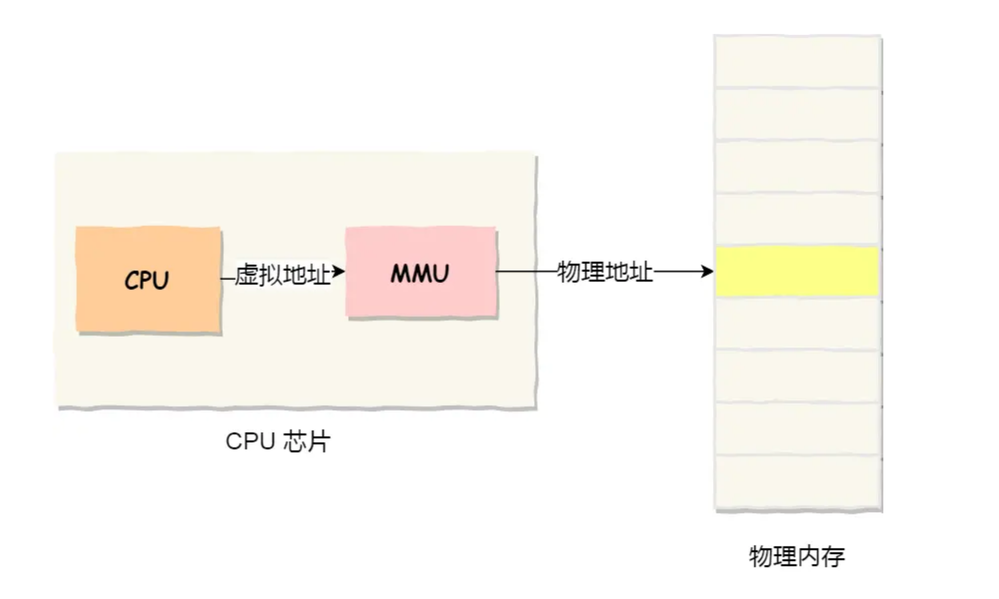

### 基本概念

- **虚拟内存地址**（Virtual Memory Address）：程序使用的内存地址。
- **物理内存地址**（Physical Memory Address）：实际存在于硬件中的内存地址。

操作系统通过**内存分段**和**内存分页**来控制虚拟内存和物理内存地址的映射。

### 1.1 内存分段

程序是由若干个逻辑分段组成的，如可由代码分段、数据分段、栈段、堆段组成。**不同的段是有不同的属性的，所以就用分段（*Segmentation*）的形式把这些段分离出来。**

虚拟地址由两部分组成：**段选择因子**和**段内偏移量**。

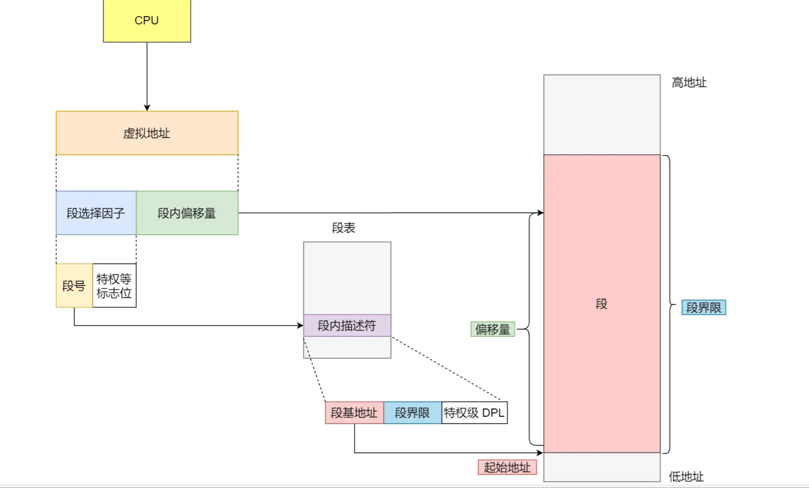

- **段选择子**保存在段寄存器里，包含**段号**，用于段表的索引。段表包含段的基地址、段的界限和特权等级等。
- **段内偏移量**在0和段界限之间。如果段内偏移量合法，段基地址加上段内偏移量得到物理内存地址。

每个段在段表中有一个项，在这一项找到段的基地址，再加上偏移量，于是就能找到物理内存中的地址，如下图：

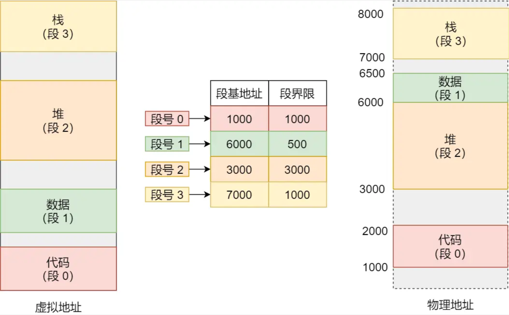

例如，访问段3中偏移量500的虚拟地址，计算物理地址为段3基地址7000 + 偏移量500 = 7500。

#### 内存碎片

什么是内存碎片：

> 我们来看看这样一个例子。假设有 1G 的物理内存，用户执行了多个程序，其中：
>
> - 游戏占用了 512MB 内存
> - 浏览器占用了 128MB 内存
> - 音乐占用了 256 MB 内存。
>
> 这个时候，如果我们关闭了浏览器，则空闲内存还有 1024 - 512 - 256 = 256MB。
>
> 如果这个 256MB 不是连续的，被分成了两段 128 MB 内存，这就会导致没有空间再打开一个 200MB 的程序。
>
> 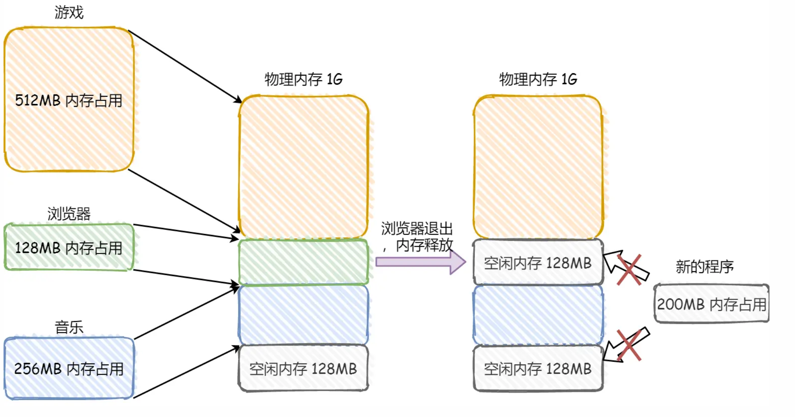

- **内部内存碎片**：分段管理能根据需求分配内存，不会出现。
- **外部内存碎片**：由于段长度不固定，多个段未必能恰好使用所有内存空间，导致不连续的小物理内存，无法装载新程序。

**解决方法：内存交换**

通过把内存写到硬盘上，然后重新加载到紧跟已占用内存后面，空缺出连续的空间。例如在Linux系统中，Swap空间用于内存与硬盘的交换。

#### 内存交换效率低

分段方式容易产生外部内存碎片，导致重新Swap内存区域，性能下降。硬盘访问速度比内存慢很多，每次内存交换都需把大段连续内存数据写到硬盘。

为解决分段的外部内存碎片和低效问题，出现了内存分页。

### 1.2 内存分页

分页把整个虚拟和物理内存空间切成固定大小的段，称为**页**（Page），在Linux下每页大小为4KB。

虚拟地址与物理地址之间通过**页表**来映射，页表是存储在内存里的，**内存管理单元** （*MMU*）就做将虚拟内存地址转换成物理地址的工作。

而当进程访问的虚拟地址在页表中查不到时，系统会产生一个**缺页异常**，进入系统内核空间分配物理内存、更新进程页表，最后再返回用户空间，恢复进程的运行。

虚拟地址分为**页号**和**页内偏移**。页号作为页表的索引，页表包含物理页所在物理内存的基地址。基地址与页内偏移组合形成物理内存地址。

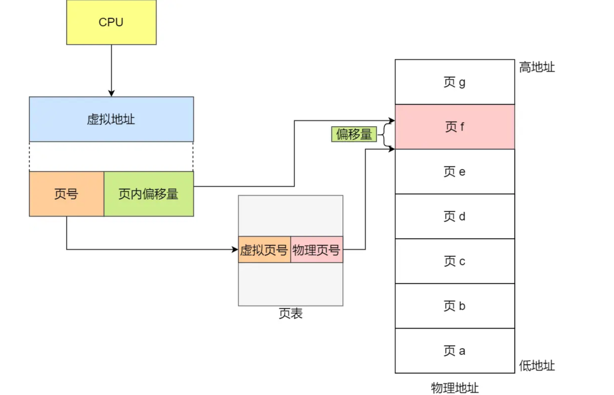

总结：内存地址转换的三个步骤：

1. 虚拟内存地址切分成页号和偏移量。
2. 根据页号，从页表查询对应的物理页号。
3. 物理页号加上偏移量，得到物理内存地址。

分页解决了内存碎片问题，但由于最小分配单位是一页，页内会出现内存浪费，即**内部内存碎片**。

如果内存空间不足，操作系统会释放其他进程中最近未使用的内存页面（Swap Out），并在需要时再加载进来（Swap In）。每次交换只需少数页，效率较高。

分页使得程序不需一次性加载到物理内存，按需加载页到物理内存。

#### 简单分页（有缺陷）

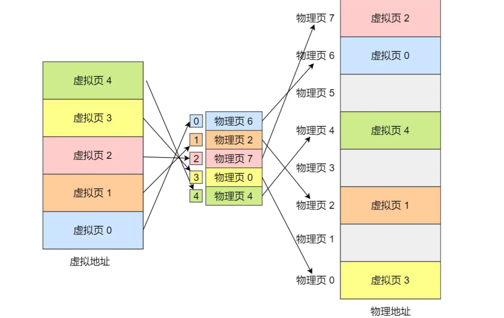

简单分页的缺陷：有空间上的缺陷。

在 32 位的环境下，虚拟地址空间共有 4GB，假设一个页的大小是 4KB（2^12），那么就需要大约 100 万 （2^20） 个页，每个「页表项」需要 4 个字节大小来存储，那么整个 4GB 空间的映射就需要有 `4MB` 的内存来存储页表。

但是每个进程都是有自己的虚拟地址空间的，`100` 个进程的话，就需要 `400MB` 的内存来存储页表位的环境了。

#### 多级页表

单级页表在32位和4KB页大小环境下，一个进程的页表需装下约100万个「页表项」，每项占用4字节，页表需4MB空间。多个进程需大量内存存储页表。

**解决方法：二级分页**

把单级页表再分页，形成二级分页。一级页表分为1024个页表（每个包含1024个「页表项」），如图：

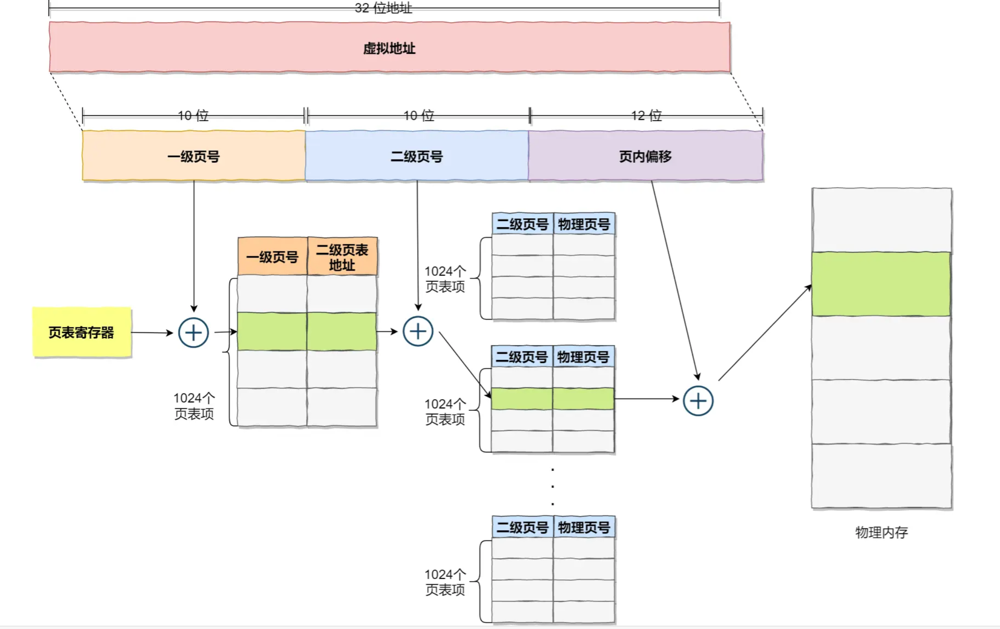

一级页表覆盖整个4GB虚拟地址空间，但只在需要时创建二级页表。假设20%一级页表项被用到，占用内存仅为4KB（一级页表）+ 20% * 4MB（二级页表）= 0.804MB。

多级页表推广到64位系统，形成四级目录：

- 全局页目录项 PGD（Page Global Directory）
- 上层页目录项 PUD（Page Upper Directory）
- 中间页目录项 PMD（Page Middle Directory）
- 页表项 PTE（Page Table Entry）

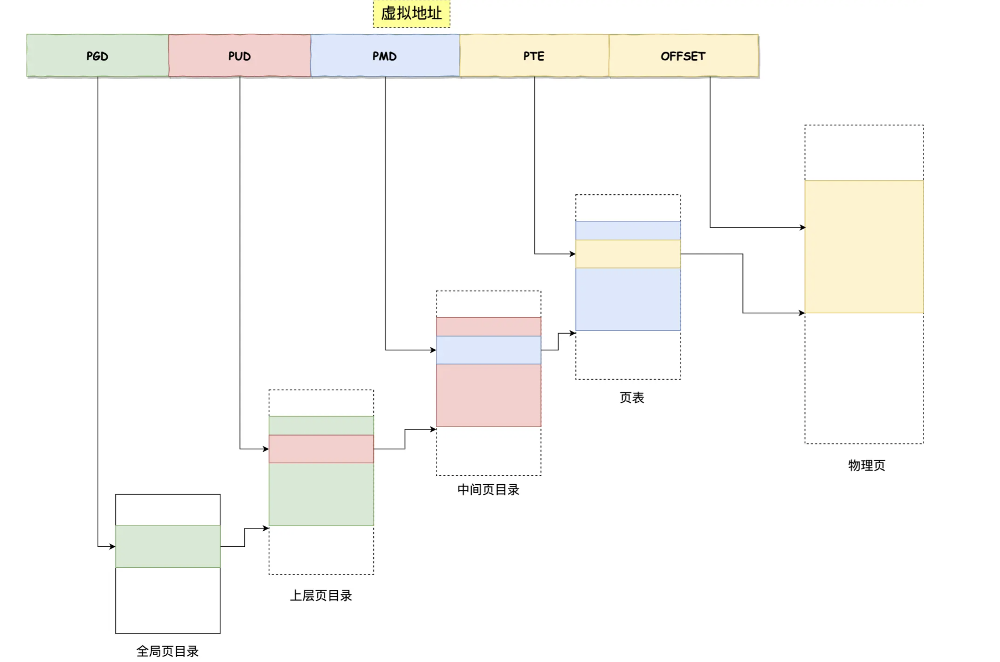

#### TLB

多级页表增加地址转换工序，降低速度。程序有局部性，一段时间内执行局限于某部分。为加快速度，CPU加入了**转址旁路缓存**（Translation Lookaside Buffer, TLB），存放最常访问的页表项。

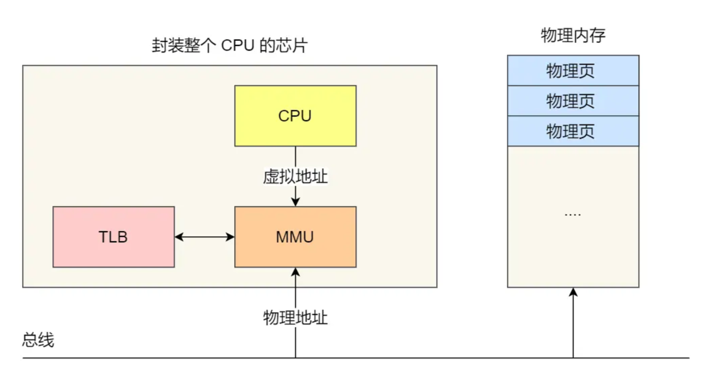

TLB在CPU内，访问快，命中率高。CPU在寻址时先查TLB，未找到再查常规页表。

### 1.3 段页式内存管理

结合内存分段和分页，形成**段页式内存管理**。

- 先将程序划分为多个逻辑段。
- 再把每个段划分为多个页。

地址结构由**段号、段内页号和页内位移**组成。段表每个段有一个页表，页表中地址为物理页号，物理页号加页内位移得到物理地址。

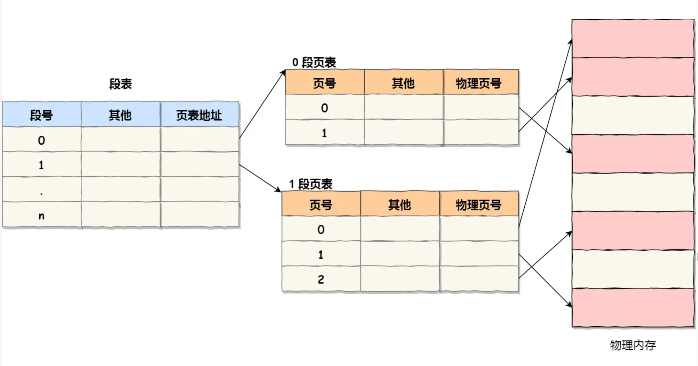

段页式地址变换需三次内存访问：

1. 访问段表，得到页表起始地址。
2. 访问页表，得到物理页号。
3. 物理页号加页内位移，得到物理地址。

段页式地址变换通过软硬件结合，提高内存利用率。

### Linux内存布局

早期Intel 80386处理器设计页式内存管理时，没有绕开段式内存管理。页式内存管理在段式内存管理基础上再加一层地址映射。段式内存管理先将逻辑地址映射成线性地址，再由页式内存管理将线性地址映射成物理地址。

- **逻辑地址**：程序使用的地址，未映射。
- **线性地址**：通过段式内存管理映射的地址，也叫虚拟地址。

**Linux主要采用页式内存管理，同时涉及段机制**。每个段从0地址开始整个4GB虚拟空间，所有段起始地址相同，相当于屏蔽了逻辑地址概念，段用于访问控制和内存保护。

Linux虚拟地址空间分为**内核空间**和**用户空间**，不同位数系统地址空间范围不同。

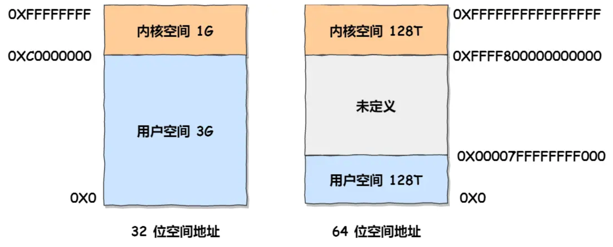

#### 内核空间与用户空间的区别

- 用户态进程只能访问用户空间内存。
- 进入内核态后，才可访问内核空间内存。

每个进程有独立虚拟内存，但每个虚拟内存中的内核地址关联相同物理内存。进程切换到内核态后，可方便访问内核空间内存。

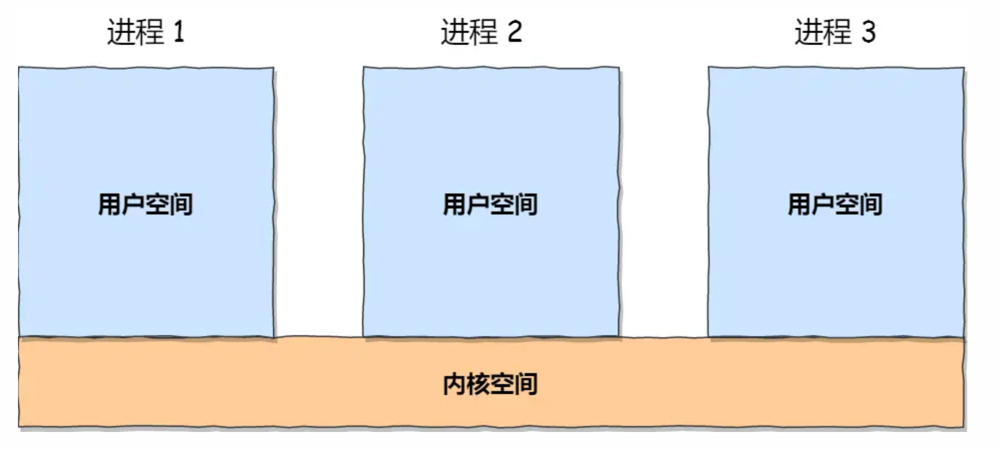

32位系统用户空间内存布局：

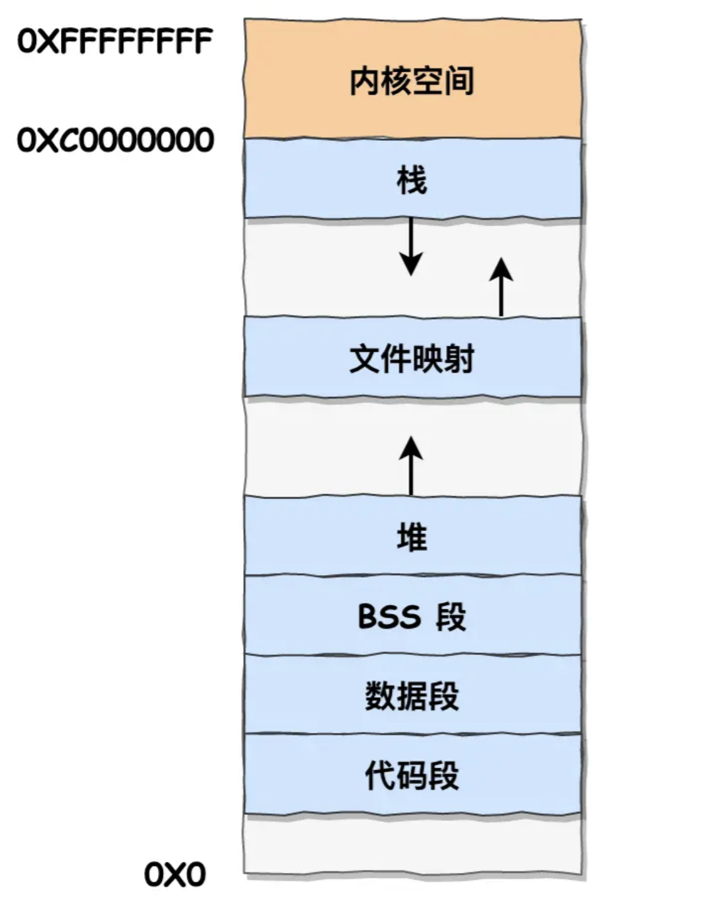

- **代码段**：二进制可执行代码。
- **数据段**：已初始化静态常量和全局变量。
- **BSS段**：未初始化静态变量和全局变量。
- **堆段**：动态分配内存，从低地址向上增长。
- **文件映射段**：动态库、共享内存等，从低地址向上增长。
- **栈段**：局部变量和函数调用上下文，从高地址向下增长，固定大小（一般为8MB）。

代码段下有一段**保留区**，防止程序bug导致非法内存访问。

堆和文件映射段内存可动态分配，如使用C标准库的`malloc()`或`mmap()`。

### 虚拟内存的作用

#### 虚拟内存的功能

- **程序大小大于物理内存**：程序不需一次性装入物理内存，动态分配内存页，按需加载页到物理内存。
- **内存保护**：虚拟内存控制每个进程能访问的内存范围，防止非法内存访问。
- **内存共享**：多个进程共享相同虚拟内存页面，节省内存。

#### 虚拟内存管理器

虚拟内存的功能由**虚拟内存管理器**（Virtual Memory Manager, VMM）实现，功能包括内存分配、内存回收、地址映射等。

**总结**

虚拟内存是计算机系统重要技术，通过分段和分页机制，提高内存利用率，保证程序安全性，提升系统性能。理解虚拟内存有助于优化程序性能和系统资源管理。