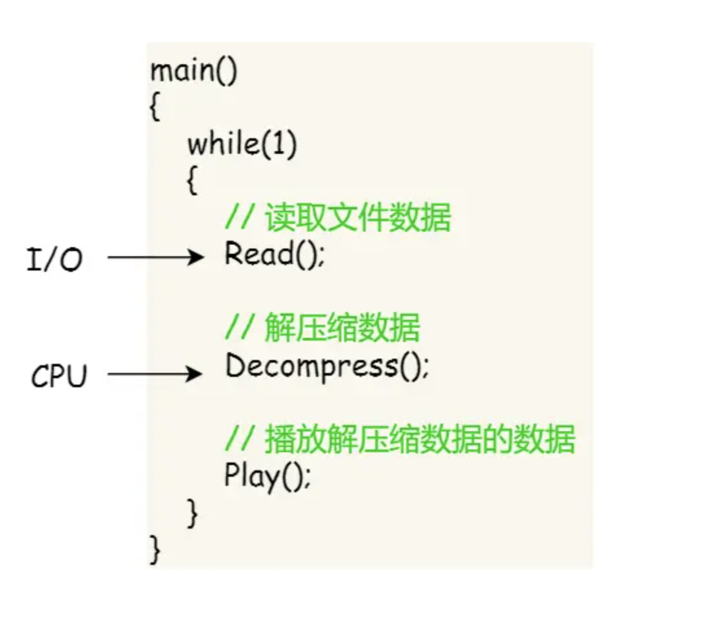
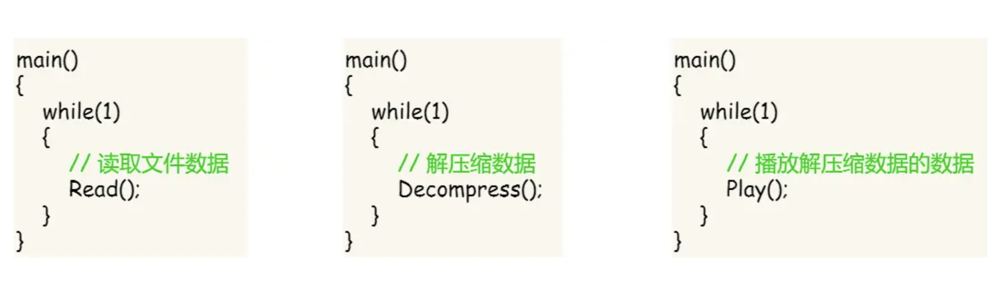
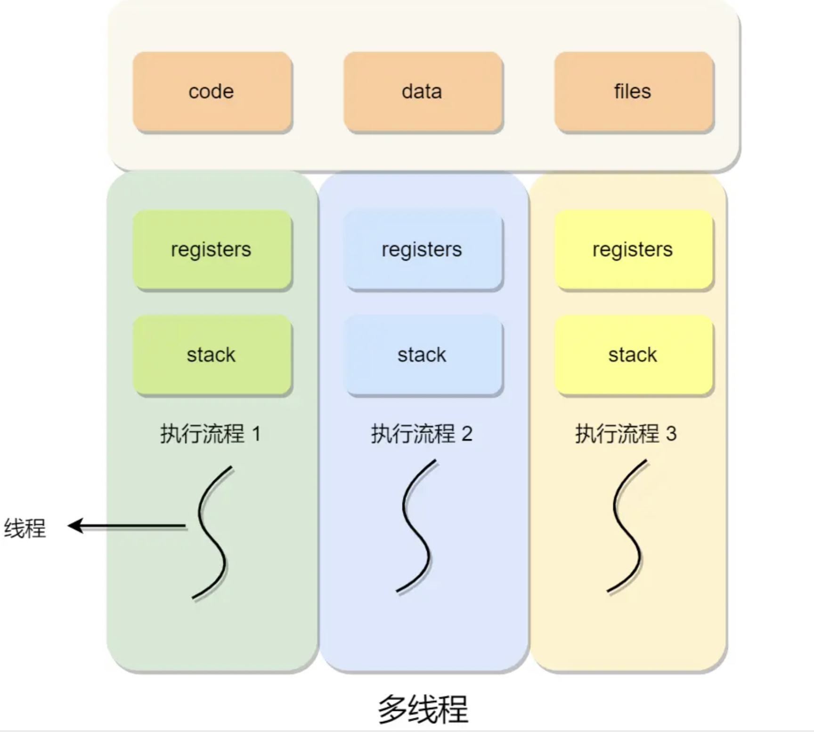

<!-- more -->

# 线程管理

在早期的操作系统中，进程是被视为独立运行的基本单位，但后来，随着计算机科学的发展，人们提出了更小的能够独立运行的基本单位——线程。

### 线程的优势

为什么要使用线程呢？我们来看一个例子：假设你正在编写一个视频播放器软件，其核心功能有三个部分：

- 从视频文件中读取数据
- 对读取的数据进行解压缩
- 播放解压缩后的视频数据

在单进程的情况下，这些操作可能会按照以下方式进行：

然而，单进程方式存在一些问题：

- 视频播放可能不连贯，因为等待硬盘数据时 CPU 会处于空闲状态，导致播放中断。
- 各功能模块之间无法并发执行，影响资源利用效率。

对此，多进程方式看似解决了这些问题：

但多进程方式也存在新的问题：

- 进程间通信与资源共享困难，需要复杂的机制。
- 进程管理的系统开销较大，如创建/销毁进程，进程切换等。

这时就需要一个新的实体，既能并发执行，又能共享相同的资源。这就是线程。

### 理解线程

线程是进程内的一条执行流程。在同一个进程中，多个线程共享代码段、数据段等资源，但各自拥有独立的栈和寄存器，确保控制流的独立性。

线程的优点在于：

- 进程内可同时存在多个线程，实现并发执行。
- 各线程之间可以共享地址空间和资源。

但也存在一些缺点：

- 线程崩溃可能导致整个进程崩溃（部分语言除外）。
- 多线程执行时，每个线程获得的时间片较少，执行效率可能降低。

### 线程与进程的比较

线程与进程的比较如下：

- 进程是资源分配的基本单位，线程是CPU调度的基本单位。
- 进程拥有完整的资源平台，而线程共享进程的资源。
- 线程同样具有就绪、阻塞、执行三种基本状态和状态间的转换。
- 线程的上下文切换开销较小，因为线程共享相同的地址空间。

### 线程的上下文切换
线程与进程最大的区别在于：**线程是调度的基本单位，而进程则是资源拥有的基本单位**。

- 当进程只有一个线程时，可以认为进程就等于线程；
- 当进程拥有多个线程时，这些线程会共享相同的虚拟内存和全局变量等资源，这些资源在上下文切换时是不需要修改的；
          1.  当两个线程不是属于同一个进程，则切换的过程就跟进程上下文切换一样；
          2.  **当两个线程是属于同一个进程，因为虚拟内存是共享的，所以在切换时，虚拟内存这些资源就保持不动，只需要切换线程的私有数据、寄存器等不共享的数据**；

所以，线程的上下文切换相比进程，开销要小很多。

### 线程的实现方式

主要有三种线程的实现方式：

- 用户线程：在用户空间实现的线程，由用户级线程库完成管理。
- 内核线程：在内核中实现的线程，由内核管理。
- 轻量级进程：在内核中支持用户线程的线程。

线程与进程的对应关系包括：

- 多对一：多个用户线程对应一个内核线程，适用于用户线程管理模型。
- 一对一：一个用户线程对应一个内核线程，适用于内核线程管理模型。
- 多对多：多个用户线程对应多个内核线程，适用于轻量级进程模型。

### 线程的优劣势

不同线程管理模型有各自的优劣势：

用户线程模型优点

- 在于快速创建和切换
  
用户线程的**缺点**：

- 如果一个线程发起了系统调用而阻塞，那进程所包含的用户线程都不能执行了。
- 当一个线程开始运行后，除非它主动地交出 CPU 的使用权，否则它所在的进程当中的其他线程无法运行，因为用户态的线程没法打断当前运行中的线程，它没有这个特权，只有操作系统才有，但是用户线程不是由操作系统管理的。
- 由于时间片分配给进程，故与其他进程比，在多线程执行时，每个线程得到的时间片较少，执行会比较慢；

内核线程的**优点**：

- 在一个进程当中，如果某个内核线程发起系统调用而被阻塞，并不会影响其他内核线程的运行；
- 分配给线程，多线程的进程获得更多的 CPU 运行时间；

内核线程的**缺点**：

- 在支持内核线程的操作系统中，由内核来维护进程和线程的上下文信息，如 PCB 和 TCB；
- 线程的创建、终止和切换都是通过系统调用的方式来进行，因此对于系统来说，系统开销比较大；
  
轻量级进程模型综合了前两者的优点，但需要内核和用户空间的配合。

不同应用场景可能适合不同的线程管理模型，根据具体需求选择合适的模型。