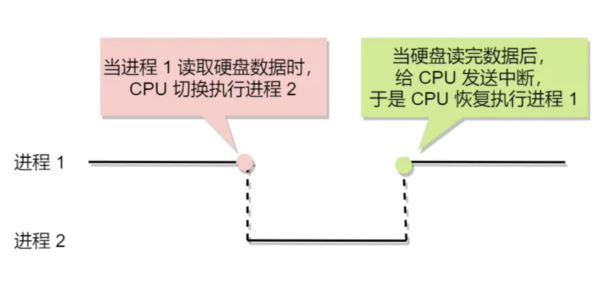
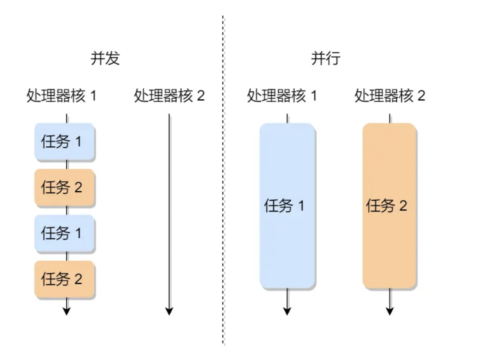
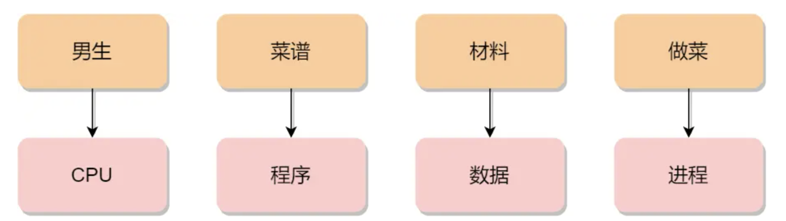

<!-- more -->

# 进程管理

当我们编写的代码被编译后，生成了一个二进制可执行文件。当我们运行这个可执行文件时，操作系统会将其装载到内存中，CPU 会执行程序中的每一条指令。这个正在运行的程序被称为「进程」（Process）。

假设有一个程序需要读取硬盘文件的数据。在运行到读取文件的指令时，程序会去硬盘读取数据。但是硬盘的读写速度很慢，如果 CPU 傻等硬盘返回数据，CPU 的利用率就会很低。

我们可以做个类比：当你煮水时，你会傻等水壶烧开吗？显然不会。我们可以在等待的同时做其他事情。当水烧开了，我们会听到「嘀嘀嘀」的声音，然后再倒水。

因此，当进程需要从硬盘读取数据时，CPU 不必阻塞等待数据返回，而是可以执行其他进程。当硬盘数据返回时，CPU 会收到一个中断信号，然后继续执行该进程。

在支持多进程的系统中，CPU 会快速地在多个进程之间切换，每个进程可能运行几十或几百毫秒。尽管单核 CPU 在某一时刻只能执行一个进程，但在一秒钟内，它可能会执行多个进程，这给人一种并行的错觉，实际上这是并发。

那么，并发和并行有什么区别呢？

**并发**是指系统同时处理多个任务，这些任务可能在同一时间段内交替执行，但在任意时刻只有一个任务在 CPU 上执行。

**并行**是指系统同时执行多个任务，这些任务在同一时刻真正地同时在多个处理单元（如多核 CPU）上执行。

让我们用一个类比来理解进程与程序的关系：

想象一对小情侣在晚饭时间肚子都饿了，于是男生决定给女生做晚饭。他找到了辣子鸡的菜谱，并购买了所需材料，然后开始准备食材并烹饪这道菜。

突然，女生说她想喝可乐。男生暂停了做菜的工作，并在菜谱上记录了当前进度。他离开厨房去买可乐，然后返回继续做菜。

这个情景展示了 CPU 在不同进程间切换的过程。当从一个进程（做菜）切换到另一个进程（买可乐）时，需要记录当前进程的状态，以便在切换回来时能够恢复执行。因此，进程展现了一种“运行-暂停-运行”的活动规律。

## 进程的状态：

进程的状态变迁是系统中重要的概念，它包括了进程在不同阶段的状态和相互转换的规则。让我们详细了解进程的各种状态：

1. **创建状态（new）**：当一个新进程被创建时，它处于创建状态。
2. **就绪状态（Ready）**：进程被创建完成并初始化后，准备好运行时，它进入就绪状态。在就绪状态下的进程已经准备好运行，只等待 CPU 的分配。
3. **运行状态（Running）**：当操作系统的进程调度器选中就绪状态的进程并将其分配给 CPU 时，该进程进入运行状态，占用 CPU 执行其任务。
4. **结束状态（Exit）**：当进程执行完成或出现错误时，进程会被标记为结束状态，从系统中消失。
5. **阻塞状态（Blocked）**：当进程请求某个事件且必须等待时，例如等待 I/O 操作完成时，进程进入阻塞状态，暂时停止运行。在阻塞状态下，即使 CPU 可用，该进程也无法执行。
6. **挂起状态**：挂起状态描述了进程没有占用实际的物理内存空间的情况。它可以分为两种：
   - **阻塞挂起状态**：进程在外存（硬盘）并等待某个事件的出现。
   - **就绪挂起状态**：进程在外存（硬盘），但只要进入内存，即刻立刻运行。

除了上述基本状态外，还有一种额外状态：

7. **睡眠状态**：有时，进程需要暂时挂起自己的执行，等待某些条件的发生，例如通过 `sleep` 命令或用户手动暂停进程。在睡眠状态下，进程不会占用 CPU 时间。

进程状态的转换包括：

- 从创建状态转换到就绪状态是快速的，即刻完成初始化后即可进入就绪状态。
- 从就绪状态到运行状态是由操作系统的进程调度器决定的，它选中就绪状态的进程并将其分配给 CPU。
- 从运行状态到结束状态是由进程的执行情况决定的，可能是任务完成、出错等原因。
- 从运行状态到就绪状态，可能是因为进程的时间片用完，需要让其他进程运行。
- 从运行状态到阻塞状态是因为进程需要等待某些事件的发生，例如等待 I/O 操作完成。
- 从阻塞状态到就绪状态是当进程等待的事件完成时，可以继续运行。
- 进程还可以从挂起状态转换到其他状态，这取决于进程何时重新分配内存资源。

了解进程状态和状态转换有助于理解操作系统中的进程管理和调度机制，从而更好地优化系统性能和资源利用率。

## 进程的控制结构：

PCB（Process Control Block）是操作系统中描述进程状态和管理进程所需信息的数据结构。它包含了进程在系统中存在的所有信息，是进程存在的唯一标识。PCB 的内容相当丰富，主要包括以下几个方面的信息：

1. 进程描述信息：
   - 进程标识符：用于标识和区分各个进程，每个进程都有一个唯一的标识符。
   - 用户标识符：指明进程归属的用户，用于资源的共享和保护。

2. 进程控制和管理信息：
   - 进程当前状态：描述进程当前所处的状态，如 new、ready、running、waiting 或 blocked 等。
   - 进程优先级：用于确定进程抢占 CPU 资源的优先级。

3. 资源分配清单：
   - 内存地址空间或虚拟地址空间的信息。
   - 所打开文件的列表和所使用的 I/O 设备信息。

4. CPU 相关信息：
   - CPU 中各个寄存器的值：当进程被切换时，CPU 的状态信息会被保存在 PCB 中，以便进程重新执行时能够从断点处继续执行。

PCB 通常通过链表的方式进行组织，将具有相同状态的进程链在一起，形成各种队列。

例如：

- 将所有处于就绪状态的进程链在一起，称为**就绪队列**；
- 把所有因等待某事件而处于等待状态的进程链在一起就组成各种**阻塞队列**；
- 另外，对于运行队列在单核 CPU 系统中则只有一个运行指针了，因为单核 CPU 在某个时间，只能运行一个程序。

除了链接的组织方式，还有索引方式，它的工作原理：将同一状态的进程组织在一个索引表中，索引表项指向相应的 PCB，不同状态对应不同的索引表。

一般会选择链表，因为可能面临进程创建，销毁等调度导致进程状态发生变化，所以链表能够更加灵活的插入和删除

## 进程的控制

主要包括进程的创建、终止、阻塞和唤醒等过程：

1. 创建进程：操作系统允许一个进程创建另一个进程，并允许子进程继承父进程的资源。创建进程的过程包括申请一个空白的 PCB、为进程分配所需资源，然后将 PCB 插入就绪队列等待调度。

2. 终止进程：进程可以有 3 种终止方式：正常结束、异常结束以及外界干预（信号 `kill` 掉）。

   当子进程被终止时，其在父进程处继承的资源应当还给父进程。而当父进程被终止时，该父进程的子进程就变为孤儿进程，会被 1 号进程收养，并由 1 号进程对它们完成状态收集工作。

   终止进程的过程如下：

   - 查找需要终止的进程的 PCB；
   - 如果处于执行状态，则立即终止该进程的执行，然后将 CPU 资源分配给其他进程；
   - 如果其还有子进程，则应将该进程的子进程交给 1 号进程接管；
   - 将该进程所拥有的全部资源都归还给操作系统；
   - 将其从 PCB 所在队列中删除；

3. 阻塞进程：当进程需要等待某一事件完成时，可以调用阻塞语句将自己阻塞等待。阻塞进程的过程包括找到需要阻塞的进程的 PCB，将其状态转为阻塞状态，并将其插入到阻塞队列中。

4. 唤醒进程：处于阻塞状态的进程是无法自行唤醒的，需要由其他进程唤醒。唤醒进程的过程包括找到需要唤醒的进程的 PCB，并将其从阻塞队列中移出，将其状态置为就绪状态，然后将其插入到就绪队列中等待调度。

这些进程控制的操作是操作系统中的重要功能，能够有效地管理和调度进程，保证系统资源的合理利用和进程的正常运行。

## 进程的上下文切换
进程的上下文切换是指将 CPU 从一个进程切换到另一个进程运行时，所涉及到的上下文环境的保存和恢复过程。在详细讨论进程上下文切换之前，让我们先了解一下 CPU 上下文切换。

在多任务操作系统中，CPU 上下文切换是指在多个任务之间切换时，保存当前任务的 CPU 上下文，并加载下一个任务的 CPU 上下文的过程。CPU 上下文包括 CPU 寄存器和程序计数器的状态，它们记录了当前任务的执行状态和位置。

CPU 寄存器是位于 CPU 内部的高速存储器，用于存储当前执行指令和处理数据所需的相关信息。程序计数器则用于存储正在执行的指令位置或即将执行的下一条指令位置。这些寄存器和计数器构成了 CPU 的上下文环境，在每次任务切换时需要保存和恢复。

CPU 上下文切换的过程如下：

保存当前任务的 CPU 上下文信息，包括 CPU 寄存器和程序计数器的值。
加载下一个任务的 CPU 上下文信息到相应的寄存器和程序计数器中。
跳转到下一个任务的执行位置，开始执行下一个任务。
系统内核负责管理和调度这些上下文信息，以确保任务的连续性和一致性。通过保存和恢复 CPU 上下文，可以保证任务在被重新分配给 CPU 运行时能够继续执行，而不会受到影响。

上述内容介绍了 CPU 上下文切换的基本概念和过程。在进程上下文切换中，除了保存和恢复 CPU 上下文外，还涉及到进程的其他资源，例如虚拟内存、栈、全局变量等用户空间的资源，以及内核堆栈、寄存器等内核空间的资源。进程的上下文切换通常通过进程控制块（PCB）来实现，PCB 中保存了进程的相关信息，包括 CPU 上下文、内存分配情况等。

发生进程上下文切换的常见场景包括：时间片耗尽导致任务切换、系统资源不足时等待资源导致任务挂起、任务主动挂起等。理解这些场景有助于我们更好地理解进程的上下文切换机制。
