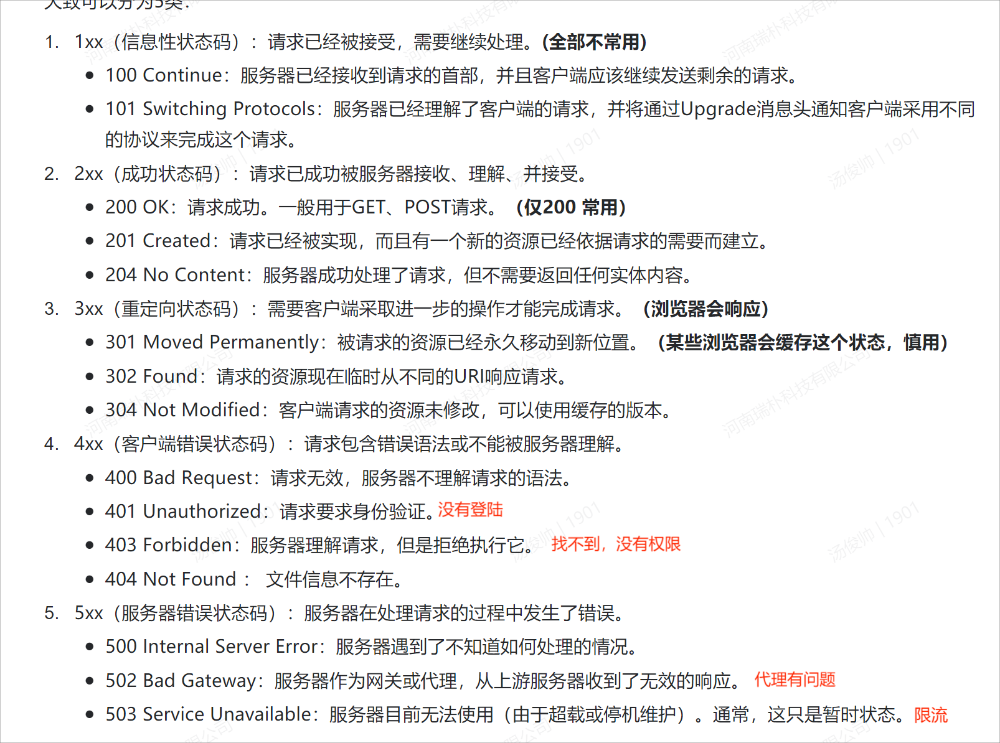

<!-- more -->

## HTTP基本概念

### HTTP是什么？

HTTP 是超文本传输协议，也就是**H**yperText **T**ransfer **P**rotocol。
HTTP 是一个用在计算机世界里的**协议**。它使用计算机能够理解的语言确立了一种计算机之间交流通信的规范（**两个以上的参与者**），以及相关的各种控制和错误处理方式（**行为约定和规范**）。
HTTP 协议是一个**双向协议**。
**HTTP 是一个在计算机世界里专门在「两点」之间「传输」文字、图片、音频、视频等「超文本」数据的「约定和规范」**

### HTTP常见的状态码：

### HTTP常见字段有哪些：

***Host* 字段**

客户端发送请求时，用来指定服务器的域名。

***Content-Length 字段***

服务器在返回数据时，会有 `Content-Length` 字段，表明本次回应的数据长度。

**HTTP 协议通过设置回车符、换行符作为 HTTP header 的边界，通过 Content-Length 字段作为 HTTP body 的边界，这两个方式都是为了解决“粘包”的问题**。

***Connection 字段***

`Connection` 字段最常用于客户端**要求服务器使用「HTTP 长连接」机制**，以便其他请求复用。HTTP 长连接的特点是，只要任意一端没有明确提出断开连接，则**保持 TCP 连接状态。**

***Content-Type 字段***

`Content-Type` 字段用于服务器回应时，告诉客户端，本次数据是什么格式。

***Content-Encoding 字段***

`Content-Encoding` 字段说明数据的压缩方法。表示服务器返回的数据使用了什么压缩格式

## GET与POST请求:

### GET与POST的区别:

GET：**从服务器获取指定的资源**
GET请求的参数都是在URL，URL 规定只能支持 ASCII，浏览器会对URL的长度进行限制

POST：**根据请求负荷（报文body）对指定的资源做出处理**

### GET和POST的方法都是安全和幂等的吗？

安全：请求方法不会破坏服务器上的资源

幂等：多次执行相同的操作，结构都是相同的

**GET 的语义是请求获取指定的资源。GET 方法是安全、幂等、浏览器上可被缓存的。**

**POST 的语义是根据请求负荷（报文主体）对指定的资源做出处理，具体的处理方式视资源类型而不同。POST 不安全，不幂等，（大部分实现）不可缓存。**

## HTTP缓存技术

**强制缓存和协商缓存**

### 强缓存：

**指的是只要浏览器判断缓存没有过期**，则直接使用浏览器的**本地**缓存，决定是否使用缓存的**主动**性在于**浏览器**这边。

强缓存是利用下面这两个 HTTP 响应头部（Response Header）字段实现的，它们都用来表示资源在客户端缓存的有效期：

- `Cache-Control`， 是一个相对时间；
- `Expires`，是一个绝对时间；

**Cache-Control 的优先级高于 Expires** 

Cache-control 选项更多一些，设置更加精细，所以建议使用 Cache-Control 来实现强缓存。具体的实现流程如下：

- 当浏览器第一次请求访问服务器资源时，服务器会在返回这个资源的同时，在 Response 头部加上 Cache-Control，Cache-Control 中设置了过期时间大小；
- 浏览器再次请求访问服务器中的该资源时，会先**通过请求资源的时间与 Cache-Control 中设置的过期时间大小，来计算出该资源是否过期**，如果没有，则使用该缓存，否则重新请求服务器；
- 服务器再次收到请求后，会再次更新 Response 头部的 Cache-Control

### 协商缓存：

**通过服务端告知用户端是否可以使用缓E存的方式是协商缓存**

有两种实现方式：一种是基于时间，一种是基于一个唯一标识符

**Etag 的优先级更高**

**协商缓存这两个字段都需要配合强制缓存中 Cache-Control 字段来使用，只有在未能命中强制缓存的时候，才能发起带有协商缓存字段的请求**。

## HTTP特性：

**优点**：简单，灵活和易于扩展，应用广泛，跨平台

**缺点：**无状态，明文传输，不安全

**不安全表现在:明文传输,容易被窃听,容易被篡改,无法验证通信方身份信息容易被假的网站冒充**

**HTTP 的安全问题，可以用 HTTPS 的方式解决**

「**请求 - 应答**」性能的关键在这两点：
性能：长连接，可以使用管道（减少整体响应时间），容易造成队头阻塞（影响性能）