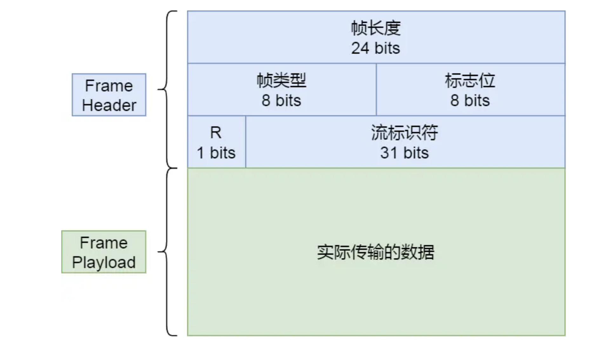
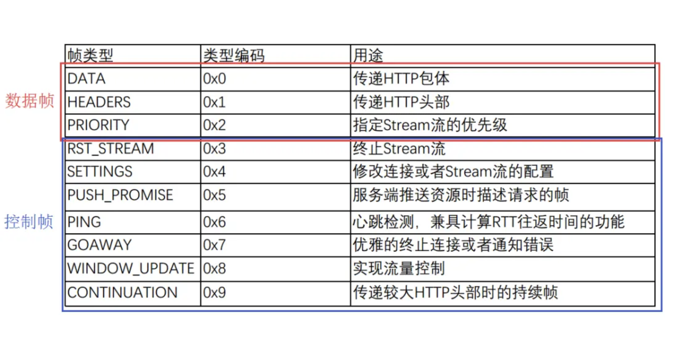
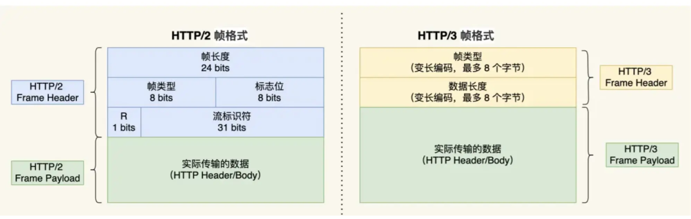

<!-- more -->

# HTTP/1.1该如何优化

## 1.如何避免发送HTTP请求

通过缓存技术，把URL作为key,响应作为Value，两者间映射

设置缓存时间过期之后重新请求，带上Etag头，如果一样说明资源未改变，可以使用客户端的缓存**`304 Not Modified`**

## 2.如何减少HTTP请求次数

1.减少重定向次数

将重定向的工作交给代理服务器，可以鉴赏HTTP请求次数

2.合并请求

**合并请求的方式就是合并资源，以一个大资源的请求替换多个小资源的请求**。但是如果有一个小资源改变就需要重新下载全部

3.延迟发送请求

按需获取，当用户有需要操作时再获取资源

## 3.如何减少HTTP响应的数据大小？

无损压缩：解压之后和原来数据一模一样

有损压缩：和原来数据和接近

# HTTP2

## 1.HTTP的性能问题

- *消息的大小变大了*，*页面资源变多了* *内容形式变多样了* *实时性要求变高了*

  造成HTTP1.1的出现高延迟

  **延迟高的问题来源**：

- *延迟难以下降*，虽然现在网络的「带宽」相比以前变多了，但是延迟降到一定幅度后，就很难再下降了，说白了就是到达了延迟的下限；
- *并发连接有限*，谷歌浏览器最大并发连接数是 6 个，而且每一个连接都要经过 TCP 和 TLS 握手耗时，以及 TCP 慢启动过程给流量带来的影响；
- *队头阻塞问题*，同一连接只能在完成一个 HTTP 事务（请求和响应）后，才能处理下一个事务；
- *HTTP 头部巨大且重复*，由于 HTTP 协议是无状态的，每一个请求都得携带 HTTP 头部，特别是对于有携带 Cookie 的头部，而 Cookie 的大小通常很大；
- *不支持服务器推送消息*，因此当客户端需要获取通知时，只能通过定时器不断地拉取消息，这无疑浪费大量了带宽和服务器资源。

## 2.兼容HTTP1.1

**HTTP2可以兼容HTTP1.1**
1.HTTP2没有在URL中引入新的协议名，仍然使用「http://」表示明文协议，用「https://」表示加密协议。
2.只在应用层做了改变，基本改变了HTTP报文的传输格式

## 3.头部压缩

HTTP1.1的头部存在问题，太大了**需要压缩**,请求中大量字段重复需要**避免重复性**，字段需要改成**二进制编码**

使用**HPACK** 算法：

- 静态字典；

- 动态字典；

- Huffman 编码（压缩算法）；

  ### 静态表编码

HTTP/2 为高频出现在头部的字符串和字段建立了一张**静态表**
根据 RFC7541 规范，如果头部字段属于静态表范围，并且 Value 是变化，那么它的 HTTP/2 头部前 2 位固定为 *01*

Huffman 编码的原理是将高频出现的信息用「较短」的编码表示，从而缩减字符串长度。

### 动态编码表

不在静态编码表的范围内时，要自行构建**动态表**
使得动态表生效有一个前提：**必须同一个连接上，重复传输完全相同的 HTTP 头部**
字典累计越来越大，会有一个限制

**动态表是具有时序性的，如果首次出现的请求发生了丢包，后续的收到请求，对方就无法解码出 HPACK 头部，因为对方还没建立好动态表，因此后续的请求解码会阻塞到首次请求中丢失的数据包重传过来**。

## 4.二进制帧

HTTP2把报文从文本改成了二进制格式，HTTP/2 把响应报文划分成了两类**帧（Frame）**

- HEADERS（首部）和 DATA（消息负载） 是帧的类型

前三个字节为**帧长度**，帧长度后面的一个字节为**帧类型**

帧类型后面的一个字节是**标志位**，可以保存 8 个标志位，用于携带简单的控制信息
帧头的最后 4 个字节是**流标识符**（Stream ID），它的作用是用来标识该 Frame 属于哪个 Stream

## 5.并发传输

多个 Stream 跑在一条 TCP 连接，同一个 HTTP 请求与响应是跑在同一个 Stream 中，HTTP 消息可以由多个 Frame 构成， 一个 Frame 可以由多个 TCP 报文构成。

**不同 Stream 的帧是可以乱序发送的（因此可以并发不同的 Stream ）**，因为每个帧的头部会携带 Stream ID 信息，所以接收端可以通过 Stream ID 有序组装成 HTTP 消息，而**同一 Stream 内部的帧必须是严格有序的**。

**当 HTTP/2 实现 100 个并发 Stream 时，只需要建立一次 TCP 连接，而 HTTP/1.1 需要建立 100 个 TCP 连接，每个 TCP 连接都要经过 TCP 握手、慢启动以及 TLS 握手过程，这些都是很耗时的。**

## 6.服务器主动推送资源

比如，客户端通过 HTTP/1.1 请求从服务器那获取到了 HTML 文件，而 HTML 可能还需要依赖 CSS 来渲染页面，这时客户端还要再发起获取 CSS 文件的请求，需要两次消息往返
在 HTTP/2 中，客户端在访问 HTML 时，服务器可以直接主动推送 CSS 文件，减少了消息传递的次数。

# HTTP3

## 1.HTTP2的问题

HTTP2是基于TCP协议实现的

- 队头阻塞；

- TCP 与 TLS 的握手时延迟；
- 网络迁移需要重新连接；

#### 1.队头阻塞：

HTTP/2 多个请求是跑在一个 TCP 连接中的，那么当 TCP 丢包时，整个 TCP 都要等待重传，那么就会阻塞该 TCP 连接中的所有请求。

#### 2.TCP与TLS的握手延迟

TCP三次握手TLS四次握手

#### 3.网络迁移需要重新连接

一个 TCP 连接是由四元组（源 IP 地址，源端口，目标 IP 地址，目标端口）确定的，这意味着如果 IP 地址或者端口变动了，就会导致需要 TCP 与 TLS 重新握手，这不利于移动设备切换网络的场景，比如 4G 网络环境切换成 WiFi。

## 2.QUIC协议的特点

它具有类似 TCP 的**连接管理**、**拥塞窗口**、**流量控制**的网络特性

#### 1.无队头阻塞

某个流中的一个数据包丢失了，即使该流的其他数据包到达了，数据也无法被 HTTP/3 读取，直到 QUIC 重传丢失的报文，数据才会交给 HTTP/3。
QUIC 连接上的多个 Stream 之间并没有依赖，都是独立的，某个流发生丢包了，只会影响该流，其他流不受影响。

#### 2.更快连接建立

 **QUIC 内部包含了 TLS，它在自己的帧会携带 TLS 里的“记录”，再加上 QUIC 使用的是 TLS 1.3，因此仅需 1 个 RTT 就可以「同时」完成建立连接与密钥协商，甚至在第二次连接的时候，应用数据包可以和 QUIC 握手信息（连接信息 + TLS 信息）一起发送，达到 0-RTT 的效果**。

#### 3.连接迁移

通过**连接 ID** 来标记通信的两个端点，客户端和服务器可以各自选择一组 ID 来标记自己

## 3.HTTP3协议

HTTP3在头部压缩升级到了QPACK，静态表更大

QUIC 会有两个特殊的单向流，所谓的单向流只有一端可以发送消息，双向则指两端都可以发送消息，传输 HTTP 消息时用的是双向流，这两个单向流的用法：

- 一个叫 QPACK Encoder Stream，用于将一个字典（Key-Value）传递给对方，比如面对不属于静态表的 HTTP 请求头部，客户端可以通过这个 Stream 发送字典；
- 一个叫 QPACK Decoder Stream，用于响应对方，告诉它刚发的字典已经更新到自己的本地动态表了，后续就可以使用这个字典来编码了。

这两个特殊的单向流是用来**同步双方的动态表**，编码方收到解码方更新确认的通知后，才使用动态表编码 HTTP 头部