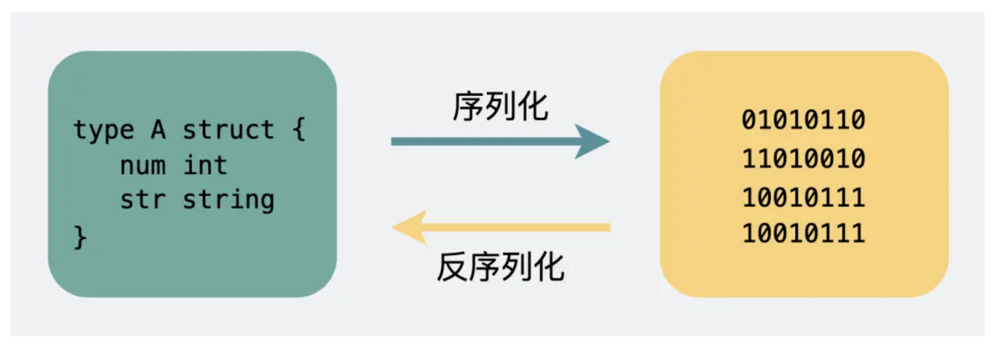

<!-- more -->

# 既然有HTTP为啥还要有RPC？

##### TCP 是有三个特点，**面向连接**、**可靠**、基于**字节流**。

**RPC**（**R**emote **P**rocedure **C**all），又叫做**远程过程调用**。它本身并不是一个具体的协议，而是一种**调用方式**。

## 1.HTTP和RPC的区别

1.**服务发现**
找到服务对应的 IP 端口的过程，其实就是**服务发现**。
HTTP中使用DNS服务，而RPC有专门的**==中间服务==**去保存服务名和IP信息

**2.底层连接形式**
HTTP：其默认在建立底层 TCP 连接之后会一直保持这个连接（**Keep Alive**），之后的请求和响应都会复用这条连接。
RPC：也是通过建立 TCP 长链接进行数据交互，但不同的地方在于，RPC 协议一般还会再建个**连接池**

**3.传输的内容**这个将结构体转为二进制数组的过程就叫**序列化**，反过来将二进制数组复原成结构体的过程叫**反序列化**。

HTTP：使用 **Json** 来**序列化**结构体数据。
RPC：可以采用体积更小的 Protobuf 或其他序列化协议去保存结构体数据

## 2.WebSocket是什么

WebSocket：

为了兼容这些使用场景。浏览器在 **TCP 三次握手**建立连接之后，都**统一使用 HTTP 协议**先进行一次通信。

- 如果此时是**普通的 HTTP 请求**，那后续双方就还是老样子继续用普通 HTTP 协议进行交互，这点没啥疑问。
- 如果这时候是**想建立 WebSocket 连接**，就会在 HTTP 请求里带上一些**特殊的header 头**，请求升级

WebSocket完美继承了 TCP 协议的**全双工**能力，

双全功：**同一时间里**，**双方**都可以**主动**向对方发送数据