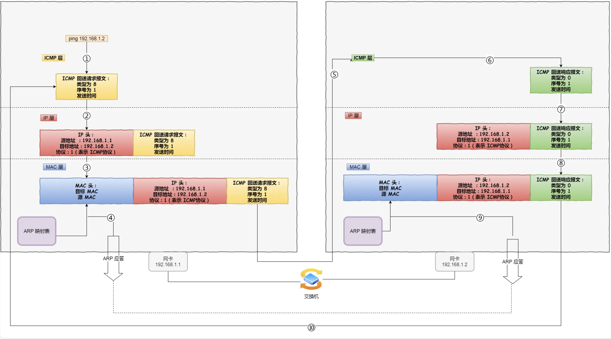

<!-- more -->

## ping的工作原理

#### 查询报文类型

> 回送消息 —— 类型 `0` 和 `8`

**回送消息**用于进行通信的主机或路由器之间，判断所发送的数据包是否已经成功到达对端的一种消息，`ping` 命令就是利用这个消息实现的。

可以向对端主机发送**回送请求**的消息（`ICMP Echo Request Message`，类型 `8`），也可以接收对端主机发回来的**回送应答**消息（`ICMP Echo Reply Message`，类型 `0`）。

相比原生的 ICMP，这里多了两个字段：

- **标识符**：用以区分是哪个应用程序发 ICMP 包，比如用进程 `PID` 作为标识符；
- **序号**：序列号从 `0` 开始，每发送一次新的回送请求就会加 `1`， 可以用来确认网络包是否有丢失。

在**选项数据**中，`ping` 还会存放发送请求的时间值，来计算往返时间，说明路程的长短


ping 命令执行的时候，源主机首先会构建一个 **ICMP 回送请求消息**数据包。

ICMP 数据包内包含多个字段，最重要的是两个：

- 第一个是**类型**，对于回送请求消息而言该字段为 `8`；
- 另外一个是**序号**，主要用于区分连续 ping 的时候发出的多个数据包

目标主机 会构建一个 **ICMP 回送响应消息**数据包，回送响应数据包的**类型**字段为 `0`，**序号**为接收到的请求数据包中的序号，然后再发送出去给源主机

在规定的时候间内，源主机如果没有接到 ICMP 的应答包，则说明目标主机不可达；如果接收到了 ICMP 回送响应消息，则说明目标主机可达。

此时，源主机会检查，用当前时刻减去该数据包最初从源主机上发出的时刻，就是 ICMP 数据包的时间延迟。



#### traceroute :

*1. traceroute 作用一*

traceroute 的第一个作用就是**故意设置特殊的 TTL，来追踪去往目的地时沿途经过的路由器。**

它的原理就是利用 IP 包的**生存期限** 从 `1` 开始按照顺序递增的同时发送 **UDP 包**，强制接收 **ICMP 超时消息**的一种方法。

比如，将 TTL 设置 为 `1`，则遇到第一个路由器，就牺牲了，接着返回 ICMP 差错报文网络包，类型是**时间超时**。

接下来将 TTL 设置为 `2`，第一个路由器过了，遇到第二个路由器也牺牲了，也同时返回了 ICMP 差错报文数据包，如此往复，直到到达目的主机。

这样的过程，traceroute 就可以拿到了所有的路由器 IP。

当然有的路由器根本就不会返回这个 ICMP，所以对于有的公网地址，是看不到中间经过的路由的。

> 发送方如何知道发出的 UDP 包是否到达了目的主机呢？

traceroute 在发送 `UDP` 包时，会填入一个**不可能的端口号**值作为 UDP 目标端口号：33434。然后对于每个下一个探针，它都会增加一个，这些端口都是通常认为不会被使用，不过，没有人知道当某些应用程序监听此类端口时会发生什么。

当目的主机，收到 UDP 包后，会返回 ICMP 差错报文消息，但这个差错报文消息的类型是「**端口不可达**」。

所以，**当差错报文类型是端口不可达时，说明发送方发出的 UDP 包到达了目的主机。**

*2. traceroute 作用二*

traceroute 还有一个作用是**故意设置不分片，从而确定路径的 MTU**。

这样做的目的是为了**路径MTU发现**。

因为有的时候我们并不知道路由器的 `MTU` 大小，以太网的数据链路上的 `MTU` 通常是 `1500` 字节，但是非以太网的 `MTU` 值就不一样了，所以我们要知道 `MTU` 的大小，从而控制发送的包大小。

它的工作原理如下：

首先在发送端主机发送 `IP` 数据报时，将 `IP` 包首部的**分片禁止标志位设置为 1**。根据这个标志位，途中的路由器不会对大数据包进行分片，而是将包丢弃。

随后，通过一个 ICMP 的不可达消息将**数据链路上 MTU 的值**一起给发送主机，不可达消息的类型为「**需要进行分片但设置了不分片位**」。

发送主机端每次收到 ICMP 差错报文时就**减少**包的大小，以此来定位一个合适的 `MTU` 值，以便能到达目标主机。

## 断网了还能ping通127.0.0.1吗？

### 什么是127.0.0.1

首先，这是个 `IPV4` 地址。

`IPV4` 地址有 `32` 位，一个字节有 `8` 位，共 `4` 个字节。

其中**127 开头的都属于回环地址**，也是 `IPV4` 的特殊地址，没什么道理，就是人为规定的。

 ping 作为一个小软件，它的功能比较简单，就是**尝试**发送一个小小的消息到目标机器上，判断目的机器是否**可达**，其实也就是判断目标机器网络是否能连通。

##### TCP和Ping数据的区别：

在 TCP 传输中创建的方式是 `socket(AF_INET, SOCK_STREAM, 0);`，其中 `AF_INET` 表示将使用 IPV4 里 **host:port** 的方式去解析待会你输入的网络地址。`SOCK_STREAM` 是指使用面向字节流的 TCP 协议，**工作在传输层**。

创建好了 `socket` 之后，就可以愉快的把要传输的数据写到这个文件里。调用 socket 的`sendto`接口的过程中进程会从**用户态进入到内核态**，最后会调用到 `sock_sendmsg` 方法。

然后进入传输层，带上`TCP`头。网络层带上`IP`头，数据链路层带上 `MAC`头等一系列操作后。进入网卡的**发送队列 ring buffer** ，顺着网卡就发出去了。

回到 `ping` ，创建 `socket` 的时候用的是 `socket(AF_INET,SOCK_RAW,IPPROTO_ICMP)`，`SOCK_RAW` 是原始套接字 ，**工作在网络层**，ping 在进入内核态后最后也是调用的 `sock_sendmsg` 方法，进入到网络层后加上**ICMP和IP头**后，数据链路层加上**MAC头**，也是顺着网卡发出。

#### 为什么断网了还能ping通127.0.0.1？

当发现**目标IP是回环地址**时，就会选择**本地网卡**。

本地网卡会把数据推到一个叫 `input_pkt_queue` 的 \**链表\**中。这个链表，其实是所有网卡共享的，上面挂着发给本机的各种消息。消息被发送到这个链表后，会再触发一个**软中断**。

专门处理软中断"ksoftirqd"（这是个**内核线程**），它在收到软中断后就会立马去链表里把消息取出，然后顺着数据链路层、网络层等层层往上传递最后给到应用程序。

根本就没有出网络，而是在本机打了一个转又回去了

ping回环地址和ping本机地址没有什么区别

#### 127.0.0.1和localhost和0.0.00有什么区别？

127.0.0.1是一个回环地址，localhost是一个域名默认等于127.0.0.1

其次就是 `0.0.0.0`，执行 ping 0.0.0.0 ，是会失败的，因为它在`IPV4`中表示的是无效的**目标地址**。

```shell
$ ping 0.0.0.0
PING 0.0.0.0 (0.0.0.0): 56 data bytes
ping: sendto: No route to host
ping: sendto: No route to host
```

我们启动服务器的时候，一般会 `listen` 一个 IP 和端口，等待客户端的连接。

如果此时 `listen` 的是本机的 `0.0.0.0` , 那么它表示本机上的**所有IPV4地址**。
