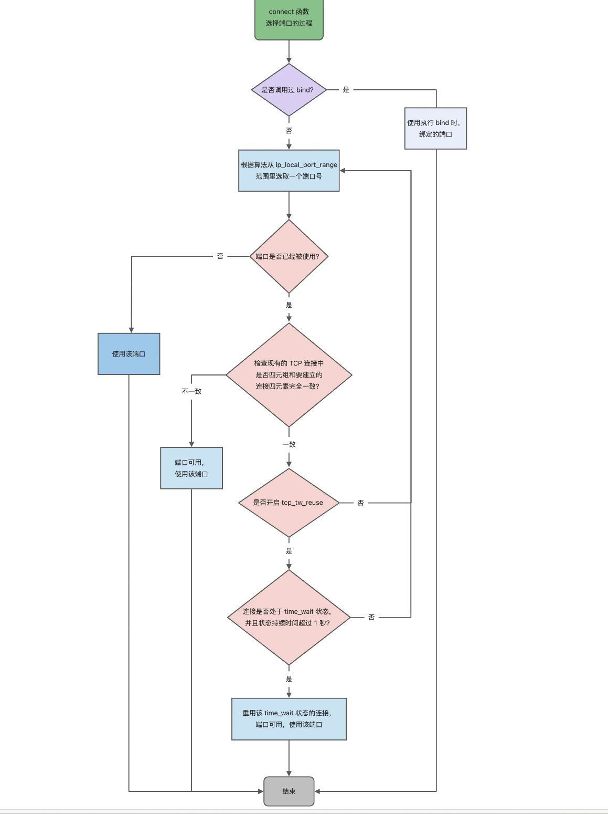

<!-- more -->

### 针对TCP应该如何socket编程？

- 服务端创建一个监听`socket`和客户端初始化用来通信的 `socket`，得到文件描述符；
- 服务端调用 `bind`，将 socket 绑定在指定的 IP 地址和端口;
- 服务端调用 `listen`，进行监听；
- 服务端调用 `accept`，等待客户端连接；
- 客户端调用 `connect`，向服务端的地址和端口发起连接请求；
- 服务端 `accept` 返回一个新创建的用于传输的 `socket`（已完成的） 的文件描述符；
- 客户端调用 `write` 写入数据；服务端调用 `read` 读取数据；
- 客户端断开连接时，会调用 `close`，那么服务端 `read` 读取数据的时候，就会读取到了 `EOF`，待处理完数据后，服务端调用 `close`，表示连接关闭。

监听的 socket 和真正用来传送数据的 socket，是「两个」 socket，一个叫作**监听 socket**，一个叫作**已完成连接 socket**。

### listen 时候参数 backlog 的意义？

- 半连接队列（SYN 队列）：接收到一个 SYN 建立连接请求，处于 SYN_RCVD 状态；
- 全连接队列（Accpet 队列）：已完成 TCP 三次握手过程，处于 ESTABLISHED 状态；

**所以现在通常认为 backlog 是 accept 队列。**

**但是上限值是内核参数 somaxconn 的大小，也就说 accpet 队列长度 = min(backlog, somaxconn)。**

### accept 发生在三次握手的哪一步？

**客户端 connect 成功返回是在第二次握手，服务端 accept 成功返回是在三次握手成功之后**

### 客户端调用 close 了，连接是断开的流程是什么？

- 客户端调用 `close`，表明客户端没有数据需要发送了，则此时会向服务端发送 FIN 报文，进入 FIN_WAIT_1 状态；
- 服务端接收到了 FIN 报文，TCP 协议栈会为 FIN 包插入一个文件结束符 `EOF` 到接收缓冲区中，应用程序可以通过 `read` 调用来感知这个 FIN 包。这个 `EOF` 会被**放在已排队等候的其他已接收的数据之后**，这就意味着服务端需要处理这种异常情况，因为 EOF 表示在该连接上再无额外数据到达。此时，服务端进入 CLOSE_WAIT 状态；
- 接着，当处理完数据后，自然就会读到 `EOF`，于是也调用 `close` 关闭它的套接字，这会使得服务端发出一个 FIN 包，之后处于 LAST_ACK 状态；

## 服务端没有调用Listen,客户端请求建立连接会发生什么？

**服务端如果只 bind 了 IP 地址和端口，而没有调用 listen 的话，然后客户端对服务端发起了连接建立，服务端会回 RST 报文**

#### 没有listen可以建立TCP连接吗？

**是可以的，客户端是可以自己连自己的形成连接（TCP自连接），也可以两个客户端同时向对方发出请求建立连接（TCP同时打开），这两个情况都有个共同点，就是没有服务端参与，也就是没有listen，就能建立连接**。

因为客户端没有执行listen，因为半连接队列和全连接队列都是在执行 listen 方法时，内核自动创建的。

但内核还有个全局 hash 表，可以用于存放 sock 连接的信息。

这个全局 hash 表其实还细分为 ehash，bhash和listen_hash等，但因为过于细节，大家理解成有一个全局 hash 就够了，

**在 TCP 自连接的情况中，客户端在 connect 方法时，最后会将自己的连接信息放入到这个全局 hash 表中，然后将信息发出，消息在经过回环地址重新回到 TCP 传输层的时候，就会根据 IP + 端口信息，再一次从这个全局 hash 中取出信息。于是握手包一来一回，最后成功建立连接**。

## 没有Accpet，能建立TCP连接吗？

建立连接的过程中根本不需要`accept()`参与， **执行accept()只是为了从全连接队列里取出一条连接。**

#### 为什么半连接队列要设计成哈希表？

**全连接里队列**，他本质是个链表，因为也是线性结构，说它是个队列也没毛病。它里面放的都是已经建立完成的连接，这些连接正等待被取走。而服务端取走连接的过程中，并不关心具体是哪个连接，只要是个连接就行，所以直接从队列头取就行了。这个过程算法复杂度为`O(1)`。

而**半连接队列**却不太一样，因为队列里的都是不完整的连接，嗷嗷等待着第三次握手的到来。那么现在有一个第三次握手来了，则需要从队列里把相应IP端口的连接取出，**如果半连接队列还是个链表，那我们就需要依次遍历，才能拿到我们想要的那个连接，算法复杂度就是O(n)。**

而如果将半连接队列设计成哈希表，那么查找半连接的算法复杂度就回到`O(1)`了。

因此出于效率考虑，全连接队列被设计成链表，而半连接队列被设计为哈希表。

#### 会有一个cookies队列吗

实际上`cookies`并不会有一个专门的队列保存，它是通过**通信双方的IP地址端口、时间戳、MSS**等信息进行**实时计算**的，保存在**TCP报头**的`seq`里。

####  cookies方案为什么不直接取代半连接队列？

凡事皆有利弊，`cookies`方案虽然能防 **SYN Flood攻击**，但是也有一些问题。因为服务端并不会保存连接信息，所以如果传输过程中数据包丢了，也不会重发第二次握手的信息。

另外，编码解码`cookies`，都是比较**耗CPU**的，利用这一点，如果此时攻击者构造大量的**第三次握手包（ACK包）**，同时带上各种瞎编的`cookies`信息，服务端收到`ACK包`后**以为是正经cookies**，憨憨地跑去解码（**耗CPU**），最后发现不是正经数据包后才丢弃。

这种通过构造大量`ACK包`去消耗服务端资源的攻击，叫**ACK攻击**，受到攻击的服务器可能会因为**CPU资源耗尽**导致没能响应正经请求。

## TCP和UDP可以同时绑定相同的端口吗？

#### 1.TCP和UDP可以同时绑定相同的端口吗？

可以

> 在数据链路层中，通过 MAC 地址来寻找局域网中的主机。在网际层中，通过 IP 地址来寻找网络中互连的主机或路由器。在传输层中，需要通过端口进行寻址，来识别同一计算机中同时通信的不同应用程序。

TCP和UDP在内核中是两个**完全独立**的软件模块：当主机接收到一个数据包，跟据数据包的头部，确定是TCP还是UDP然后交给对应的模块，然后模块处理之后跟据**端口号**发送给对应的应用程序

#### 2.**多个TCP可以同时绑定一个端口吗？**

**如果两个 TCP 服务进程同时绑定的 IP 地址和端口都相同，那么执行 bind() 时候就会出错，错误是“Address already in use”**。

但是如果ip不同端口相同的话就可以绑定

但是如果 TCP 绑定的**地址是 0.0.0.0 和端口 8888**，而如果 另一个TCP  绑定的地址是**其他地址和端口 8888**，那么执行 bind() 时候也会出错。（这是因为 0.0.0.0 地址比较特殊，代表任意地址，意味着绑定了 0.0.0.0 地址，相当于把主机上的所有 IP 地址都绑定了。）

这个问题也可以由 SO_REUSEADDR 解决，因为它的**另外一个作用**：绑定的 IP地址 + 端口时，只要 IP 地址不是正好(exactly)相同，那么允许绑定。

#### **3.重启 TCP 服务进程时，为什么会有“Address in use”的报错信息？**

**当 TCP 服务进程重启时，服务端会出现 TIME_WAIT 状态的连接，TIME_WAIT 状态的连接使用的 IP+PORT 仍然被认为是一个有效的 IP+PORT 组合，相同机器上不能够在该 IP+PORT 组合上进行绑定，那么执行 bind() 函数的时候，就会返回了 Address already in use 的错误**。

等TIME_WAIT结束之后就可以，重启TCP服务

#### 4.重启 TCP 服务进程时，如何避免“Address in use”的报错信息？

因为 SO_REUSEADDR 作用是：**如果当前启动进程绑定的 IP+PORT 与处于TIME_WAIT 状态的连接占用的 IP+PORT 存在冲突，但是新启动的进程使用了 SO_REUSEADDR 选项，那么该进程就可以绑定成功**

#### **5.客户端的端口可以重复使用吗？**

**CP 连接是由四元组（源IP地址，源端口，目的IP地址，目的端口）唯一确认的，那么只要四元组中其中一个元素发生了变化，那么就表示不同的 TCP 连接的。所以如果客户端已使用端口 64992 与服务端 A 建立了连接，那么客户端要与服务端 B 建立连接，还是可以使用端口 64992 的，因为内核是通过四元祖信息来定位一个 TCP 连接的，并不会因为客户端的端口号相同，而导致连接冲突的问题。**

#### **6.多个客户端可以 bind 同一个端口吗？**

要看多个客户端绑定的 IP + PORT 是否都相同，如果都是相同的，那么在执行 bind() 时候就会出错，错误是“Address already in use”。

一般而言，客户端不建议使用 bind 函数，应该交由 connect 函数来选择端口会比较好，因为客户端的端口通常都没什么意义。

#### 7.客户端 TCP 连接 TIME_WAIT 状态过多，会导致端口资源耗尽而无法建立新的连接吗？

针对这个问题，也是有解决办法的，那就是打开 `net.ipv4.tcp_tw_reuse` 这个内核参数。

**因为开启了这个内核参数后，客户端调用 connect 函数时，如果选择到的端口，已经被相同四元组的连接占用的时候，就会判断该连接是否处于 TIME_WAIT 状态，如果该连接处于 TIME_WAIT 状态并且 TIME_WAIT 状态持续的时间超过了 1 秒，那么就会重用这个连接，然后就可以正常使用该端口了。**

开启了 net.ipv4.tcp_tw_reuse 内核参数，是客户端（连接发起方） 在调用 connect() 函数时才起作用，所以在服务端开启这个参数是没有效果的。

