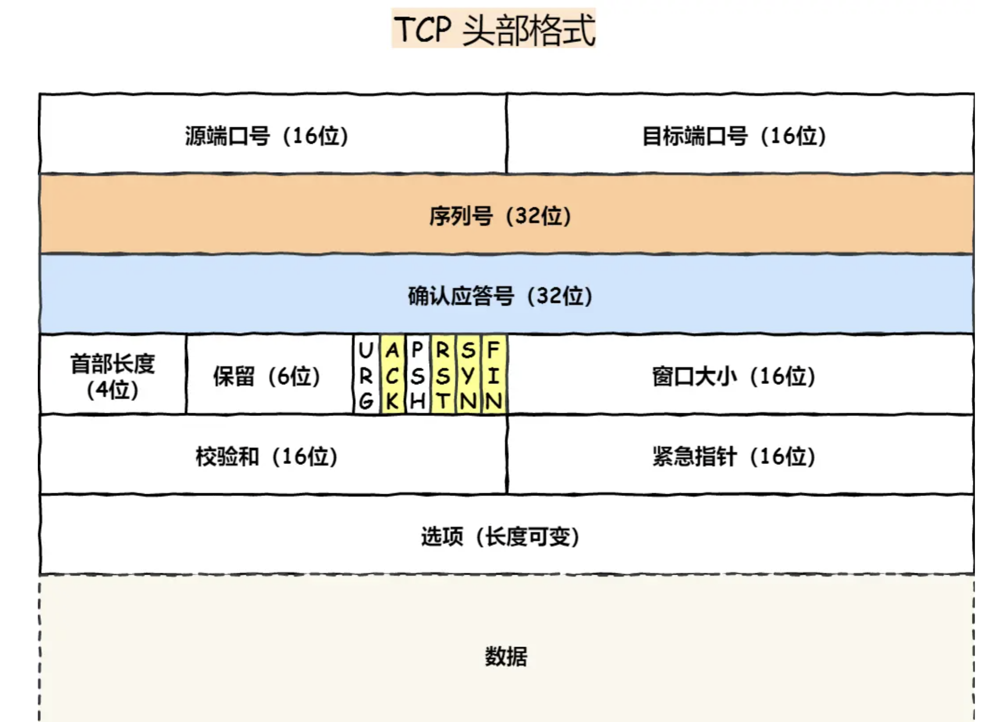
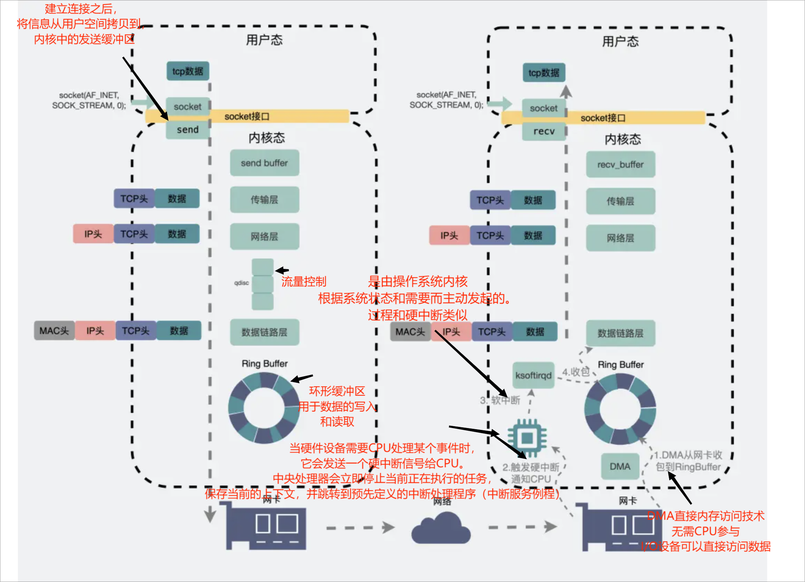
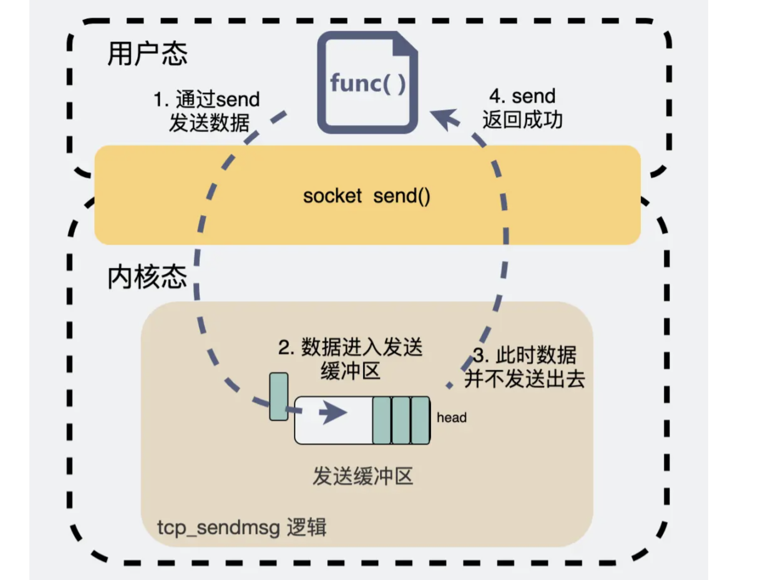

<!-- more -->

# TCP篇

## TCP基本认识

### TCP的头格式：

**序列号**：在建立连接时由计算机生成的随机数作为其初始值，每发送一次数据，就累加一次。用来解决网络包乱序问题。

**确认应答号**：指下一次「期望」收到的数据的序列号，发送端接收到确认答应之后，可以认定之前的数据全部被接收。用来解决丢包问题

- *ACK*：该位为 `1` 时，「确认应答」的字段变为有效，TCP 规定除了最初建立连接时的 `SYN` 包之外该位必须设置为 `1` 。
- *RST*：该位为 `1` 时，表示 TCP 连接中出现异常必须强制断开连接。
- *SYN*：该位为 `1` 时，表示希望建立连接，并在其「序列号」的字段进行序列号初始值的设定。
- *FIN*：该位为 `1` 时，表示今后不会再有数据发送，希望断开连接。当通信结束希望断开连接时，通信双方的主机之间就可以相互交换 `FIN` 位为 1 的 TCP 段。

### TCP工作在那一层：

TCP 是一个工作在**传输层**的**可靠**数据传输的服务，它能确保接收端接收的网络包是**无损坏、无间隔、非冗余和按序的。**

### 什么是TCP协议：

TCP 是**面向连接的、可靠的、基于字节流**的传输层通信协议。

- **面向连接**：一定是「一对一」才能连接，不能像 UDP 协议可以一个主机同时向多个主机发送消息，也就是一对多是无法做到的；
- **可靠的**：无论的网络链路中出现了怎样的链路变化，TCP 都可以保证一个报文一定能够到达接收端；
- **字节流**：用户消息通过 TCP 协议传输时，消息可能会被操作系统「分组」成多个的 TCP 报文，如果接收方的程序如果不知道「消息的边界」，是无法读出一个有效的用户消息的。并且 TCP 报文是「有序的」，当「前一个」TCP 报文没有收到的时候，即使它先收到了后面的 TCP 报文，那么也不能扔给应用层去处理，同时对「重复」的 TCP 报文会自动丢弃。

### 什么是TCP连接:

连接：**用于保证可靠性和流量控制维护的某些状态信息，这些信息的组合，包括 Socket、序列号和窗口大小称为连接。**

建立一个TCP连接需要：

- **Socket**：由 IP 地址和端口号组成
- **序列号**：用来解决乱序问题等
- **窗口大小**：用来做流量控制

### 如何确定一个TCP连接：

TCP 四元组可以唯一的确定一个连接，四元组包括如下：

- 源地址
- 源端口
- 目的地址
- 目的端口

源地址和目的地址在IP头部，源端口和目的端口在TCP头部

> **有一个 IP 的服务端监听了一个端口，它的 TCP 的最大连接数是多少？**

对 IPv4，客户端的 IP 数最多为 `2` 的 `32` 次方，客户端的端口数最多为 `2` 的 `16` 次方，也就是服务端单机最大 TCP 连接数，约为 `2` 的 `48` 次方。

- 文件描述符限制

  每个 TCP 连接都是一个文件，如果文件描述符被占满了，会发生 Too many open files。Linux 对可打开的文件描述符的数量分别作了三个方面的限制：

  - **系统级**：当前系统可打开的最大数量
  - **用户级**：指定用户可打开的最大数量
  - **进程级**：单个进程可打开的最大数量

- **内存限制**，每个 TCP 连接都要占用一定内存，操作系统的内存是有限的，如果内存资源被占满后，会发生 OOM

## 如何理解TCP是基于字节流的协议？

> #### 先来说说为什么 UDP 是面向报文的协议？
>
> 使用UDP传输协议的时候，操作系统不会对消息进行拆分。**每个 UDP 报文就是一个用户消息的边界**
>
> 操作系统在收到 UDP 报文后，会将其插入到队列里，**队列里的每一个元素就是一个 UDP 报文**

> #### 再来说说为什么 TCP 是面向字节流的协议？
>
> **消息可能会被操作系统分组成多个的 TCP 报文**，也就是一个完整的用户消息被拆分成多个 TCP 报文进行传输。

如何解决粘包：

- 固定长度的消息；
- 特殊字符作为边界；
- 自定义消息结构

## TCP半连接队列和全连接队列

**如果持续不断地有连接因为 TCP 全连接队列溢出被丢弃，就应该调大 backlog 以及 somaxconn 参数**

**开启 syncookies 功能就可以在不使用 SYN 半连接队列的情况下成功建立连接**

SYN攻击：

- 增大半连接队列；
- 开启 tcp_syncookies 功能
- 减少 SYN+ACK 重传次数

**发送缓冲区不能超过「带宽时延积」**

- 如果发送缓冲区「超过」带宽时延积，超出的部分就没办法有效的网络传输，同时导致网络过载，容易丢包；
- 如果发送缓冲区「小于」带宽时延积，就不能很好的发挥出网络的传输效率

## SYN报文在什么情况下会被丢弃？

- net.ipv4.tcp_tw_recycle，如果开启该选项的话，允许处于 TIME_WAIT 状态的连接被快速回收；

  要使得这个选项生效，有一个前提条件，就是要打开 TCP 时间戳，即 net.ipv4.tcp_timestamps=1（默认即为 1)）。
  当同时开启了recycle 和 timestamps 选项，会开启**「 per-host 的 PAWS 机制」**

**tcp_tw_recycle在NAT网络下使用是不安全的**

PAWS 就是为了避免TCP中序列号出现回绕，在开启 tcp_timestamps 选项情况下，一台机器发的所有 TCP 包都会带上发送时的时间戳，PAWS 要求连接双方维护最近一次收到的数据包的时间戳（Recent TSval），每收到一个新数据包都会读取数据包中的时间戳值跟 Recent TSval 值做比较，**如果发现收到的数据包中时间戳不是递增的，则表示该数据包是过期的，就会直接丢弃这个数据包**。

**per-host 是对「对端 IP 做 PAWS 检查」**，而非对「IP + 端口」四元组做 PAWS 检查，在NAT网络下使用不安全

- 半连接队列满了
- 全连接队列满了

## 拔掉网线之后，TCP连接会消失吗？

TCP连接存在于内核中，不会因为把掉网线造成TCP断开

##  **为什么 tcp_tw_reuse 默认是关闭的？**

**RST 报文的时间戳即使过期了，只要 RST 报文的序列号在对方的接收窗口内，也是能被接受的**。

- 历史 RST 报文可能会终止后面相同四元组的连接，因为 PAWS 检查到即使 RST 是过期的，也不会丢弃。
- 如果第四次挥手的 ACK 报文丢失了，有可能被动关闭连接的一方不能被正常的关闭;

## 用了TCP传输数据就一定不会丢包吗？

TCP丢包：

- 三次握手时（连接建立失败）
- 流量控制丢包（当发送数据过快，流控队列长度`txqueuelen`又不够大时，就容易出现**丢包**现象。）
- 网卡丢包（**网线质量差，接触不良**）RingBuffer过小导致丢包（网卡性能不足）
- 接收缓冲区丢包，当缓冲区满了，就会将在收到的信息丢掉

使用TCP出现丢包：

**聊天软件还需要将数据从TCP的接收缓冲区里读出来，如果在读出来这一刻，手机由于内存不足或其他各种原因，导致软件崩溃闪退了。**

这类丢包问题怎么解决：

服务器**可能**记录了我们最近发过什么数据，假设**每条消息都有个id**，服务器和聊天软件每次都拿**最新消息的id**进行对比

对于**发送方**，只要定时跟服务端的内容对账一下，就知道哪条消息没发送成功，直接重发就好了。

如果**接收方**的聊天软件崩溃了，重启后跟服务器稍微通信一下就知道少了哪条数据，同步上来就是了，所以也不存在上面提到的丢包情况。

**TCP只保证传输层的消息可靠性，并不保证应用层的消息可靠性。如果我们还想保证应用层的消息可靠性，就需要应用层自己去实现逻辑做保证。**

> 主要有三个原因。
>
> - 第一，如果是两端通信，你聊天软件里有`1000个`好友，你就得建立`1000个`连接。但如果引入服务端，你只需要跟服务器建立`1个`连接就够了，**聊天软件消耗的资源越少，手机就越省电**。
> - 第二，就是**安全问题**，如果还是两端通信，随便一个人找你对账一下，你就把聊天记录给同步过去了，这并不合适吧。如果对方别有用心，信息就泄露了。引入第三方服务端就可以很方便的做各种**鉴权**校验。
> - 第三，是**软件版本问题**。软件装到用户手机之后，软件更不更新就是由用户说了算了。如果还是两端通信，且两端的**软件版本跨度太大**，很容易产生各种兼容性问题，但引入第三端服务器，就可以强制部分过低版本升级，否则不能使用软件。但对于大部分兼容性问题，给服务端加兼容逻辑就好了，不需要强制用户更新软件。