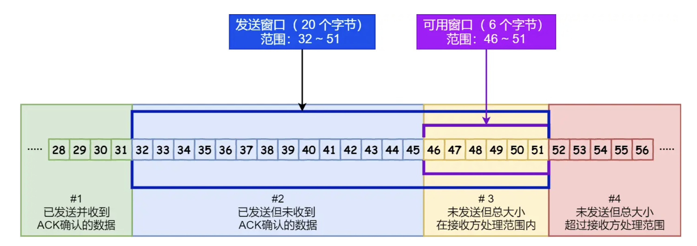
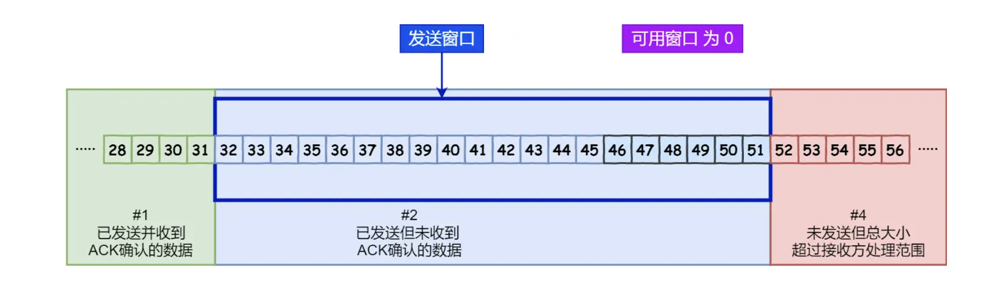
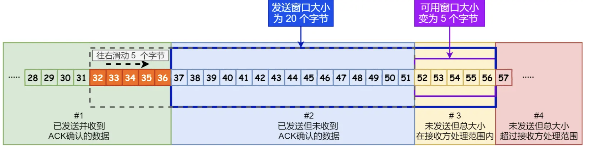
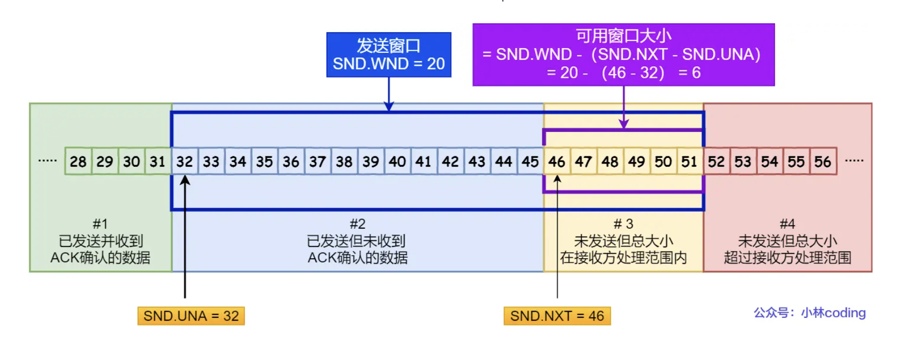
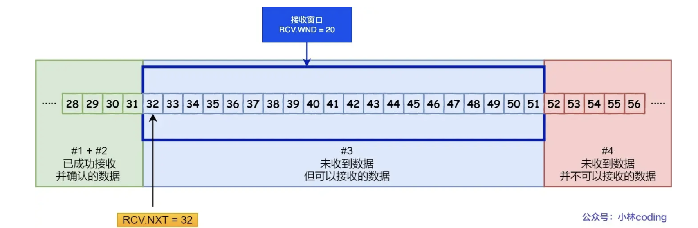

<!-- more -->

## 滑动窗口

窗口大小就是指**无需等待确认应答，而可以继续发送数据的最大值**

累计确认或者累计应答：

例如，如果接收方已经收到了序号为1至100的数据段，但是序号为101的数据段丢失了，接收方会发送一个确认报文，确认收到了1至100的数据。发送方收到这个确认后，会重新发送序号为101的数据段，以确保数据的完整性和正确性。

如果接收方在接收到序号为1至98和序号为100的数据段后，发现序号为99的数据段丢失了，那么它会发送一个确认报文，确认收到了序号为1至98的数据，并且请求发送方重传序号为99的数据段。

### 窗口大小由哪一方决定？

> TCP 头里有一个字段叫 `Window`，也就是窗口大小。
>
> **这个字段是接收端告诉发送端自己还有多少缓冲区可以接收数据。于是发送端就可以根据这个接收端的处理能力来发送数据，而不会导致接收端处理不过来。**

### 发送方的滑动窗口：

>
> - \#1 是已发送并收到 ACK确认的数据：1~31 字节
>
> - \#2 是已发送但未收到 ACK确认的数据：32~45 字节
>
> - \#3 是未发送但总大小在接收方处理范围内（接收方还有空间）：46~51字节
>
> - \#4 是未发送但总大小超过接收方处理范围（接收方没有空间）：52字节以后
>
>   当发送方把数据「全部」都一下发送出去后，可用窗口的大小就为 0 了
>
>   
>
>   当收到之前发送的数据 `32~36` 字节的 ACK 确认应答后，如果发送窗口的大小没有变化，则**滑动窗口往右边移动 5 个字节，因为有 5 个字节的数据被应答确认**，接下来 `52~56` 字节又变成了可用窗口，那么后续也就可以发送 `52~56` 这 5 个字节的数据了。
>
>   

### 程序如何表示发送方的四个部分呢？

- `SND.WND`：表示发送窗口的大小（大小是由接收方指定的）；
- `SND.UNA`（*Send Unacknoleged*）：是一个绝对指针，它指向的是已发送但未收到确认的第一个字节的序列号，也就是 #2 的第一个字节。
- `SND.NXT`：也是一个绝对指针，它指向未发送但可发送范围的第一个字节的序列号，也就是 #3 的第一个字节。
- 指向 #4 的第一个字节是个相对指针，它需要 `SND.UNA` 指针加上 `SND.WND` 大小的偏移量，就可以指向 #4 的第一个字节了。

那么可用窗口大小的计算就可以是：

**可用窗口大小 = SND.WND -（SND.NXT - SND.UNA）**

### 接收方的滑动窗口：

- `RCV.WND`：表示接收窗口的大小，它会通告给发送方。
- `RCV.NXT`：是一个指针，它指向期望从发送方发送来的下一个数据字节的序列号，也就是 #3 的第一个字节。
- 指向 #4 的第一个字节是个相对指针，它需要 `RCV.NXT` 指针加上 `RCV.WND` 大小的偏移量，就可以指向 #4 的第一个字节了。

### 接收窗口和发送窗口的大小是相等的吗？

因为滑动窗口并不是一成不变的。比如，当接收方的应用进程读取数据的速度非常快的话，这样的话接收窗口可以很快的就空缺出来。那么新的接收窗口大小，是通过 TCP 报文中的 Windows 字段来告诉发送方。那么这个传输过程是存在时延的，所以接收窗口和发送窗口是约等于的关系。

## 流量控制

**TCP 提供一种机制可以让「发送方」根据「接收方」的实际接收能力控制发送的数据量，这就是所谓的流量控制。**

### 操作系统缓冲区和滑动窗口的关系：

发送窗口和接收窗口中所存放的字节数，都是放在操作系统内存缓冲区中的，而操作系统的缓冲区，会**被操作系统调整**。

先减少缓存，再收缩窗口，就会出现丢包的现象。

**为了防止这种情况发生，TCP 规定是不允许同时减少缓存又收缩窗口的，而是采用先收缩窗口，过段时间再减少缓存，这样就可以避免了丢包情况**

### 窗口关闭

**如果窗口大小为 0 时，就会阻止发送方给接收方传递数据，直到窗口变为非 0 为止，这就是窗口关闭。**

> 窗口关闭的潜在危险？
>
> 当窗口关闭的时候，接收方处理完数据会发送一个窗口大小非0的ACK报文，如果这个ACK报文丢失就会造成双方均处于等待的死锁环境

| TCP是如何解决窗口关闭的时候，潜在的死锁现象？                |      |      |      |      |      |
| ------------------------------------------------------------ | ---- | ---- | ---- | ---- | ---- |
| **只要 TCP 连接一方收到对方的零窗口通知，就启动持续计时器。** |      |      |      |      |      |
| 窗口探测的次数一般为 3 次，每次大约 30-60 秒（不同的实现可能会不一样）。如果 3 次过后接收窗口还是 0 的话，有的 TCP 实现就会发 `RST` 报文来中断连接 |      |      |      |      |      |
|                                                              |      |      |      |      |      |

### 糊涂窗口综合征

**如果接收方腾出几个字节并告诉发送方现在有几个字节的窗口，而发送方会义无反顾地发送这几个字节，这就是糊涂窗口综合症**。

糊涂窗口综合症的现象是可以发生在发送方和接收方：

- 接收方可以通告一个小的窗口
- 而发送方可以发送小数据

于是，要解决糊涂窗口综合症，就要同时解决上面两个问题就可以了：

- 让接收方不通告小窗口给发送方，当「窗口大小」小于 min( MSS，缓存空间/2 ) ，也就是小于 MSS 与 1/2 缓存大小中的最小值时，就会向发送方通告窗口为 `0`，等到窗口大小 >= MSS，或者接收方缓存空间有一半可以使用，就可以把窗口打开让发送方发送数据过来。

- 让发送方避免发送小数据，

  两个条件满足一个：

  条件一：要等到窗口大小 >= `MSS` 并且 数据大小 >= `MSS`；条件二：收到之前发送数据的 `ack` 回包；

**接收方得满足「不通告小窗口给发送方」+ 发送方开启 Nagle 算法，才能避免糊涂窗口综合症**。