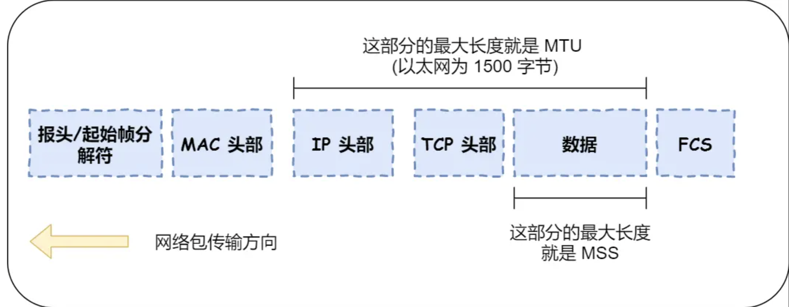

<!-- more -->

  ## TCP连接的建立：

TCP的三次握手：

一开始双方处于close状态，服务器会主动监听某个端口处于LISTEN，

第一次握手：客户端向服务端发送一个带有初始化序列号（ISN）的，SYN=1的SNTCP报文，之后客户端处于SYN_SENT状态

第二次握手：服务端收到客户端发来的报文，然会向服务端发送一个带有自己初始化的随机序列号，确认应答号是客户端的ISN+1，
并且SYN和ACK都等于1的TCP报文，然后服务端处于SYN_RCYD（半连接状态）

第三次握手：客户端向服务端发送一个，确认应答号为服务端ISN加1的，ACK为1，TCP报文发送给服务端，之后客户端处于ESTABLISHED（连接状态），可以携带数据

第三次握手是可以携带数据的，前两次不可以携带数据

### 为什么是三次握手：

1.**TCP 使用三次握手建立连接的最主要原因是防止「历史连接」初始化了连接**

**在两次握手的情况下，服务端没有中间状态给客户端来阻止历史连接，导致服务端可能建立一个历史连接，造成资源浪费**。

**要解决这种现象，最好就是在服务端发送数据前，也就是建立连接之前，要阻止掉历史连接，这样就不会造成资源浪费，而要实现这个功能，就需要三次握手**。

2.*同步双方初始序列号*

序列号的作用：

- 接收方可以去除重复的数据；

- 接收方可以根据数据包的序列号按序接收；

- 可以标识发送出去的数据包中， 哪些是已经被对方收到的（通过 ACK 报文中的序列号知道）

  **一来一回，才能确保双方的初始序列号能被可靠的同步。**

两次握手只保证了一方的初始序列号能被对方成功接收，没办法保证双方的初始序列号都能被确认接收

### 为什么每次建立TCP链接的时候，初始化序列号的都要求不一样？

- 首要目的是，防止历史报文被下一个相同四元组接收
- 为了安全性，防止黑客伪造的相同序列号TCP报文被对方接收

### 初始序列号ISN是如何随机产生的？

ISN = M + F(localhost, localport, remotehost, remoteport)

M:计时器，每4微秒加一
F：是一个Hash，跟据源IP，目的IP，源端口，目标端口。随即生成一个随机数

### 既然IP层会分片，为什么TCP层还需要MSS？

如果直接交给IP层，让他进行分片，如果其中一个IP包丢失，由于IP层**没有超时重传**，直接导致发送方迟迟接收不到ACK，导致整个IP报文被重传

所以，为了达到最佳的传输效能 TCP 协议在**建立连接的时候通常要协商双方的 MSS 值**，当将分片交给TCP层后就不需要IP层进行分片了，如果一个TCP分片丢失，只用重发丢失片

IP层分片：为了适应不同链路的MUT不同

### 当第一次握手丢失：

会触发超时重传，并且重传的SYN报文序列号是一样的

通常，第一次超时重传是在 1 秒后，第二次超时重传是在 2 秒，第三次超时重传是在 4 秒后，第四次超时重传是在 8 秒后，第五次是在超时重传 16 秒后，**每次超时的时间是上一次的 2 倍**。

一般有一个最大重传次数 tcp_syn_retries，如果超过会在等一段时间（上一次超时的二倍），之后还没有，就断开连接

### 第二次握手丢失：

客户端和服务端都会触发超时重传机制

由于客户端在第一次握手之后迟迟没有接受ACK，会认为第一次握手报文丢失就会重新传SYN报文
然后，服务端的话由于长时间没有收到第三次握手，会认为第二次握手丢失就会重传SYN_ACK报文（也有一个最大重传次数 tcp_syn_retries）

### 第三次握手丢失：

服务端会触发超时重传

由于服务端长时间没有收到ACK报文，就会重传SYN_ACK报文

**ACK 报文是不会有重传的，当 ACK 丢失了，就由对方重传对应的报文**。

## 为什么每次建立TCP连接，初始化序列号都要不一样？

- 尽最大可能避免历史报文被新的TCP连接接收到

随机数是会基于时钟计时器递增的，基本不可能会随机成一样的初始化序列号。

​	序列号（SEQ）：用于对TCP连接上发送的每一个数据包进行编号0，序列号在整个TCP连接的生命周期中都是递增的，并且它们用于确定数据包的顺序以及检测数据包的丢失或乱序到达，**序列号是一个 32 位的无符号数，因此在到达 4G 之后再循环回到 0**。

​	初始化序列号（ISN）：用于每次建立TCP的链接，目的是确保每个TCP连接都具有唯一的起始序列号，以防止对连接的重放攻击和其他形式的网络攻击。**初始化序列号可被视为一个 32 位的计数器，该计数器的数值每 4 微秒加 1，循环一次需要 4.55 小时**。

**序列号和初始化序列号并不是无限递增的，会发生回绕为初始值的情况，这意味着无法根据序列号来判断新老数据**。

> TCP时间戳：**一个是便于精确计算 RTT ，另一个是能防止序列号回绕（PAWS）**。
>
> 防回绕序列号算法要求连接双方维护最近一次收到的数据包的时间戳（Recent TSval），每收到一个新数据包都会读取数据包中的时间戳值跟 Recent TSval 值做比较，**如果发现收到的数据包中时间戳不是递增的，则表示该数据包是过期的，就会直接丢弃这个数据包**。

引入时间戳之后可以完全避免历史报文接收问题

## TCP 序列号和确认号是如何变化的？

## 万能公式

**发送的 TCP 报文：**

- **公式一：序列号 = 上一次发送的序列号 + len（数据长度）。特殊情况，如果上一次发送的报文是 SYN 报文或者 FIN 报文，则改为 上一次发送的序列号 + 1。**
- **公式二：确认号 = 上一次收到的报文中的序列号 + len（数据长度）。特殊情况，如果收到的是 SYN 报文或者 FIN 报文，则改为上一次收到的报文中的序列号 + 1。**
- 

- **序列号**：在建立连接时由内核生成的随机数作为其初始值，通过 SYN 报文传给接收端主机，每发送一次数据，就「累加」一次该「数据字节数」的大小。**用来解决网络包乱序问题。**
- **确认号**：指下一次「期望」收到的数据的序列号，发送端收到接收方发来的 ACK 确认报文以后，就可以认为在这个序号以前的数据都已经被正常接收。**用来解决丢包的问题。**
- **控制位：**用来标识 TCP 报文是什么类型的报文，比如是 SYN 报文、数据报文、ACK 报文，FIN 报文等

## 已建立的TCP连接，收到SYN会发生什么？

1. 客户端的SYN报文中的源端口号和历史连接的不同

   服务端会认为这是一个新的连接请求，就会建立一个新的链接

2. 客户端的SYN中的端口号和历史连接的不同

   **处于连接中的TCP连接，如果收到了SYN报文，服务端会返回一个带有正确的确认号和正确的序列号这个 ACK 被称之为 Challenge ACK。**

   **接着，客户端收到这个 Challenge ACK，发现确认号（ack num）并不是自己期望收到的，于是就会回 RST 报文，服务端收到后，就会释放掉该连接**

### killcx 的工具

**我们可以伪造一个四元组相同的 SYN 报文，来拿到“合法”的序列号！**

正如我们最开始学到的，如果处于 Established 状态的服务端，收到四元组相同的 SYN 报文后，**会回复一个 Challenge ACK，这个 ACK 报文里的「确认号」，正好是服务端下一次想要接收的序列号，说白了，就是可以通过这一步拿到服务端下一次预期接收的序列号。**

**然后用这个确认号作为 RST 报文的序列号，发送给服务端，此时服务端会认为这个 RST 报文里的序列号是合法的，于是就会释放连接！**

### tcpkill 的工具

- tcpkill 工具是在双方进行 TCP 通信时，拿到对方下一次期望收到的序列号，然后将序列号填充到伪造的 RST 报文，并将其发送给对方，达到关闭 TCP 连接的效果。

  无法关闭非活跃的TCP连接

  ## **TCP 的 Keepalive 和 HTTP 的 Keep-Alive 是一个东西吗？**

- HTTP 的 Keep-Alive，是由**应用层（用户态）** 实现的，称为 HTTP 长连接

  只要一端没有明确的提出断开连接，就会让这个TCP保持连接状态；但是有一个，HTTP连接超时时间的限制

- TCP 的 Keepalive，是由 **TCP 层（内核态）** 实现的，称为 TCP 保活机制
