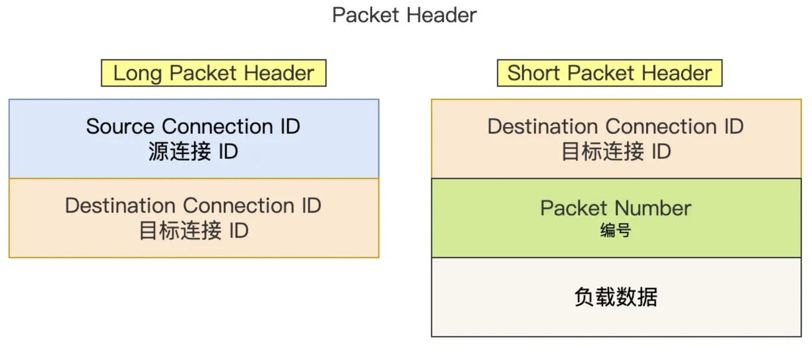
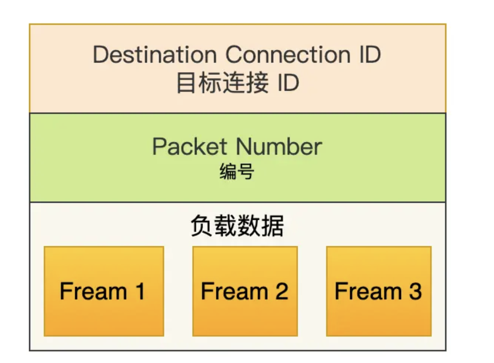
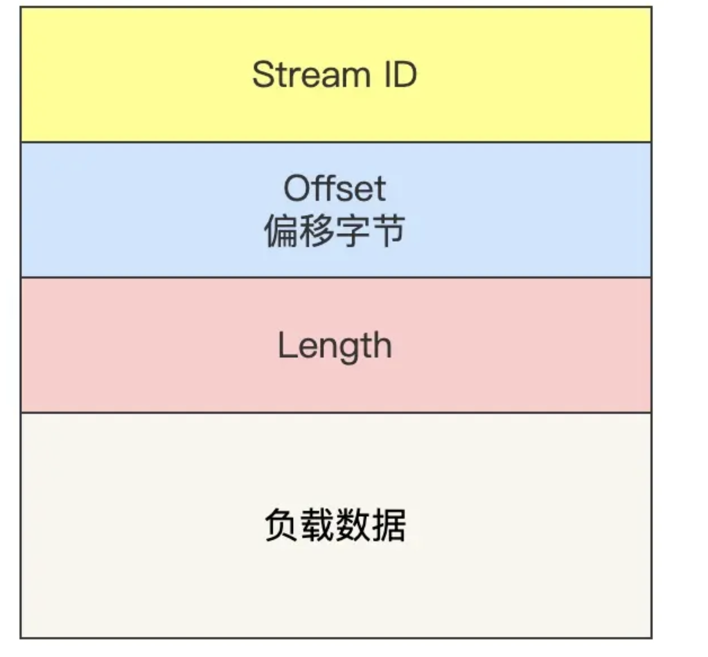

<!-- more -->

## **如何基于UDP实现可靠传输？**

### QUIC是如何实现可靠传输的？

在应用层下功夫，报文多加几个头部字段

#### Packet Header

Packet Header 首次建立连接时和日常传输数据时使用的 Header 是不同的

QUIC 也是需要三次握手来建立连接的，主要目的是为了协商连接 ID。

 `Packet Number` 是每个报文独一无二的编号，它是**严格递增**的，也就是说就算 Packet N 丢失了，重传的 Packet N 的 Packet Number 已经不是 N，而是一个比 N 大的值。

> 这样做的好处，使重传没有歧义（歧义：是接受到上一次的数据包，还是重传之后的数据包），可以支持乱序确认

#### QUIC Frame Header

stream类型的Fream:

stream ID:用于区分不同的HTTP信息
Offset：用于标识数据，保证数据的顺序性和可靠
Length:指明数据的长度

**丢失的数据包和重传的数据包 Stream ID 与 Offset 都一致，说明这两个数据包的内容一致**

### QUIC 是如何解决 TCP 队头阻塞问题的？

**TCP 必须按序处理数据，也就是 TCP 层为了保证数据的有序性，只有在处理完有序的数据后，滑动窗口才能往前滑动**，如果其中一个数据丢失，窗口停留直到丢失的数据包被重传接收

**HTTP/2 多个 Stream 请求都是在一条 TCP 连接上传输，这意味着多个 Stream 共用同一个 TCP 滑动窗口，那么当发生数据丢失，滑动窗口是无法往前移动的，此时就会阻塞住所有的 HTTP 请求，这属于 TCP 层队头阻塞**。

QUIC的解决办法：

**QUIC 给每一个 Stream 都分配了一个独立的滑动窗口，这样使得一个连接上的多个 Stream 之间没有依赖关系，都是相互独立的，各自控制的滑动窗口**。

### QUIC 是如何做流量控制的？

QUIC 的滑动窗口滑动的条件跟 TCP 有一点差别，但是同一个 Stream 的数据也是要保证顺序的，不然无法实现可靠传输，因此某一个 Stream 的数据包丢失了，也会造成某一个Stream的窗口无法滑动。

- **Stream 级别的流量控制**：Stream 可以认为就是一条 HTTP 请求，每个 Stream 都有独立的滑动窗口，所以每个 Stream 都可以做流量控制，防止单个 Stream 消耗连接（Connection）的全部接收缓冲。
  1. 接受窗口的左侧边界取决于最大偏移数
  2. 当已读取的数据大于最大接受窗口的一半时，将窗口向右移动当前已读取的数据字节数
  3. 控制数据发送的唯一限制就是最大绝对字节偏移量，该值是接收方基于当前已经提交的偏移量（连续已确认并向上层应用提交的数据包offset）和发送方协商得出
- **Connection 流量控制**：限制连接中所有 Stream 相加起来的总字节数，防止发送方超过连接的缓冲容量
  1. 而对于 Connection 级别的流量窗口，其接收窗口大小就是各个 Stream 接收窗口大小之和

### QUIC 对拥塞控制改进

将TCP的拥塞控制算法搬过来，QUIC作为一个基于UDP的传输层协议，提供了在应用层实现拥塞控制的能力，**QUIC 可以随浏览器更新，QUIC 的拥塞控制算法就可以有较快的迭代速度**。**可以针对不同的应用设置不同的拥塞控制算法**

###  QUIC 更快的连接建立

**QUIC 内部包含了 TLS，它在自己的帧会携带 TLS 里的“记录”，再加上 QUIC 使用的是 TLS1.3，因此仅需 1 个 RTT 就可以「同时」完成建立连接与密钥协商，甚至在第二次连接的时候，应用数据包可以和 QUIC 握手信息（连接信息 + TLS 信息）一起发送，达到 0-RTT 的效果**。

### QUIC 是如何迁移连接的？

通过**连接 ID**来标记通信的两个端点，客户端和服务器可以各自选择一组 ID 来标记自己，因此即使移动设备的网络变化后，导致 IP 地址变化了，只要仍保有上下文信息（比如连接 ID、TLS 密钥等），就可以“无缝”地复用原连接，消除重连的成本，没有丝毫卡顿感，达到了**连接迁移**的功能
