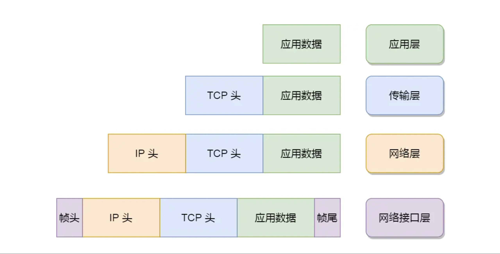

<!-- more -->

# 计算机网络

1.TCP/IP，网络模型

### 应用层：

我们电脑或手机使用的应用软件都是在应用层实现。那么，当两个不同设备的应用需要通信的时候，应用就把应用数据传给下一层，也就是传输层。
<u>应用层是工作在操作系统中的用户态，传输层及以下则工作在内核态</u>

##### 用户态和内核态：

用户态和内核态是操作系统中的两种运行模式，用来描述程序或进程执行时所处的不同权限级别或特权级别。

### 传输层：（作为传输媒介）

在传输层有两种传输协议：TCP(传输控制协议),UDP

TCP 比UDP多了很多特性，比如流量控制，超时重传，拥塞控制等，都是为了数据包能可靠的传输给对方（http应用层协议）；最大报文段长度MSS；传输时会加一个TCP头；传输单位是段

当数据包大小大于MSS时要将数据包分块，每一个分块我们称为TCP段，这样在传输时如果丢了一小段，只需重新发送这一小段

UDP就只是传输数据包，不保证数据包是否能够抵达对方，实时性相对较好，传输效率更高。也可以实现可靠传输，***在应用层把***TCP的特性全部实现（不容易）。

每一个应用都有对应的端口号，以方便辨识数据包应该传输给哪一个应用
浏览器中每一个标签栏都是独立的进程，会分配暂时的端口号

### 网络层:(有着实际的传输功能)

最常用的是IP协议，将传输层传来的数据再加上<u>IP包头</u>组转成IP报文;传输单位是包

当报文长度超过MTU时，再进行分片

##### IP协议的寻址作用：

将IP地址分成两部分：

1.网络号，负责表示属于哪个子网
2.主机号，负责表示同一子网下的不同设备

通过子网掩码，将ip地址与子网掩码进行***按位与***可以得到网络号
将子网掩码**取反**之后，与IP地址进行***按位与***可以获得主机号

##### IP协议还可以*路由*

IP协议的***寻址作用***告诉我们要***<u>往哪走</u>***，而***路由***则是跟据下一个目的地***选择路径***

### 网络接口层：

1.生成IP头部之后，交给网络接口层生成MAC头部，封装成**数据帧**发送到网络上；传输单位是帧
2.MAC头部是以太网使用的头部，包含了接收方和发送方的MAC地址等信息，可以通过ARP协议获取对方MAC地址
3.负责在以太网、WiFi 这样的底层网络上发送原始数据包，工作在网卡这个层次，使用 MAC 地址来标识网络上的设备

