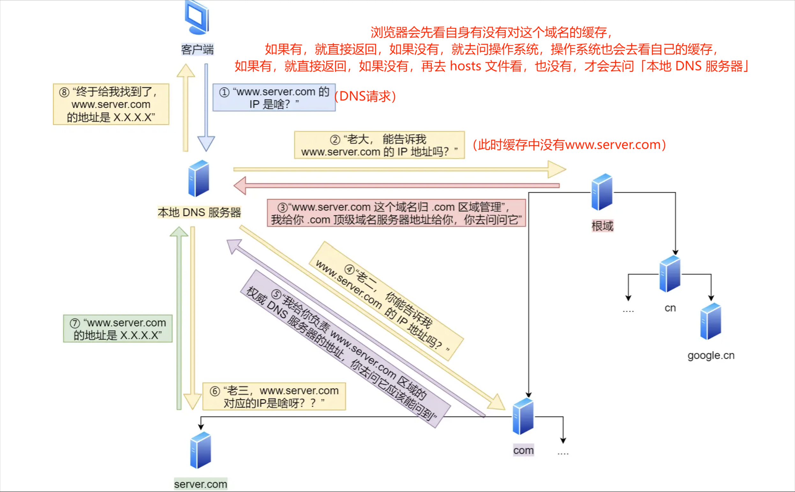
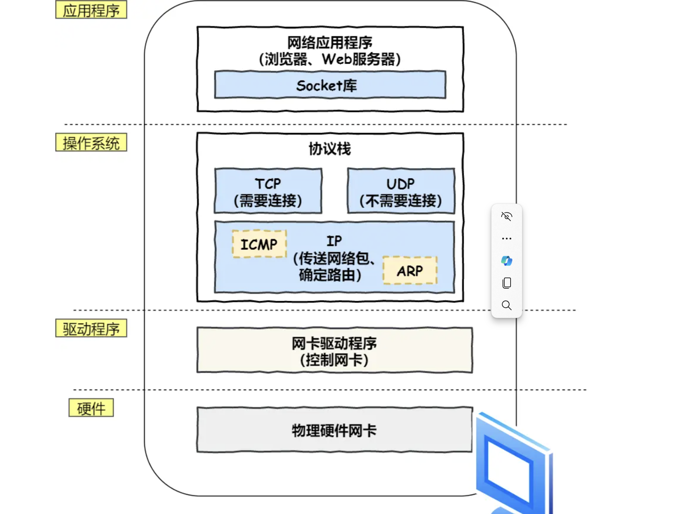
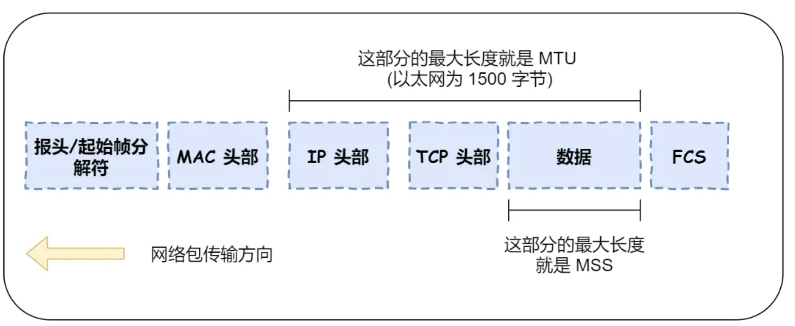
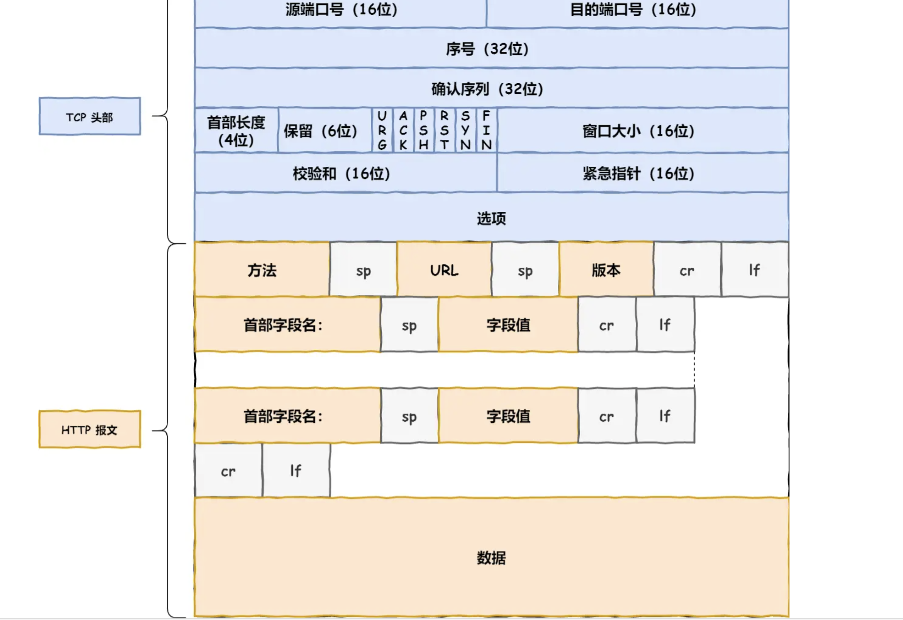
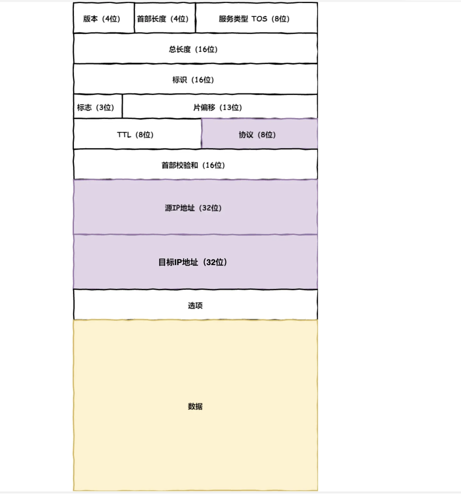

<!-- more -->

# 键入网址到网页显示，期间发生了什么？

### 1.浏览器第一步工作是解析ULR，然后生产HTTP请求消息，然后会**委托操作系统发送消息**

### 2.在发送之前，**必须查询服务器域名对应的IP地址**，在委托操作系统发送消息时必须提供**通讯对象的IP地址**

#### DNS服务器:专门保存了 `Web` 服务器域名与 `IP` 的对应关系

`www.server.com.`，`.` 根域是在最顶层，它的下一层就是 `.com` 顶级域，再下面是 `server.com`。

所以域名的层级关系类似一个树状结构：

- 根 DNS 服务器（.）
- 顶级域 DNS 服务器（.com）
- 权威 DNS 服务器（server.com）

**根域的 DNS 服务器信息保存在互联网中所有的 DNS 服务器中。**
户端只要能够找到任意一台 DNS 服务器，就可以通过它找到根域 DNS 服务器，然后再一路顺藤摸瓜找到位于下层的某台目标 DNS 服务器。

###### 只指路不带路

### 3.通过DNS获取到IP后，把传输工作给操作系统中的协议栈

应用程序（浏览器）通过调用 Socket 库，来委托协议栈工作。

**协议栈的上半部分有两块，分别是负责收发数据的 TCP 和 UDP 协议，这两个传输协议会接受应用层的委托执行收发数据的操作**
**下面一半是用 IP 协议控制网络包收发操作，在互联网上传数据时，数据会被切分成一块块的网络包，而将网络包发送给对方的操作就是由 IP 负责的**

此外 IP 中还包括 `ICMP` 协议和 `ARP` 协议。

- `ICMP` 用于告知网络包传送过程中产生的错误以及各种控制信息。
- `ARP` 用于根据 IP 地址查询相应的以太网 MAC 地址。

IP 下面的网卡驱动程序负责控制网卡硬件，而最下面的网卡则负责完成实际的收发操作，也就是对网线中的信号执行发送和接收操作。

### 4.http协议是基于TCP协议传输的

在 HTTP 传输数据之前，首先需要 TCP 建立连接，TCP 连接的建立，通常称为**三次握手**。

###### 1.第一次握手

**首先双方都处于`closed`状态，客户端会发送一个带有`SYN`（同步序列编号）标志的TCP报文到服务器，表示客户端请求连接；并且在其中客户端还会选择一个`ISN`（初始序列号）放入`SYN`报文段中**

**ISN**：用于标识客户端到服务器的数据流

**SYN**：SYN 标志用于指示一个 TCP 报文段是一个连接请求（SYN=1，ACK=0）或连接接受（SYN=1，ACK=1）

第一次握手之后：客户端处于`SYN_SENT`状态（同步已发送），服务器处于`LISTEN`（监听状态）

###### 2.第二次握手

**服务器同意建立连接，会回复一个带有`SYN`和`ACK`（确认号）标识的TCP报文；服务器也会选择一个初始序列号用于标识服务器到客户端的数据流**

**ACK**：ACK标识表示确认号表示服务器希望下一次接受的下一序列号，是 SYN 报文段的序列号加一

第二次握手之后：客户端处于`SYN_SENT`状态，服务器处于`SYN-RCVD`（半连接状态）

###### 3.第三次握手

**客户端在接收服务器的带有`SYN`和`ACK`（确认号）标识的TCP报文之后，会向服务器发送一个带有`ACK`标志的确认报文段;并且这个报文字段包含客户端收到的服务端的`ISN`，以及`ACK`（表示客户端希望下一次接受的序列号）**

第三次握手之后：客户端和服务器都进入`ESTABLISHED`

三次握手的目的是**确认双方都有发送和接受的能力**

###### 完整的TCP报文：

###### 4.IP

TCP模块在执行链接，收发，断开等各阶段操作时，都需要委托IP模块将数据封装成**网络包**发送给通信对象

IP协议需要**源IP**和**目标地址IP**：

- 源地址IP，即是客户端输出的 IP 地址；
- 目标地址，即通过 DNS 域名解析得到的 Web 服务器 IP。

在IP包头的**协议号**要填写**16**进制的，表示协议为TCP
在客户端有多个网卡的时候，选择源IP时将**目标地址的网络号**（IP与子网掩码做与运算）与**网卡的IP地址**比较选择相同的那个网卡。
如果其它条目都无法匹配自动匹配**默认网关**（目标地址和子网掩码都是 `0.0.0.0`）

**一个完整的网络包**：

###### 5.MAC

在生成IP包头之后，还需要在网络包前面加一个**MAC头部**
MAC头部是以太网使用的头部：
在MAC头里面要包含**发送方MAC地址**和**接收方MAC地址**，用于**两点之间的传输**

在一般的TCP/IP通信里，MAC协议只有两种：

- `0800` ： IP 协议（当以太网数据帧中的以太类型字段的值为0800，数据帧包含的是IP协议的数据）
- `0806` ： ARP 协议（当以太网数据帧中的以太类型字段的值为0806，数据帧包含的是APR协议的数据）

获取对方的MAC地址，首先根据路由表找到对方IP地址，再跟据APR协议找到对方MAC地址
**APR协议：通过广播的形式从局域网中找到响应者的MAC地址**然后保存到**APR缓存**中，下次先访问**缓存**

通过0806以太类型字段值发送ARP请求来获取目标设备MAC地址与0800以太类型字段值发送ARP请求的方法**类似**，只是前者明确了数据帧中包含的是**ARP协议的数据**。

**MAC报文**：

### 5.网卡（真正的数据发送）

**网卡驱动程序**获取网络包，将其**复制**到网卡的**缓存区**，在其开头加上**报头**和**起始帧分界符**，**在末尾加上用于检测错误的帧校验序列**

- 起始帧分界符是一个用来表示包起始位置的标记
- 末尾的 `FCS`（帧校验序列）用来检查包传输过程是否有损坏

最后将**数字信息（网络包中的二进制数据）**转为**电信号**，通过网线发送出去

### 6.交换机

交换机的设计是将网络包**原样**转发到目的地
交换机工作在MAC层，也称**二层网络设备**

首先当电信号到达**网线接口**，交换机将**电信号**转变为**数字信号**，如果没问题则放到**缓存区**

接下来，**交换机通过查询MAC地址表，将信号发送到对应端口**

当在表中找不到的时候，交换机会将包转发到除了**源端口之外的所有端口**，确保设备可以接收**（这样做是没什么问题的，以太网的设计本身就是将包发送到整个网络，只有接收者才会接受，其他则会忽略这个包）**

如果接受方MAC地址是一个**广播地址**，交换机会将包转发到除了**源端口之外的所有端口**

**网卡和交换机的区别**：

- 计算机的**网卡本身具有MAC地址**，通过核对收到的**包的接收方**的MAC地址判断是不是发送给自己的，如果不是就丢弃。
- **交换机的端口不具有MAC地址**，不核对收到的**包的接收方**的MAC地址，而是直接接受所有包并存在缓冲区

**MAC地址表：**

- 一个是设备的 MAC 地址，
- 另一个是该设备连接在交换机的哪个端口上

**以下两个属于广播地址**：

- MAC 地址中的 `FF:FF:FF:FF:FF:FF`
- IP 地址中的 `255.255.255.255`

### 7.路由器

网络包经过交换机之后，现在到达了**路由器**，并在此被转发到下一个路由器或目标设备。
当转发包时，首先**路由器端口**会接收发给自己的以太网包，然后**路由表**查询转发目标，再由相应的端口作为发送方将以太网包发送出去。

**路由器接受包：**
首先，电信号到达网线接口部分，路由器中的模块会将电信号转成数字信号，检查 MAC 头部中的**接收方 MAC 地址**，看看是不是发给自己的包，如果是就放到接收缓冲区中，否则就丢弃这个包。

在完成接收之后，路由器会去掉包**MAC**头部，跟据**IP头部**进行包的转发，跟据**路由表**

**路由器发送包**：

首先，我们需要根据**路由表的网关列**判断对方的地址。

- 如果网关是一个 IP 地址，则这个IP 地址就是我们要转发到的目标地址，**还未抵达终点**，还需继续需要路由器转发。
- 如果网关为空，则 IP 头部中的接收方 IP 地址就是要转发到的目标地址，也是就终于找到 IP 包头里的目标地址了，说明**已抵达终点**。

知道对方的 IP 地址之后，接下来需要通过 `ARP` 协议根据 IP 地址查询 MAC 地址，并将查询的结果作为接收方 MAC 地址。

**路由器和交换机是有区别的**：

- 因为**路由器**是基于 IP 设计的，俗称**三层**网络设备，路由器的各个端口都具有 MAC 地址和 IP 地址；
- 而**交换机**是基于以太网设计的，俗称**二层**网络设备，交换机的端口不具有 MAC 地址。

在网络包传输的过程中，**源 IP 和目标 IP 始终是不会变的，一直变化的是 MAC 地址**，因为需要 MAC 地址在以太网内进行**两个设备**之间的包传输。

### 8.客户端&服务器

**四次挥手：**

- 第一次挥手：客户端向服务器发送连接释放请求（FIN）。
- 第二次挥手：服务器收到客户端的连接释放请求后，向客户端发送确认（ACK）。
- 第三次挥手：服务器准备好关闭连接时，向客户端发送连接释放请求（FIN）。
- 第四次挥手：客户端收到服务器的连接释放请求后，向服务器发送确认（ACK），完成连接的关闭。
