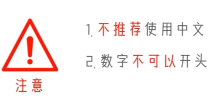

| 类型             | 描述                                                         | 说明                                                         |
| ---------------- | ------------------------------------------------------------ | ------------------------------------------------------------ |
| 数字(Number)     | 整数(int)<br/>浮点数(float)<br/>复数(complex)<br/>布尔(bool) | 整数(int),如:10、-10<br />浮点数(float),如:13.14、-13.14<br />复数(complex)，如:4+3j，以j结尾表示复数<br />布尔(bool)表达现实生活中的逻辑,即真和假,True表示真,<br />False表示假。<br/>True本质上是一个数字记作1,False记作0 |
| 字符串(String)   | 描述文本的一种数据类型                                       | 字符串(string)由任意数量的字符组成                           |
| 列表(List)       | 有序的可变序列                                               | Python中使用最频繁的数据类型,可有序记录一堆数据              |
| 元组(Tuple)      | 有序的不可变序列                                             | 可有序记录一堆不可变的Python数据集合                         |
| 集合(Set)        | 无序不重复集合                                               | 可无序记录一堆不重复的Python数据集合                         |
| 字典(Dictionary) | 无序Key-Value集合                                            | 可无序记录一堆Key-Value型的Python数据集合                    |
|                  |                                                              |                                                              |

type（数据）
查看数据的类型,也可以查看变量的数据类型

```python
print(type("字符串"))

# 输出
<class 'str'>


# 数据类型转换
a=str(11)
# 只有双引号里都是数字才可以转为int类型
b=int("123")
c=float("1.2")
print(type(a))
print(type(b))
print(type(c))


<class 'str'>
<class 'int'>
<class 'float'>
```

标识符命名规则 - 内容限定

1. 标识符命名中，只允许出现：

- 英文
- 中文
- 数字
- 下划线(_)

这四类元素。

其余任何内容都不被允许。



1. 大小写敏感
2. 不可使用关键字

| 运算符 | 描述   | 实例                                                         |
| ------ | ------ | ------------------------------------------------------------ |
| +      |        | 两个对象相加a+b 输出结果 30                                  |
| -      |        | 得到负数或是一个数减去另一个数a-b输出结果-10                 |
| *      |        | 两个数相乘或是返回一个被重复若干次的字符串a*b输出结果<br/>200 |
| /      |        | b /a 输出结果 2                                              |
| //     | 取整除 | 返回商的整数部分9//2输出结果 4,9.0//2.0 输出结果 4.0         |
| %      | 取余   | 返回除法的余数b%a 输出结果0                                  |
| **     | 指数   | a ** b为10的20次方,输出结果 100000000000000000000            |
|        |        |                                                              |

```python
# 算术(数学)运算符
print("1 +1=",1+1)
print("2 - 1 =", 2 -1)
print("3 * 3=", 3*3)
print("4 / 2 = ", 4 / 2)
print("11 // 2=", 11 // 2)
print("9 % 2 = ", 9 % 2)
print("2 ** 2 =", 2 ** 2)

#复合运算符
num = 1
num += 1 # num = num + 1
print("num += 1: ", num)
num -= 1
print("num -= 1: ", num)
num *= 4
print("num *= 4: ", num)
num /= 2
print("num /= 2: ", num)
num = 3
num %= 2
print("num %= 2: ", num)
num **= 2
print("num **= 2: ", num)
num = 9
num //= 2
print("num //= 2:", num)
```

字符串

```python
print(type(name))
# 单引号定义法,使用单引号进行包围
name ='黑马程序员’
print(type(name))
# 双引号定义法
name ="黑马程序员”
print(type(name))
# 三引号定义法,写法和多行注释是一样的
name = """字符串"""
print(type(name))


# 在字符串内 包含双引号
name ='"黑马程序员”'
print(name)
# 在字符串内 包含单引号
name ="'黑马程序员'"
print(name)
# 使用转义字符 \ 解除引号的效用
name ="\"黑马程序员\""
print (name)
name='\'黑马程序员\''
print(name)


# %s 一个字符串类型的占位符
name="这是一个%s"  %  "字符串"
print(name)
""" 
%s 一个字符串类型的占位符
%d 一个整数类型的占位符
%f 一个浮点数类型的占位符
"""
name="这是一个%s，这是一个%d，这是一个%f" % ("字符串",12,12)
print(name)
```

字符串格式化-数字精度控制

我们可以使用辅助符号"m.n”来控制数据的宽度和精度

- m，控制宽度,要求是数字(很少使用)，设置的宽度小于数字自身，不生效

- .n，控制小数点精度,要求是数字，会进行小数的四舍五入

  示例：

- %5d：表示将整数的宽度控制在5位,如数字11，被设置为5d,就会变成：   11，用三个空格补足

  宽度。

- %5.2f：表示将宽度控制为5,将小数点精度设置为2

  小数点和小数部分也算入宽度计算。如，对11.345设置了%7.2f后,结果是：  11.35。2个空格补足宽度,小数部分限制2位精度后,四舍五入为.35

```python
num1 = 11
num2 = 11.345
print("数字11宽度限制5,结果是:%5d"% num1)
print("数字11宽度限制1,结果是:%1d"% num1)
print("数字11.345宽度限制7,小数精度2,结果是:%7.2f"% num2)
print("数字11.345不限制,小数精度2,结果是:%.2f"% num2)

name ="程序猿"
set_up_year = 2006
stock_price = 19.99
# f: format
print(f"我是{name},我成立于:{set_up_year}年,我今天的股价是:{stock_price}")


name="cheng"
stock_price=100
stock_code= "003032"
stock_growth=1.2
growth_day=7

finally_stock_price=stock_price*stock_growth**growth_day

print(f"公司{name},股票代码{stock_code}，当前股价{stock_price}，每日增长系数{stock_growth},经过{growth_day},股价达到{finally_stock_price}")
```

```python
age=input("请输入你的年龄")
print("你的年龄是%s" % age)
# input语句会将所有输入的数据当成字符串，如果需要自行转换类型

#
age=input("请输入你的年龄")
print("你的年龄是%s" % age)
age=int(age)

if age < 18 :
    print("未成年")
else:
    print("成年")

#    
tall=int(input("请输入你的身高"))
vip=int(input("请输入你的VIP等级"))

if tall<120:
    print("你可以不买票")
elif vip>3:
    print("您快去")
else:
    print("去买票")
    
    
# 1-10内的随机数    
num=random.randint(1,10)
print(num)


# while循环
i=0
while i<10:
    print("第%s次循环" % i)
    i+=1
    
    
    
# 99乘法表
i=0
while i<=9:
    j=1
    while j<=i:
        print(f"{j} * {i}  = {j*i}\t",end=" ")
        j+=1
    i+=1
    print()
    
    
#for循环
 name="Flipped1001"
 for i in name:
     print(i,end="")

 const=0
 name="itheima is a brand of itcast"

 for i in name:
     if i == 'a' :
         const=const+1

 print(const)


# range(num1,num2,step):获取一个从num1到num2步长为step的数字序列(不会包含num2)
for i in range(1,18,2)
    print(i)
    
    
num=101
count=0
for i in range(1,num):
    if i %2 ==0:
        count+=1

print(f"在0到{num-1}内有{count}个偶数")

# 使用for循环99乘法表
for i in range(1,10):
    for j in range(1,i+1):
        print(f"{j} * {i} = {j*i}\t",end=" ")

    print()
    
# continue 跳过本次循环
# 直接结束所在循环
```